# Clerk Training Guide

Welcome to the **Healthy Corners Clerk** app! This document will guide you through the app. (Last updated: 12/23/20)

::: details Throughout this guide, there are video demos like this. Tap the black triangle ▶ button on the left to open them.
When opened, you'll see a short description like this with a GIF below!
:::

::: tip 
To view just the video demos, click here: [Clerk Training Gif Demos](./clerktraininggifs.md)
:::

::: warning NOTE
Some of the descriptions and visuals may have changed slightly since this guide was created. However, most of the core functionality should remain similar. 
:::

**Table of Contents:** 
[[toc]]

## What is Healthy Rewards?

**Healthy Rewards** is a program that encourages shoppers to purchase more fresh and healthy fruits and vegetables! 

Here's how it works: 

1. Customers **sign up** with their phone number
2. They **buy Healthy Corners products** at participating stores
3. For every every dollar spent on healthy products, they **earn 100 points**
4. When they reach **500 points**, they earn a **$5 reward** 
5. They can them **redeem rewards** on future healthy purchases 

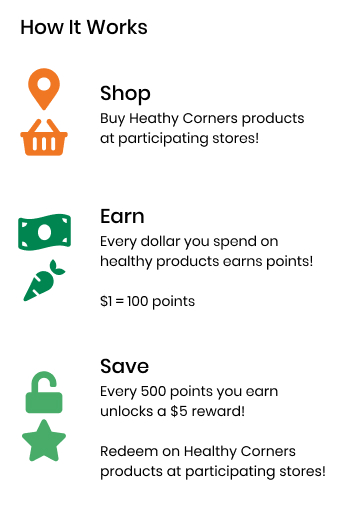

## Step 0: Combining with Store POS

::: warning NOTE
This app **does not replace** your store's current point of sale system! It is meant to be used with your store's system if a customer buys Healthy Corners products and is part of the Healthy Rewards program. 
:::

A checkout will work like this: 

1. Check if the customer purchased Healthy Corners products
2. Ask if they are part of Healthy Rewards. If so, open the app and enter their phone number
3. Checkout all their Healthy Corners products
4. Tap `Rewards` and let them know how many rewards they have and their subtotal/total
5. Ask how many rewards they would like to use and apply to sale. Confirm on app
6. Move to the store point of sale system and check out
7. **Apply the same amount of rewards/discounts** as you did on the app
8. End point of sale check out

This guide explains how the app process works!

## Step 1: Log In
The app opens **on this screen :arrow_down:**

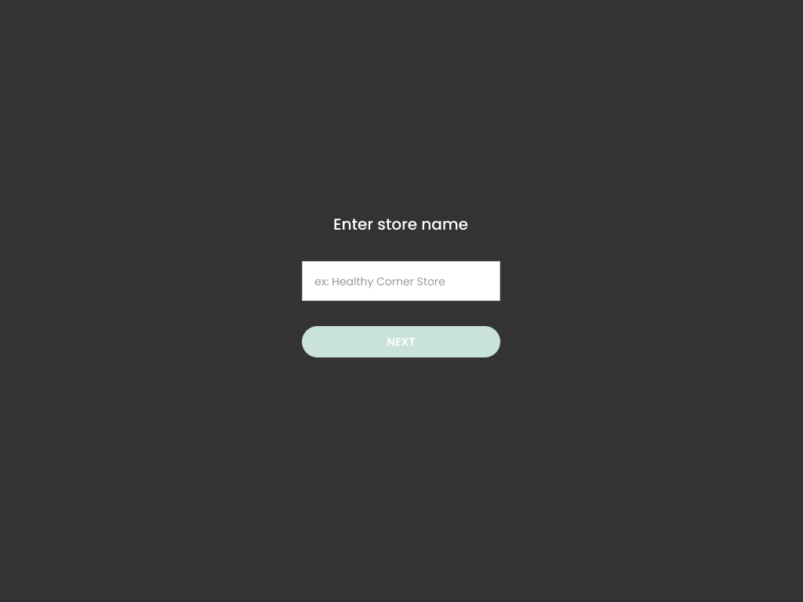

### Enter store

1. Tap the input box 
2. Start typing your store name
3. Select your store from the dropdown list 
4. Tap `Next`
   
If the **wrong store** is displayed in the top Welcome Message, **tap the :arrow_left: Back Arrow in the top left corner!**

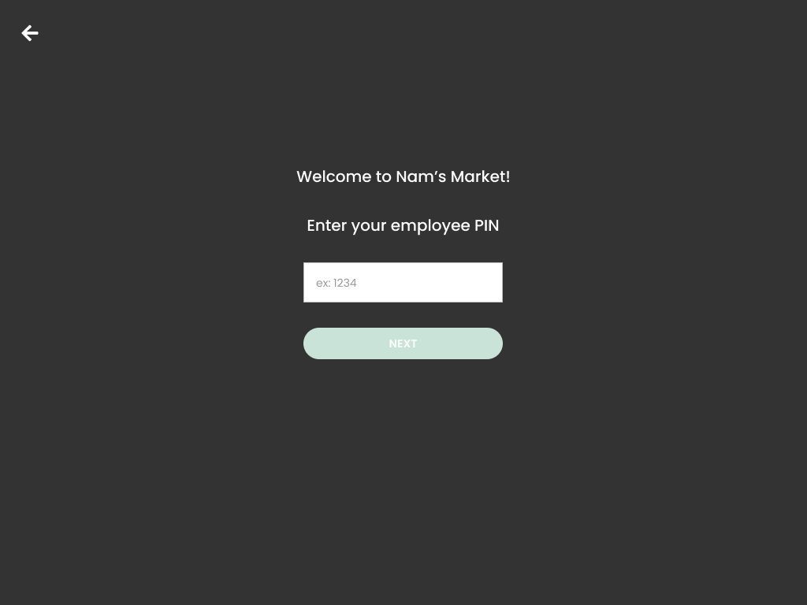

### Enter PIN

1. Tap the input box
2. Type your 4-digit PIN 
3. Tap `Next`

:::  tip
You should have received your 4-digit PIN number from Healthy Corners staff. 

If you are a Healthy Corners administrator and need to make a ew clerk account, see the guide on [here](newclerk.md).
:::

## Step 2: Enter Customer & Access Menu

Once you log in, the screen will become **white** and you can **start customer transactions** or interact with the **menu**! :arrow_down:

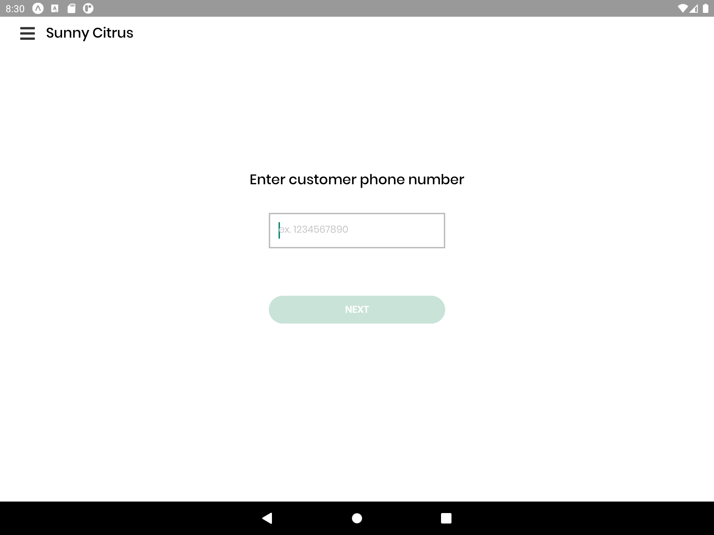

### Enter a customer

1. Tap the input box
2. Type the customer's phone number
3. Tap `Next`

### Access menu

Open the **menu** by tapping the icon in the top left corner next to your name!

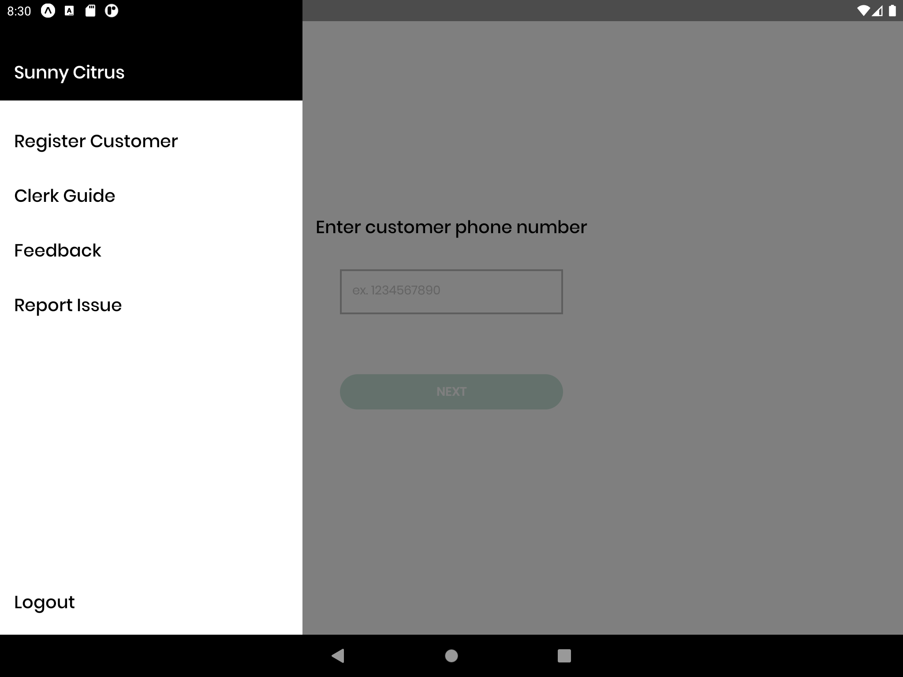

1. **Register Customer** — opens a popup to register a customer for a Healthy Rewards account (see [Register a Customer](#register-a-customer) guide)
2. **Clerk Guide** — opens this guide!
3. **Feedback** — opens a form to give feedback on the app/program 
4. **Report Issue** — opens a form to report problems with the app
5. **Logout** — log out of the app, either when your shift/training is over or if you logged in incorrectly and the *wrong name* shows up in the top left
::: details Open this drop down to see opening the menu and entering a customer!
This demo shows a clerk entering the customer Robin Hood with the phone number 0987654321. Please ignore the **yellow warning** — that will not show up! *(run time: 14 seconds)*

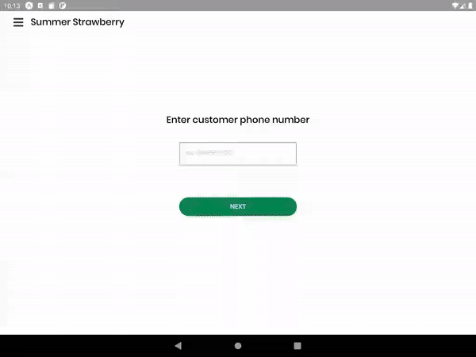
:::

## Step 3: Checkout Products

Here are the terms for the checkout screen.

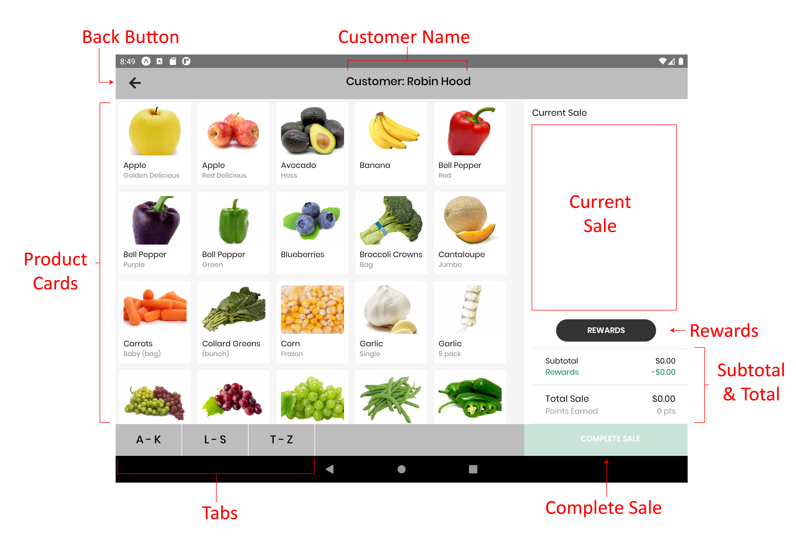

| Feature       | Function                                                                                                           |
| ------------- | ------------------------------------------------------------------------------------------------------------------ |
| Back Button   | This brings you back to the last screen. To  **cancel**  the transaction, tap :arrow_left: button in the top left. |
| Customer Name | When you enter this screen, read the customer name and **ask the customer if the name is correct.**                |
| Tabs          | To help you find an item, tap the tab that matches your item. The product cards area will jump to that section.    |
| Product Cards | All products are displayed. Scroll to view more.                                                                   |

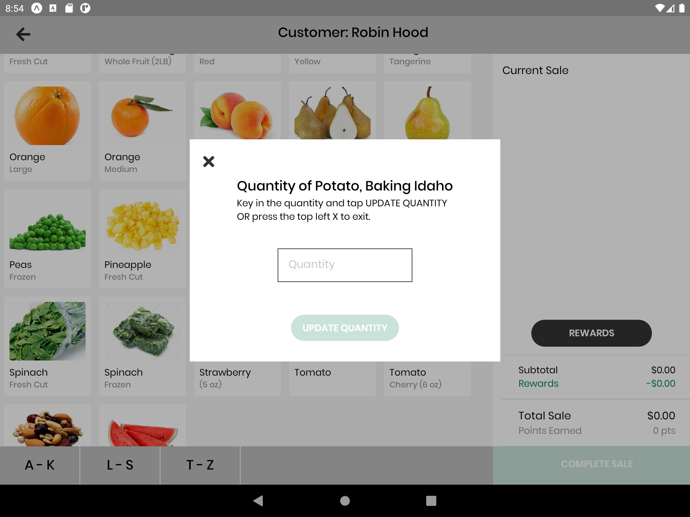

### Add to sale

1. Tap the product card and this popup will appear :arrow_up:
2. Tap the input box
3. Enter quantity
4. Tap `Update Quantity`

OR, tap `X` in the top left to exit.

### Update quantity of a product

1. Tap that item **under current sale** (see above) OR the product card, the same popup will appear
2. Enter new quantity or 0 to remove the item from the sale
3. Tap `Update Quantity`

OR, tap `X` in the top left to exit.

::: details Open this drop down to see adding and removing a product!
This demo shows a clerk scrolling down, finding potatoes, adding 2 to the current sale, then removing the potatoes. *(runtime: 21 seconds)*

:::

::: callout Current Sale
All products that have been added appear here. Scroll to view all products
:::

The example below shows what a very large sale might look like — above **Mixed Fruit**, there are still several other items that you would scroll to view. 

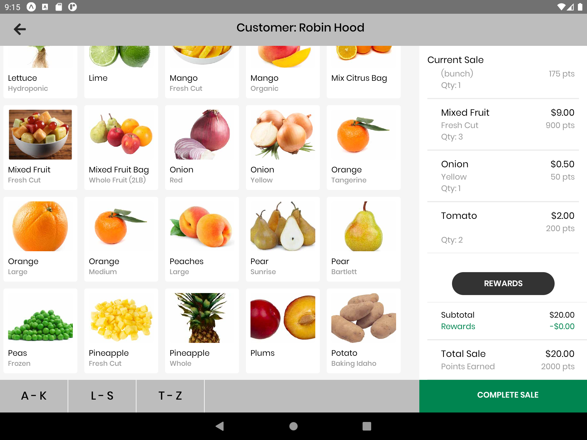

::: details Open this drop down to see scrolling up and down a large current sale!

This demo shows a clerk adding blueberries to a large sale then scrolling up and down the sale. *(runtime: 20 seconds)*

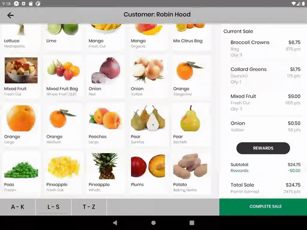
:::

## Step 4: Add Rewards and Confirm

::: callout Rewards
Rewards: see a customer's available rewards and current points, as well as apply/remove rewards from this sale
::: 

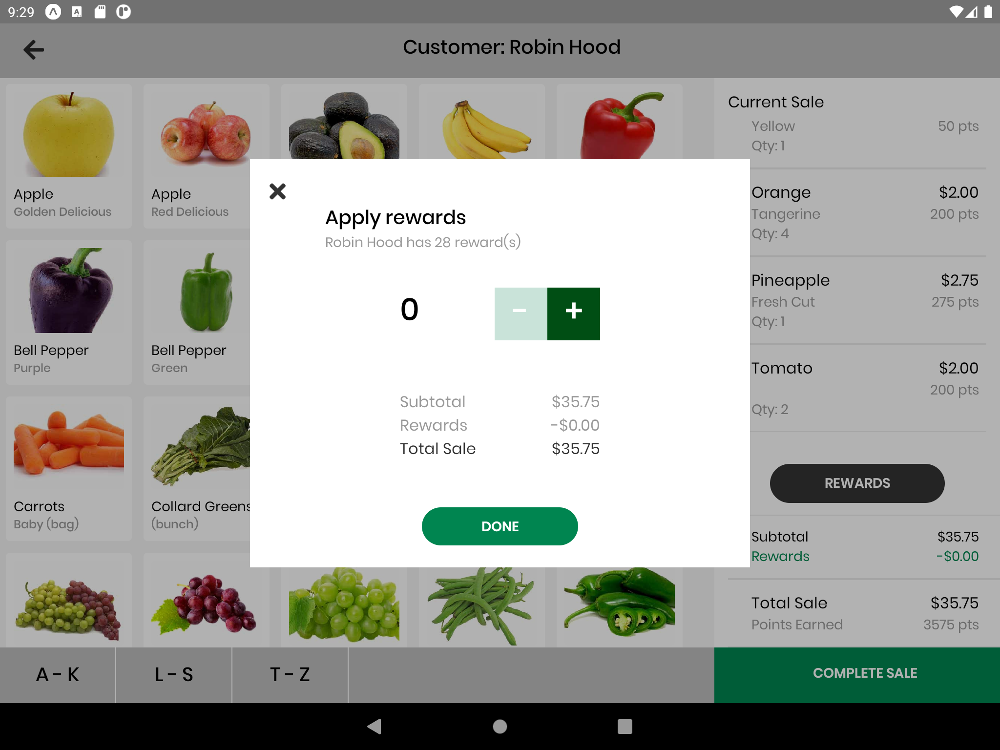

### To apply/adjust applied rewards

1. Tell the customer how many $5 rewards they have and ask how many they would like to apply, if any
2. Tap the `Rewards` button under current sale
3. Tap the -/+ buttons to add or remove rewards 
4. Tap `Done` 

OR, tap `X` in the top left to exit.

::: details Open this drop down to see applying and removing rewards!

This demo shows a clerk adding 3 rewards then removing 2 of them. Note how the *Rewards*, *Total Sale*, and *Points Earned* change! *(runtime: 24 seconds)*

:::

| Function                                                                                                                                      | Screenshot                                                      |
| --------------------------------------------------------------------------------------------------------------------------------------------- | --------------------------------------------------------------- |
| **Subtotal and Total:** shows the subtotal, value of rewards added, and total sale and points that will be earned from this purchase          | 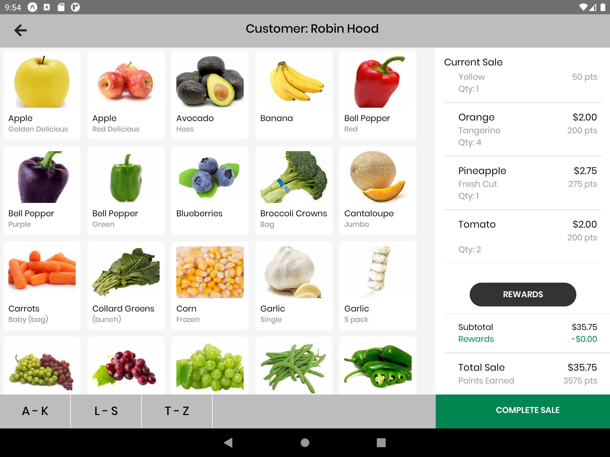 |
| **Complete Sale:**  button to complete a sale. Shows a confirmation popup (see below) Tap when all items and rewards are added and finalized! | 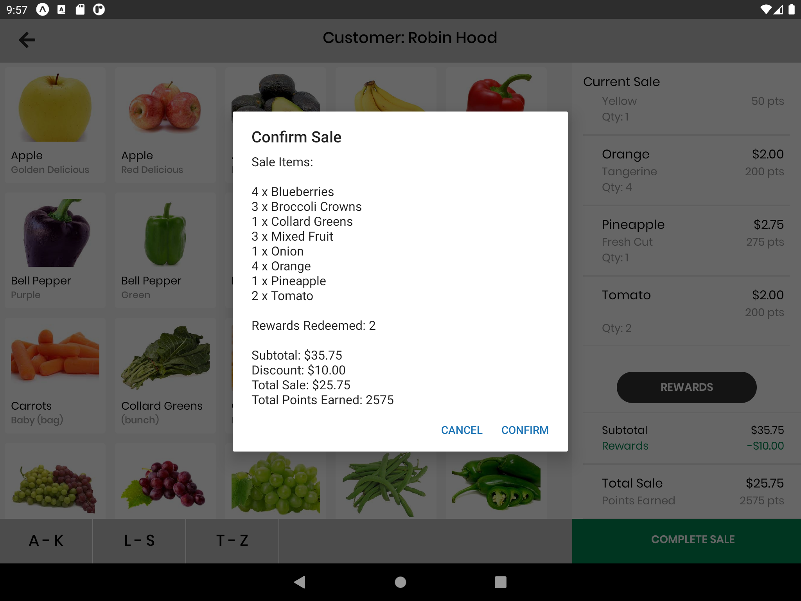 |
| **Confirmation Screen:** shows a summary of the sale.                                                                                         | 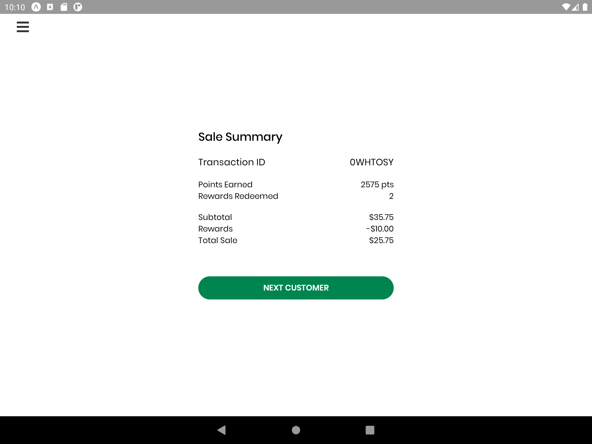 |

To check out another customer, tap`Next Customer`. 

Note that the **menu** is in the top left again — you are able to report issues or log out from here! 

:::tip
To copy the `Transaction ID` for reporting issues, tap and hold the ID on the right. 
:::

## Clerk Training Mode

::: tip
To practice using the clerk system, you can log in to the **Clerk Training Mode!** No sales are recorded here, so you can practice with the checkout system.
:::

### Log in to training mode

1. Enter `CLERK TRAINING` as the store
2. Enter `0000` as the PIN
3. Check that the name in the top left is `Sunny Citrus` — if not, log out from the menu

### Practice checkout

1. The phone number will already be in the input box. Tap `Next`
2. There will be a **yellow bar** at the top of the checkout screen, as shown here :arrow_down:

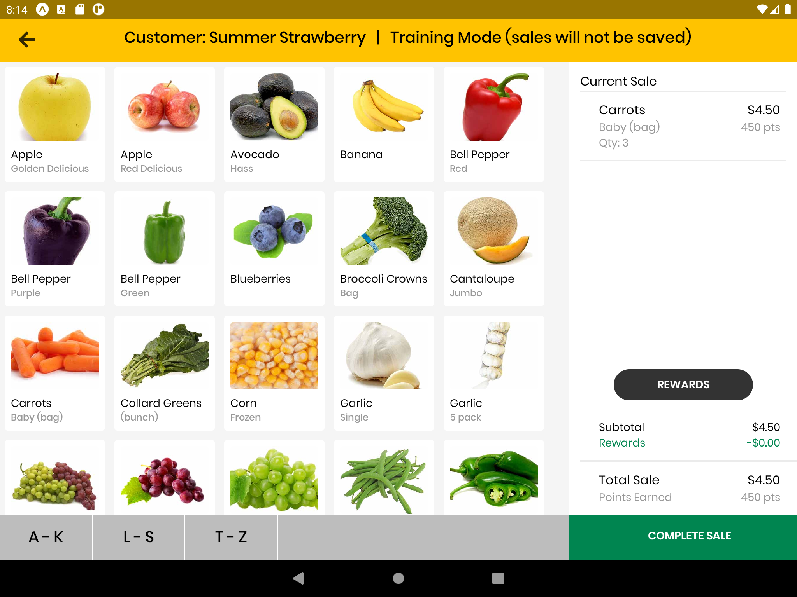

::: details Open this drop down to see Clerk Training Mode
This demo shows a clerk logging into clerk training mode with the pin 0000 and going through checkout. *(run time: 30 seconds)* 

:::

## Register a Customer
You can also register a new customer for the Healthy Rewards program directly from the tablet! Customers are **encouraged** to download the app for additional features, but they are also able to save with the rewards program without having to download the mobile app.

1. Once you're logged into your clerk account (See [Step 1. Log In](#step-1-log-in)), select **`Register a customer`**.
2. Enter the customer's preferred name (does not have to be a full/legal name) and phone number
3. Select **`Register Customer`** to confirm.
4. Once the customer is registered, you will be taken to the checkout screen for this customer -- you can continue to complete checkout for the new customer (See [Step 3. Checkout Products](#step-3-checkout-products) or go back.

Now, the customer will be able to use their phone number to continue earning and redeeming rewards in stores or log into the mobile app!

::: tip
As of 12/23/20, customers can earn a 500 point bonus (redeemable for $5 of free produce) when they register for an account in-store. Customers would receive the same bonus amount if they register on the app.
:::

##  Frequently Asked Questions

### How do I access Clerk Training Mode?

1. If you are logged in, log out by tapping the menu and tapping `Log Out` at the bottom
2. Enter `CLERK TRAINING` as your store and `0000` as your PIN
3. Tap `Next` to continue to checkout (the phone number is already there)

### How do I log out?

1. Tap the menu icon in the top left corner next to your name or "Sunny Citrus" 
2. Tap `Log Out` at the bottom

### How do I cancel a sale (customer phone number wrong or input on accident)?

1. Tap the :arrow_left: Back button in the top left corner 
2. Enter the correct phone number 

### How do I remove a product from a sale?

1. Tap the item in the Current Sale area
2. Enter `0` as the quantity
3. Tap `Update Quantity`

### How many rewards should I apply?

Ask the customer! Tell them how many rewards they have available. 

### Why can't I apply more rewards?

1. The rewards amount is higher than the sale (you can't apply $10 of rewards to a $5 purchase)
2. The customer has no more rewards 

### Something went wrong during a sale. What should I do?

1. Tap and hold the `Transaction ID` if you are still on the confirmation screen
2. Tap the menu button in the top left 
3. Tap `Report Issue` and fill out the form

### Does a customer have to download the customer mobile app to participate in the program?

No! Though customers are encouraged to use the mobile app for additional features like tracking reward progress, the program is designed to be fully usable without the customer mobile app. Whenever the customer checks out in a participating Healthy Rewards store, they just need to give their phone number at checkout to receive points and redeem rewards.