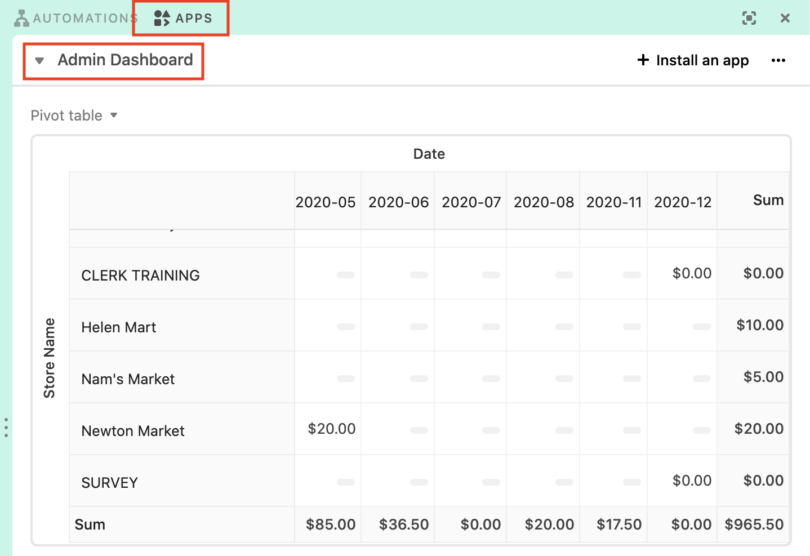

# Managing Healthy Rewards

This guide outlines how to track reimbursements due to stores through the Healthy Rewards program.

## Rewards Reimbursements

In the PROD Airtable base, select **Apps** on the top right to open the Apps panel. On the top left of the panel, pick **Admin Dashboard** from the dropdown.

This pivot table is configured to display the sum of the discounts redeemed by each store, grouped by month. The dollar values indicate the total value of the transactions from customers redeeming rewards.

::: tip Example
Here's an example screenshot from the DEV base (with dummy data). This would mean that in May 2020, Newton Market gave $20 worth of free produce for customers redeeming rewards. 

:::

### Helpful links
- [Airtable Support: Pivot table app](https://support.airtable.com/hc/en-us/articles/115013249307-Pivot-table-app)