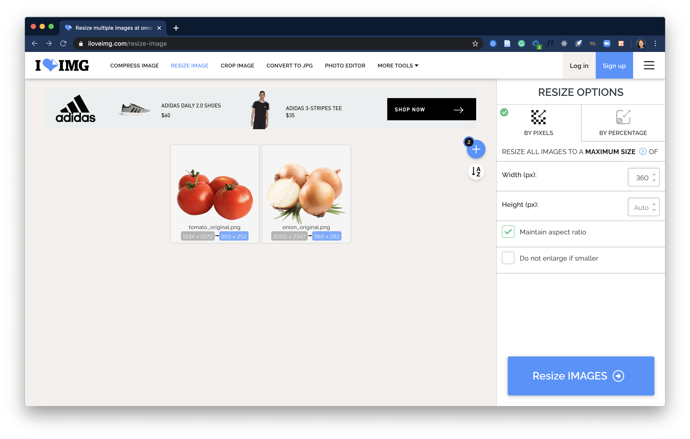

# Processing product images
Image files must be stored in Airtable at a reduced size in order for images to load efficiently in both apps.

These instructions go through how to process the images using <https://www.iloveimg.com/> to save images at standard dimensions with a reduced file size.

## Step 1. Resize the image(s)
1. Go to [this site](https://www.iloveimg.com/resize-image) and upload the product image(s).
   ::: warning
   To save time, you can upload multiple images at a time. However, you **must** upload all **.png**s separately from **.jpg**s in order to complete Step 2.
   :::
2. Under **Resize Options**, select **BY PIXELS** and enter **360px** under width. Make sure that only **Maintain aspect ratio** is selected.
    
3. Select **Resize Images ->**
   
::: warning 
Do not click **Download** yet. These steps can be done consecutively without re-uploading images.
:::

## Step 2. Convert to JPG (for .png files only)
1. Select the yellow square icon in the menu to **Continue to Convert to JPG**
   
2. Select **Convert to JPG ->**
3. If a popup opens to download the image, select **Cancel**.

## Step 3. Compress the image(s)
1. Select the green square icon in the menu to **Continue to Compress Image**
   
2. Select **Compress Images ->**
3. Click **Download compressed images**. This should download either a single image file or a .zip file of the processed images.

## Step 4. Upload processed image(s) to Airtable
If you are uploading the image to an existing record in Airtable:
- Drag and drop the processed image into the **Image** column in the **Products** table
- OR in the **Image** column, click the **+** button to open the file picker to select the file from where you saved it.

If you are uploading the image to create a new product through the [Airtable form](links.html#airtable-forms):
- Drag and drop the processed image over where it says **Drop files here**
- OR select **Attach file**