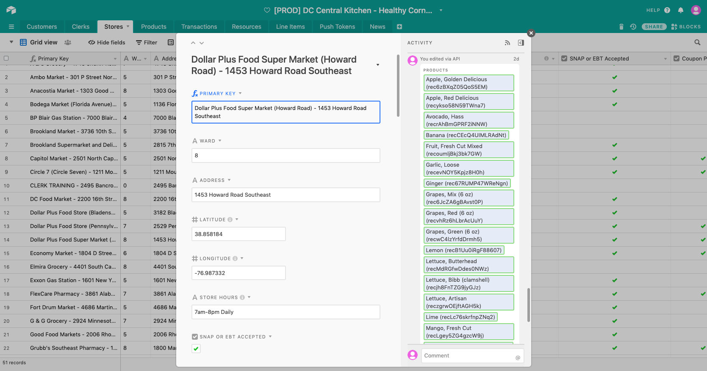
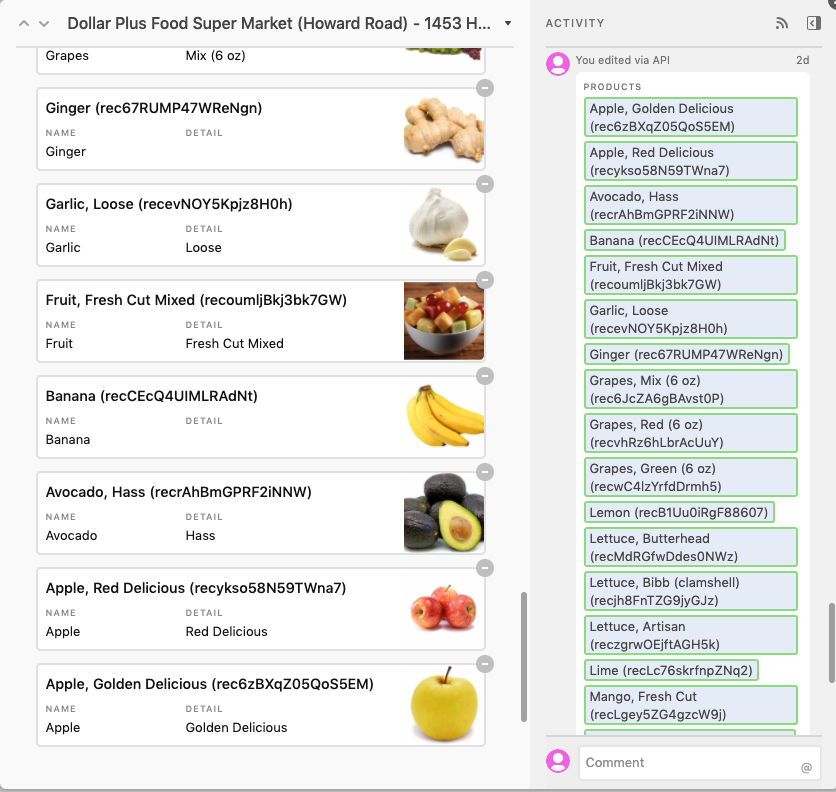
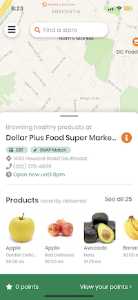
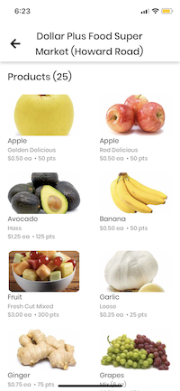

# Scheduled Product Updates

We run a daily job to automatically update a store's current products in Airtable from the most recent deliveries. Currently, the latest delivery information is pulled from the Appian API, which automatically filters out deliveries outside of the determined date range.

::: warning Note
The current date range length (# of days before products are removed from the app) is 9 days. Since this is handled by the Appian API, you will have to ask Appian developers to modify this number.
:::

The "Latest Delivery" column in the Stores table in Airtable displays the latest delivery date to a store within the specified date range. However, that doesn't mean **all updated products** were delivered on that day (i.e consider the case store had multiple deliveries within the specified date range).

Example of an updated Airtable Store record

Note that Airtable keeps a record of revision history, so you can see that the latest delivery to "Dollar Plus Super Market (Howard Road)" must have been two days ago (at time of writing).

::: warning Note
Even though the scheduled update will happen daily, Airtable will only apply **new** updates to a store record.
:::

If you scroll down in the store record, you can see the linked Product records and can add/remove to this list as usual if you need to.

Finally, as a reminder, these are some of the affected views in the customer application. We're looking at the same example store here, so you can see that the changes are reflected directly in the application.
|                        Map view                         |                      Individual store's product list                      |
| :-----------------------------------------------------: | :-----------------------------------------------------------------------: |
|  |  |
