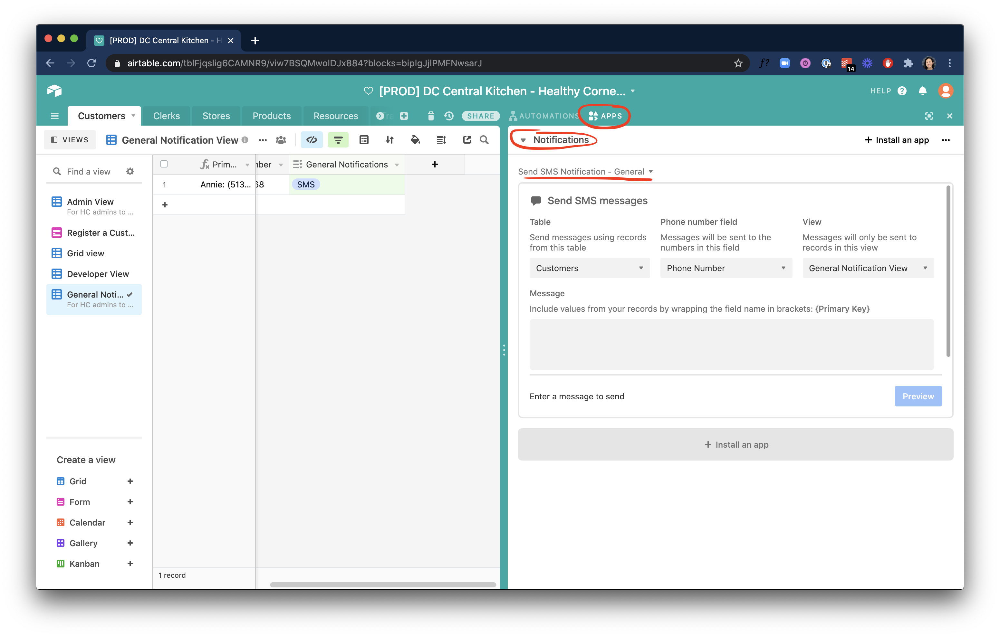

# Sending Notifications

This guide walks describes how admins can directly send SMS (text message) notifications to customers in batches using the Twilio integration in Airtable.

::: warning NOTE
This guide is for **General notifications** ("Discounts and News: Special offers, recommendations, store updates, and more"). Product delivery alerts for customers' favorited stores are handled by a separate automated process.
::: 

## Sending a message



1. In the Airtable base, on the right-hand side of the top bar, select **Apps** to open the apps panel
2. On the dashboards dropdown in the panel, select **Notifications**
3. For the most basic setup, see `Send SMS Notification - General`. This view selects all customers who opted in to receive 'general' SMS notifications. The way this is described to customers in the app is **"Discounts and News: Special offers, recommendations, store updates, and more"**.
   - If you are prompted for your 'API Credentials', you'll need to enter the `Twilio account SID`, `Twilio auth token`, or `Twilio phone number` which you should have access to from handoff credential documentation.
4. Set up the messaging app with the following settings:
   - On the `Table` dropdown, select `Customers`.
   - On the `Phone number field` dropdown, select `Phone Number`
   - On the `View` dropdown, select `General Notifications View`
5. Under `Message`, fill in the content for the message you would like to send.
   - In order to keep messaging styles standardized, try to begin messages with `Healthy Corners:` and end with `Reply STOP to unsubscribe.`:
        ```
        Healthy Corners: [message content] Reply STOP to unsubscribe.
        ```
::: tip
You can use the `{}` brackets around Airtable field names (aka column headings) if you would like to include custom information such as the customer's name.
```
Healthy Corners: Hi {Name}, You're invited to a new event on 1/1/21 at 1234 Healthy Rd. Reply STOP to unsubscribe.
```
would show up as 
```
Healthy Corners: Hi Bob, You're invited to a new event on 1/1/21 at 1234 Healthy Rd. Reply STOP to unsubscribe.
```
:::

## Important things to note
- You can add more messaging apps (`Install an app` -> `Send SMS` -> `Install`) and select different groups of customers to notify by creating new Airtable Views and filters. However, **be careful about sending messages to customers who might not have explicitly opted-in.**
  - Example use cases for more granular filtering could include: 
    - notifying all customers who 'favorited' a particular store about an upcoming event hosted at that store
    - notifying all customers who have earned rewards at a particular store to notify them of a new bonus offer
    - notifying all customers with favorited stores in a particular area that a new Healthy Corners store has joined the network nearby
  - For more info on how to do this, see Airtable's guides on [filters and record visibility](https://support.airtable.com/hc/en-us/articles/360003695134-Guide-to-filters-and-record-visibility) and [Views](https://support.airtable.com/hc/en-us/articles/202624989-Guide-to-views)
- Not all changes in customer preferences are reflected in Airtable. For example, when customers opt out from receiving notifications or if a phone number is invalid (messages cannot be delivered), these issues are handled by the messaging client (Twilio), changes will not be reflected in Airtable. This means that for some customers, even if Airtable shows that they notifications enabled, SMS messages may not actually deliver. You can track failed messages in the Twilio dashboard under <https://www.twilio.com/console/sms/logs?>.
- Messages cost a little over $0.01 per message, and each message is limited at 160 characters in length (longer messages will be split into multiple). The cost is currently covered by a $500 free credit, and as of 12/23/20, the remaining balance is still over $490.


## Helpful links
- [Airtable Support: Send SMS app (includes video)](https://support.airtable.com/hc/en-us/articles/115013405428-Send-SMS-app)