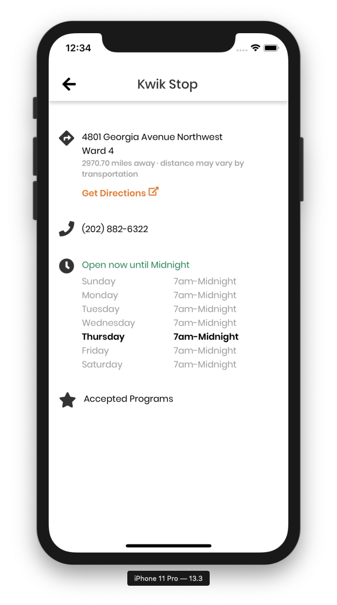
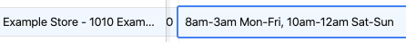

# Formatting store hours

[[toc]]

## Where to edit in Airtable

Table: `Stores`

View: `Admin View`

Column: `Store Hours`


# Overview

In order for the store hours to display correctly, they **must** be entered into Airtable according to these rules. If the store hours are missing or incorrect, the app will automatically display `Store hours unavailable`.

## Rules & Examples

### Time & Day Format Rules

Times and days must follow the following standard formats
|      | Single                                     | Range                         |
| ---- | ------------------------------------------ | ----------------------------- |
| Time | `9am` `8:30pm`                             | `9am-12pm` `8am-1am`          |
| Day  | `Sun` `Mon` `Tu` `Wed` `Thurs` `Fri` `Sat` | `Sun-Wed` `Thurs-Mon` `Daily` |

---

### Dos and Don'ts: Time Formats

| :white_check_mark: Do                        | :x: Don't                                                                                                                |
| -------------------------------------------- | ------------------------------------------------------------------------------------------------------------------------ |
| `12pm`                                       | `12 pm` do not include a space between the hour and am/pm<br/><br/>`12PM` am/pm must be lower case                       |
| `9:30am` Only include minutes when necessary | `12:00pm` Do not include minutes when the time is even on the hour.                                                      |
| `9am-8pm Mon...` Always specify am/pm.       | `9am-8 Mon`  Do not leave ambiguous numbers.                                                                             |
| `9am-12am...` Use 12am for Midnight          | `9am-Midnight` Do not add the word Midnight. Instead, enter `12am` and the app will automatically display it as Midnight |
| `12pm-9pm...` 12pm for Noon                  | `Noon-9pm` Do not add the word Noon                                                                                      |

### Dos and Don'ts: Day Formats

| :white_check_mark: Do                                                                     | :x: Don't                                                                                                                                                                                |
| ----------------------------------------------------------------------------------------- | ---------------------------------------------------------------------------------------------------------------------------------------------------------------------------------------- |
| `12pm-9pm Mon-Thurs, Closed Fri` Follow the required day abbreviations                    | `12pm-9pm Monday-Thursday, Closed Friday` Do not use full day names <br/><br/>`12pm-9pm M-Th, Closed F` Do not use any other types of abbreviation                                       |
| `8am-8pm Mon-Tu, Closed Wed, 8am-8pm Thurs-Sun` <br/><br/> `8am-8pm Thurs-Tu, Closed Wed` | `8am-8pm Mon-Sun, Closed Wed` Wed is between Mon and Sun, so the date range should end before and after Wed               <br/><br/>`8am-8pm Mon-Wed, 9am-9pm Wed` Wed is included twice |


### Combining the Time and Day

::: callout The time must always go before the day or day range.
`Time` **{SPACE}** `Day/DayRange`...

```
9am-12pm Sun
8:30am-12am Mon-Fri
```

:::

| Rule                                      | :white_check_mark: Do                                              | :x: Don't                                                                                                                                                                                                                                          |
| ----------------------------------------- | ------------------------------------------------------------------ | -------------------------------------------------------------------------------------------------------------------------------------------------------------------------------------------------------------------------------------------------- |
| If a store is open 24/7                   | `Open 24/7`                                                        | `12am-12am Daily`                                                                                                                                                                                                                                  |
| Always put time before the day/day range  | `9am-12pm Mon-Fri, 8am-8pm Sun-Sat`<br><br>`Closed Sun`            | `Mon-Fri 9am-9pm, Sun-Sat 8am-8pm`<br><br>`Sun Closed`                                                                                                                                                                                             |
| Do not add any extra words or punctuation | `Open 24/7`<br><br>`8am-8pm Mon-Tu, Closed Wed, 8am-8pm Thurs-Sun` | `8am--8pm Mon-Tu; Closed: Wed!` Do not use any other symbols like `--` `;` `:`<br> <br>`Open 9am-9pm Mon-Fri, Closed Sat` Do not add words UNLESS it is `Open 24/7`<br><br>`Mon-Tu: 8am-8pm; Fri-Sun: Closed;` Reversed & using incorrect symbols. |

## Input Scenarios & Examples

These example scenarios show how to apply the time and date rules above to make sure store hours display properly in the app.

| Scenario                                                                      | Input Example                           |
| ----------------------------------------------------------------------------- | --------------------------------------- |
| [1. Different hours on different days](#_1-different-hours-on-different-days) | 9am-7pm Sun, 9am-8pm Tu-Sat, Closed Mon |
| [2. Same hours every day of the week](#_2-same-hours-every-day-of-the-week)   | 8am-10pm Daily                          |
| [3. Open 24/7](#_3-open-24-7)                                                 | Open 24/7                               |
| [4. Store closes after midnight](#_4-store-closes-after-midnight)             | 8am-3am Mon-Fri, 10am-12am Sat-Sun      |
| [5. Store hours unavailable](#_5-store-hours-unavailable)                     | Store hours unavailable                 |

### 1. Different hours on different days

::: callout Input Format
`OpeningTime`**{-}**`ClosingTime`**{SPACE}** `Day/DayRange`**{,}{SPACE}**...

```
OpeningTime-ClosingTime Day/DayRange, NextOpeningTime...
```

Repeat this pattern for the number of days/day ranges with varying hours.
:::

::: tip Ex. A & S Grocery: 9am-7pm Sun, 9am-8pm Tu-Sat, Closed Mon
**Airtable Input**

```
9am-7pm Sun, 9am-8pm Tu-Sat, Closed Mon
```


::: details Resulting Display

:::

### 2. Same hours every day of the week

::: callout Input Format
`OpeningTime`**{-}**`ClosingTime`**{SPACE}** **Daily**

```
OpeningTime-ClosingTime Daily
```

:::

::: tip Ex. Brookland Market: 8am-10pm Daily
**Airtable Input**

```
8am-10pm Daily
```


::: details Resulting Display

:::

::: tip Ex. Kwik Stop: 7am-12am Daily
**Airtable Input**

```
7am-12am Daily
```


::: details Resulting Display

:::
::: warning Warning: stores that open/close at midnight
The time must be entered into Airtable as **12am** . The app will automatically convert this to display **Midnight**.
:::

### 3. Open 24/7

::: callout Input Format
`Open 24/7`

```
Open 24/7
```

:::

::: tip Ex. Circle 7 (Circle Seven): Open 24/7
**Airtable Input**

```
Open 24/7
```


::: details Resulting Display

:::

### 4. Store closes after midnight

::: callout Input Format
`OpeningTime` **{-}** `ClosingTimeOnNextDay(am)`**{SPACE}** `OpenDay/Range`...

```
OpeningTime-ClosingTimeOnNextDay(AM) OpenDay/Range...
```

:::

::: tip Ex. 8am-3am Mon-Fri, 10am-12am Sat-Sun
In the example below, even though the store opens until `3am` the following day, enter the closing time with the same day that the opening time corresponds to.

**Airtable Input**

```
8am-3am Mon-Fri, 10am-12am Sat-Sun
```



::: details Resulting Display

:::

::: danger Incorrect Input Examples
:x: `8am-12am Mon-Fri, 12am-3am Mon-Fri...`

:x: `8am-12am Mon, 12am-3am Tu...`

Do not split the days at midnight. Do not include any day more than once.

:::

### 5. Store hours unavailable

::: callout Input Format
`Store hours unavailable`

```
Store hours unavailable
```

:::

::: tip Ex. Smiley Mart: Store hours unavailable
**Airtable Input**

```
Store hours unavailable
```


::: details Resulting Display

:::

## Additional Considerations

### Closed on some day(s)

If a store is closed on some day(s) of the week, **either of the following input formats will work**.

::: callout Option 1: Add 'Closed...'

...**Closed** **{SPACE}** `Day/DayRange`

```
8am-8pm Tues-Sun, Closed Mon
9am-10pm Mon-Fri, Closed Sat-Sun
```

:::
::: callout Option 2: Omit the day

```
8am-8pm Tues-Sun
9am-10pm Mon-Fri
```

:::

## Not Supported

The app does not support the following scenarios. If any of the following are true, see [5. Store hours unavailable](#_5-store-hours-unavailable).

- Multiple sets of hours throughout a single day: ex. Open Monday 8am-12pm **_and_** 1pm-9pm
