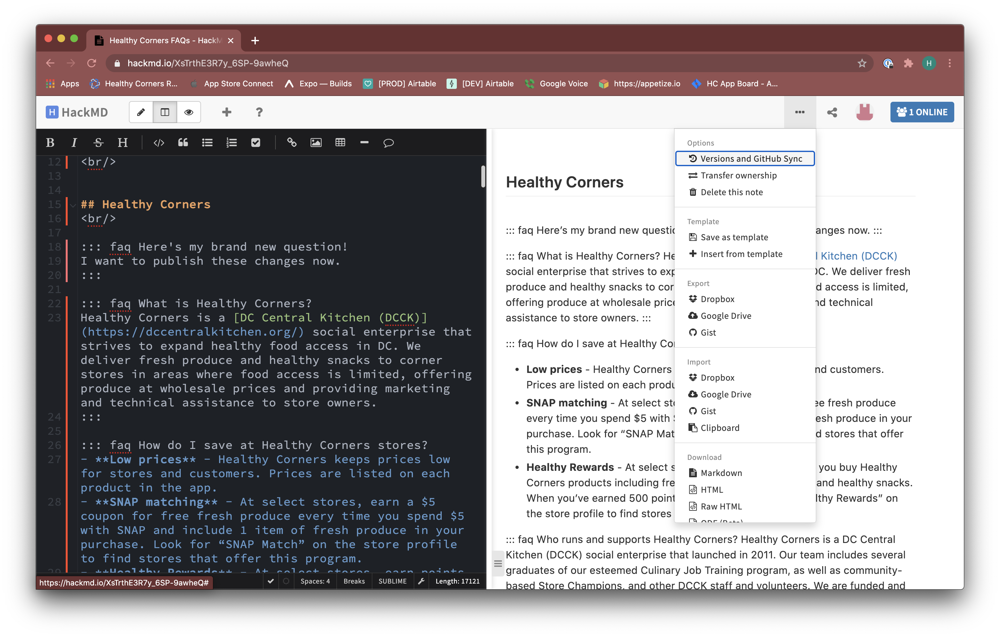

# Updating Documentation

This guide outlines how **Admins** can update the Clerk Training guide, FAQs, and Privacy Policy hosted on this site. To edit the contents of other documentation pages, we recommend asking a developer. 

If you are a developer, see the section on [Editing this site](../../#editing-this-site) or the [developer guide to Updating FAQs](../customer/updating-faqs.html#updating-faqs).

## HackMD Overview
[HackMD](https://hackmd.io/) is a web-based Markdown editor that allows you to edit Markdown files that are hosted in Github.

1. On <https://hackmd.io>, select **Sign in with Github** and authenticate with your Github account. Your Github account must have at least Write access to the [dccentralkitchen](https://github.com/calblueprint/dccentralkitchen) repository to be able to contribute.
2. Once you're logged in, using a dropdown on the left sidebar, make sure to select the `Healthy Corners` team/workspace.
.
3. In the workspace, you should see 5 files.
   1. **Untitled** - this is the mini-FAQ page with 'featured' FAQs that is embedded in the app. Since the page is designed to fit seamlessly into the app, it does not have a title. [Live preview link](../faq-mini.md)
        ::: warning
        Since the mini FAQ page name of 'Untitled' isn't editable, be careful not to accidentally delete this page!
        :::
   2. **Healthy Corners FAQs** - this is the full FAQ page that is linked in the customer app. [Live preview link](../faq.md)
   3. **Clerk Training Guide** - this is the primary Clerk Training guide that is linked in the Clerk app menu. [Live preview link](clerktraining.md)
   4. **Clerk Training Gif Demos** - this page includes all the gif demos created by Ace for the 'condensed' clerk training guide. It's unlikely you'll need to modify this page, but it's included just in case. [Live preview link](clerktraininggifs.md)
   5. **Healthy Corners App Privacy Policy** - this is the Privacy Policy that is included in the app listings on the App Store and Google Play store, and also linked within the customer app. [Live preview link](../shared/privacypolicy.md)

::: warning NOTE
The pages loaded in HackMD were selected as pages most relevant to Admins that may need to be edited. Github permissions don't allow non-Blueprint accounts to load additional files into the HackMD workspace, so if you need to modify any other pages, reach out to a developer to make the edits through the code, or reach out to Annie Wang to add the page to HackMD.
:::

## Using Markdown

Before making any edits for the first time, I *strongly* recommend spending 10-15 minutes to go through [this Markdown tutorial](https://www.markdowntutorial.com/) to familiarize yourself with the basics of Markdown. Though thorough language expertise is not *required* to make basic edits, it helps to make the experience less intimidating!

Even for people familiar with Markdown, a lot of the experience is trial and error (making a small change in the code and seeing how it shows up). As long as you keep an eye on the preview panel as you make changes, it should be fairly straightforward!


::: warning 
The version of Markdown used on the documentation site is slightly modified with custom components. This means the previews for certain elements may not exactly match how it would look in the real site. Additionally, most images that are sourced from files instead of links will not display.
:::

## Editing Documents

The following instructions are applicable to editing *any* of the documents.

1. First, open the document in HackMD. Make sure to use the split screen mode where you edit on the left panel and preview the results on the right. If this isn't automatically enabled, you can select it on the top left menu.
2. Next, go to the three dots (•••) menu on the top right, and select **Versions and GitHub Sync**. 
3. Click **Pull**. This panel should compare the version in HackMD with the version in GitHub (published publicly) and highlight changes (if any). You should be able to select **Apply all changes** to update the HackMD version to the latest in GitHub.
4. Now, the file should be up to date and you can begin to make edits.

::: tip
These steps (pulling from Github) are *essential* to make sure there are no conflicts between the HackMD version and the live version! Since HackMD does not automatically sync, make sure you Pull changes every time before editing, even if it's unlikely the file has been edited since you last used it.
:::


## Editing FAQs

In the FAQ section, we use custom-built FAQ components to make the dropdowns.

### Component Overview
<br/>

::: faq Here is the question. Click to open the answer.
Here is the answer in a dropdown
:::

``` md
::: faq Here is the question. Click to open the answer.
Here is the answer in a dropdown
:::
```

This is an FAQ block. The block starts with three colons and 'faq' (`::: faq`). Everything included in the same line as `faq` is included as part of the 'question' (the part that shows when the dropdown is collapsed).

``` md {1}
::: faq Here is the question. Click to open the answer. 
Here is the answer in a dropdown
:::
```


Everything between the first `faq` line and the ending `:::` is the contents of the block, aka the answer. The closing `:::` indicates the end of the block, so anything after that is not included as part of the block.

``` md {2}
::: faq Here is the question. Click to open the answer. 
Here is the answer in a dropdown
:::
```

### Editing an FAQ block

To edit an existing FAQ, you should not need to modify any of the `:::`s. Simply find the relevant section in the page and modify the text contents directly. You can use the built-in editing tools above the edit panel to do things like add hyperlinks, lists, images, tables, etc.


### Adding an FAQ block

To add a new FAQ block, paste the following code as a template and modify the contents as needed.
``` md
::: faq YOUR QUESTION HERE
All of this is your answer.

Your answer can be multiple lines.
1. It can also include numbered lists
2. Like this.

Or, it can include bulleted lists:
- Like this
- and this

It can also include a hyperlink like [THIS LINK TO GOOGLE](http://google.com/).
:::

```


**Here's how the code above would look on the website**

::: faq YOUR QUESTION HERE
All of this is your answer.

Your answer can be multiple lines.
1. It can also include numbered lists
2. Like this.

Or, it can include bulleted lists:
- Like this
- and this

It can also include a hyperlink like [THIS LINK TO GOOGLE](http://google.com/).
:::


### Adding an FAQ Section Heading

To add a new section heading, you can use the **H** (heading) button in the editor, or paste in the following code
```
<br/>
## Healthy Rewards 
<br/>
```
The `<br/>` tags indicate extra line breaks for spacing. Though the changes might not be reflected in the HackMD preview, these do add extra lines when published.

### Modifying the mini/featured FAQs

The 'mini' FAQ page is essentially a few selected questions from the full FAQ page without any headings. If you modify any content in the full FAQ, make sure to replicate those changes in the mini FAQ if applicable. 

To add/edit/remove content on the mini FAQ, you can simply copy/paste content from the full FAQ, or delete FAQ blocks by deleting everything between a set of `:::` indicators.

Be careful not to include too much content in the 'mini FAQ' to make sure the page does not get too crowded in the app.

## Publishing changes
1. When you're done making changes, click the three dots (**•••**) in the top right and select **Versions and GitHub Sync**

2. You should see a panel where your changes are highlighted in red/green. First, look through your changes to make sure you haven't made any extra edits on accident.
3. Once you're confident in the changes, select **Push** on the top right.
4. Under **Select branch**, make sure the branch is 'docs'. Confirm that **Save a new version and push** is selected. In the **Name** field, enter a brief description of the change (e.g. "Added questions about coupons" or "Updated broken links").
5. Finally, click **Push** to publish the changes.
6. Once changes are successfully pushed, changes should be reflected on the public site within a few minutes.


## Helpful links

- [Github's Mastering Markdown Guide](https://guides.github.com/features/mastering-markdown/)
- [HackMD's Tutorial: Keep your note in sync with Github (includes GIFS)](https://hackmd.io/c/tutorials/%2Fs%2Flink-with-github#Keep-your-note-sync-with-GitHub)
- <https://www.markdowntutorial.com/> - a great interactive Markdown tutorial