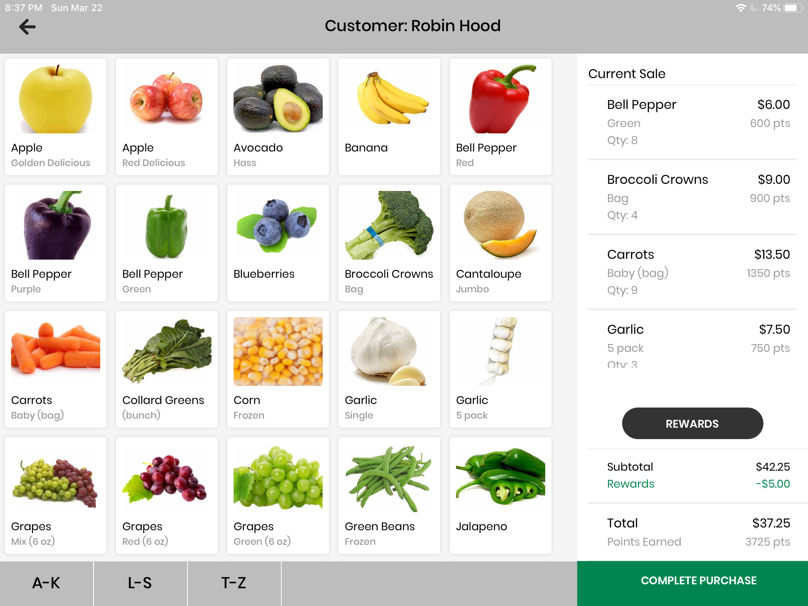
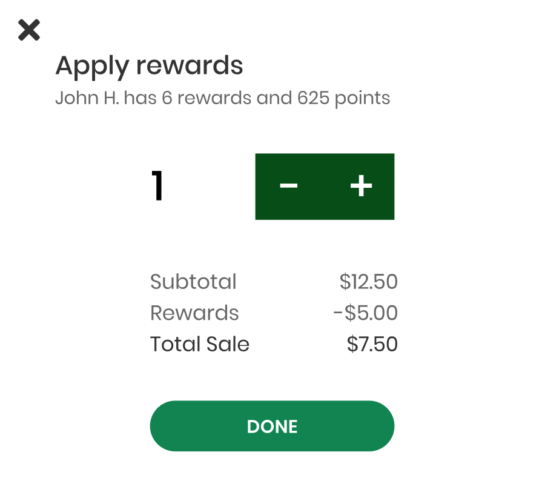
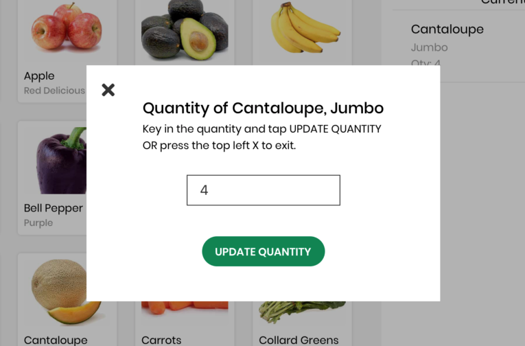

# Checkout Screen

This guide covers the basic components of the Checkout Screen.



## Current Sale (line items)

Line Items are records detailing the purchase of a specific product in a single transaction. They allow us to keep a record of specific purchases made in individual transactions, as can be seen in the Transactions table.

## Transactions

Upon confirmation of a transaction, a transaction record is created in the **Transactions** table.

```jsx
// checkoutUtils.js
export async function addTransaction(customer, cart, transaction) {
  const storeId = await AsyncStorage.getItem('storeId');
  const clerkId = await AsyncStorage.getItem('clerkId');

  const {
    discount,
    subtotal,
    totalSale,
    pointsEarned,
    rewardsApplied,
  } = transaction;

  const transactionId = await createTransactions({
    customerId: customer.id,
    currentPoints: customer.points,
    storeId,
    clerkId,
    pointsEarned,
    rewardsApplied,
    subtotal,
    discount,
    totalSale,
  });

  // A list of ids for line items from the transaction.
  const itemIds = await calculateProductsPurchased(cart);

  // productsPurchaseIds - airtable-schema-generator depluralizing bug
  await updateTransactions(transactionId, { productsPurchaseIds: itemIds });

  return transactionId;
}
```

## Modals

We use the `react-native` built-in `Modal` component. To have the modal display with a transparent background over the `CheckoutScreen` content, we wrap the modal contents (`ModalContentContainer`) in another view (`ModalCenteredOpacityLayer`), styled to have `background-color: rgba(0, 0, 0, 0.3)`. Each of our `Modal` components needs a `callback` function passed in as a prop in order to communicate back to its parent `CheckoutScreen` when the button is pressed.

::: danger
Both modals use `componentWillReceiveProps` to correctly update state when modals are closed, then re-opened. We are aware that this method is deprecated, but exceeded the set timebox when we attempted to refactor the code away from it. The motivation was because we need to track members of each modal's internal state independently of props, but we also needed to update certain other members of the modal according to props.

In the future, this will need to be updated.
:::

### Rewards Modal



The rewards modal is, in sum, tricky.

One reason is that we allow customers to use an additional reward if the current total sale is not evenly divisible by `rewardsValue`, e.g if a customer's cart adds up to \$12.50 and they have 3 rewards available, they are able to apply up to 3 rewards. We implement this by implicitly recording a negative `totalBalance`, then displaying only balances **greater than zero** when rendering the component.

Another is that it **must** always correctly display the `Total Sale` and calculate the correct number of rewards the customer **is eligible to** use given that updated value. However, it also needs to 'remember' the number of rewards applied the last time the user opened the modal. Thus, we run the `_updateState` function every time the modal is re-opened, and when props change using `componentWillReceiveProps.

The `calculateEligibleRewards` function encapsulates the mathematical logic for how many rewards a customer can apply at this time.

```javascript
// Calculate eligible rewards
/* If negative balance exists, no additional rewards allowed!
  Must take into account the current rewards applied
  */
export function calculateEligibleRewards(rewardsAvailable, rewardsApplied, totalBalance) {
  const additionalRewardsAllowed = totalBalance > 0 ? Math.ceil(totalBalance / rewardDollarValue) : 0;
  const additionalRewardsAvailable = rewardsAvailable - rewardsApplied;
  const additionalRewardsEligible = Math.min(additionalRewardsAllowed, additionalRewardsAvailable);
  return rewardsApplied + additionalRewardsEligible;
}
};
```

This modal has various states, which can be seen in the [design prototypes](./../design.md). If at min, the left button becomes disabled. If at max, the right button becomes disabled and an error message is briefly shown.

```javascript
// render function
const min = rewardsApplied === 0;
const max = rewardsApplied === rewardsEligible;
const discount = rewardDollarValue * rewardsApplied;
const totalSale = totalBalance >= 0 ? totalBalance : 0;
const actualDiscount = totalBalance < 0 ? discount + totalBalance : discount;
```

`handleApplyRewards` runs when the button is pressed, and calls the `props.callback` function (`applyRewardsCallback` in `CheckoutScreen`).

### Quantity Modal



The quantity modal can be triggered by either the `ProductDisplayCard` or `LineItemCard` from the clerk application UI, but in code we use the same component and pass in a `isLineItem` prop to decide which card type to render, wrapped by the modal so that the modal triggers on click.

`handleUpdateCart` runs when the button is pressed, and calls the `props.callback` function (`updateQuantityCallback` in `CheckoutScreen`).

This modal is relatively straightforward.

Edge cases:

- Empty text field: 'update' button is disabled
- Non-integer values: only accepts integer input
- Closing the modal before hitting 'update': modal will **always** show the **current quantity** of an item upon open.

It's due to this last edge case that the Quantity Modal also relies on `componentWillReceiveProps` to re-update its internal state (_thinking about it now, the quantity modal can likely be easily refactored with `componentWillUpdate`_)

The complexity of the rewards modal internal state also meant that we needed to modify `updateQuantityCallback` in `CheckoutScreen` to account for an edge case. Hypothetically, if someone were to add items to the cart (via the quantity modal), apply rewards, then remove items from the cart, the customer may need to be "refunded" a reward.

Additionally, because we allow customers to apply one extra reward the math is a little difficult to follow, but we've tried to document it with inline comments.

```javascript
// Special case: negative balance when rewards have been applied, but need to be restored
      // i.e rewardsValue * rewardsApplied > cartTotal after quantity drops
    } else if (newBalance < 0) {
      // MUST take absolute value first, otherwise will be incorrect
      const rewardsToUndo = Math.ceil(Math.abs(newBalance) / rewardDollarValue);
      // This keeps the "extra" reward UNAPPLIED by default. To swap it, take the remainder instead
      // updatedBalance: rewardDollarValue + (- remainder) = "unapplying" an extra reward
      this.setState((prevState) => ({
        cart: update(prevState.cart, { [product.id]: { quantity: { $set: quantity } } }),
        totalBalance:
          // If the remainder is less than 0, updatedBalance = rewardDollarValue + (negative) remainder
          (prevState.totalBalance + priceDifference) % rewardDollarValue < 0
            ? rewardDollarValue + ((prevState.totalBalance + priceDifference) % rewardDollarValue)
            : (prevState.totalBalance + priceDifference) % rewardDollarValue,
        rewardsApplied: prevState.rewardsApplied - rewardsToUndo,
      }));
    }
```

### PR Links

[Clerk PR #14: Quantity modal, initial rewards modal implementation](https://github.com/calblueprint/dccentralkitchen-clerks/pull/14)

[Clerk PR #19: Redesigned rewards modal, styling cleanup for both modals](https://github.com/calblueprint/dccentralkitchen-clerks/pull/19)

## Scrollbar

### Overview

The alphabetical scrollbar allows clerks to quickly navigate to different products with names within certain letters. For example, the "L-S" tab scrolls to the Lemon product card, which is the first product starting with a letter in the given range.

_Note_: The tab will always scroll to the first product card with a name starting with any letter in the letter range, provided that products are displayed in alphabetical order in the products container.


#### Relevant files

`CheckoutScreen.js`

#### Original PR

[Clerk PR #20: alphabet scrollbar](https://github.com/calblueprint/dccentralkitchen-clerks/pull/20)

### Methods

`getIndexOfFirstProductAtLetter` returns the index of the first product that falls within the letter range corresponding to the tab selected. It takes in the first letter in the range, as a string.

The index is later used to calculate the row number the product card is in on the screen, given that there are five columns of products on the tablet screen.

```jsx
// Returns index of the first product with a name starting with the given letter in products list.
// If no product starting with that letter exists, find the next product.
getIndexOfFirstProductAtLetter = (letter) => {
  let prodList = this.state.products.filter(
    (product) => product.name.charAt(0) === letter
  );
  let nextLetter = letter;
  while (prodList.length === 0) {
    nextLetter = String.fromCharCode(nextLetter.charCodeAt(0) + 1);
    prodList = this.state.products.filter(
      (product) => product.name.charAt(0) === nextLetter
    );
  }
  return this.state.products.indexOf(prodList[0]);
};
```

`alphabeticalScrollTab` takes in a letter range label and a letter, both strings, and returns a tab to be rendered in the scroll bar on the checkout screen.

The index of the product in the products list divided by 5 gives us the row number of the product on the screen. Since the height of each product card is roughly `160px`, the row number multiplied by 160 gives us the y-coordinate of the card in pixels.

```jsx
// Takes in strings tab label (i.e. "A-K") and starting letter (i.e. "A") and returns a
// tab for the bottom alphabetical scroll bar.
alphabeticalScrollTab = (label, letter) => {
  return (
    <TabContainer
      onPress={() =>
        this._scrollView.scrollTo({
          y: Math.floor(this.getIndexOfFirstProductAtLetter(letter) / 5) * 160,
        })
      }>
      <Title>{label}</Title>
    </TabContainer>
  );
};
```

### Quickscroll Functionality in a ScrollView

We add a `ref` to an existing ScrollView that we want to scroll through.

```jsx
<ProductsContainer
  ref={scrollView => {
    this._scrollView = scrollView;
  }}>
```

Each tab calls the ref's `scrollTo` method to quickscroll to a different y coordinate.

_Note_: Using this same logic, it's also possible to scroll horizontally by providing an x coordinate. For our purposes, we only want to scroll up and down the products container.
