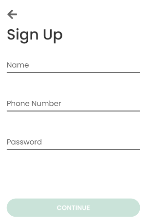
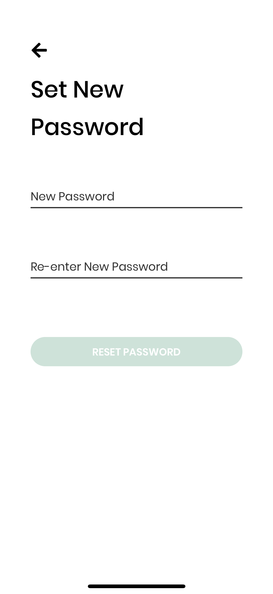

# Authentication
This document covers the main components of the customer authentication flow, including Onboarding, Sign Up, Log In, Password Reset, SMS Verification, and Guest mode.
[[toc]]

## Auth Screens
This section runs through the user flow of the Customer Auth stack, and will touch on all the different screens and possible ways to modify them.

::: tip
Read [React Navigation 5](./navigation.md) for a detailed overview of what a stack is, and the different stacks that exists within the app.
:::

Flow Diagram Taken from [React Navigation 5 Documentation](./navigation.md)

The current screens that exists in the Customer Auth stack are:
- `OnboardingScreen`
- `WelcomeScreen`
- `SignUpScreen`
- `LogInScreen`
- `PasswordResetScreen`

### `OnboardingScreen`

- A screen that shows a carousel of important information summarizing what the application does
- There are two buttons brings the user to different pages
    - **Log In** – brings the user to the `LogInScreen`. For users who already have an account to immediately log in.
    - **Get Started** – brings the user to the `WelcomeScreen`, which is further described below.

#### Modifying the onboarding content

- Navigate to the file `constants/Onboarding.js`, which contains all the content (text and illustration) of the different screens

### `WelcomeScreen`

- Screen that shows three available buttons
    - Log In – brings the user to the `LogInScreen`.
    - Sign Up – brings the user to the `SignUpScreen`.
    - **Continue without an account** – allows user to immediately use the App as a Guest.
### `SignUpScreen`

- Screen for user to input their information to sign up for an account.

### `LogInScreen`

- Screen to allow existing users to log in.
- For users who forgot their password, there is a **Forgot password?** button that brings the user to the `PasswordResetScreen`

### `PasswordResetScreen`

- Screen that brings the user through the flow of resetting the password

## Adding a new screen

- Create a new screen file in the `screens/auth` folder
- Add the screen to the `navigation/stack_navigators/AuthStack.js` file

## SMS Verification

Phone authentication is handled using Google Firebase through Expo, and imported as `expo-firebase-recaptcha`.

It is used on: 
- `SignUpScreen`
- `LogInScreen`
- `VerificationScreen`
- `PasswordResetScreen`
  
### Firebase setup
#### Configuration and Usage

Firebase is already configured in the app from `firebase.js` and initialized in `SignUpScreen.js.`

To make edits to the configuration (in the case of changing API keys, database urls, and etc.), changing them in `firebase.js` should be sufficient. If you initialize firebase from elsewhere in the app, be sure to delete `firebase.initializeApp(firebaseConfig);` from `SignUpScreen.js`.

We currently use it purely for phone number authentication (to read more on how that works, see Phone Authentication in this documentation directory).

If you do choose to add other methods of verification, see below to make the correct edits to the console, and follow provided guides on how to implement those.

#### Using the [Firebase Console](https://console.firebase.google.com/)

To configure other methods of authentication, or change any vital settings, please consult the console and relevant guides provided by Google.

### Workflow
#### Signing Up
Clicking Create Account triggers the reCaptcha modal (provided by imports) to pop up. Upon successful anti-robot verification, setModalVisible is called to pull up `VerificationScreen`. This prompts the user to enter the verification code. On successful entry, the modal calls functions that have been passed in to complete account creation.

#### Forgot Password
Pressing forgot password prompts the user to enter their phone number, which if successful, triggers the reCaptcha modal (provided by imports) to pop up. Upon successful anti-robot verification, setModalVisible is called to pull up `VerificationScreen`. This prompts the user to enter the verification code. On successful entry, the modal calls functions that have been passed in to allow new passwords to be created.

#### Relevant PRs
- [Customer #97: Phone Number Authentication + Forgot Password Functionality](https://github.com/calblueprint/dccentralkitchen/pull/97)
#### Helpful links
- <https://expo.canny.io/feature-requests/p/phone-number-auth-with-firebase>
  

## Guest mode
Guest Mode allows users to access non-rewards features of the app without the need for an account.

Guest Mode relies on a dummy account on Airtable with the number ########## so that no one can intentionally log in as a guest.

::: warning
This Guest record must not be deleted from the Customers table or the record ID will not match.
:::

Throughout the app, the guest id is stored as a constant and used to check if the user is currently signed in as a guest. If so, the entirety of the rewards features are turned to pointers to create an account, but the user still retains access to [resources](resources.md), [settings](settings.md), and the ability to search and filter stores.

See [Customer PR #74: Guest Mode](https://github.com/calblueprint/dccentralkitchen/pull/74)
