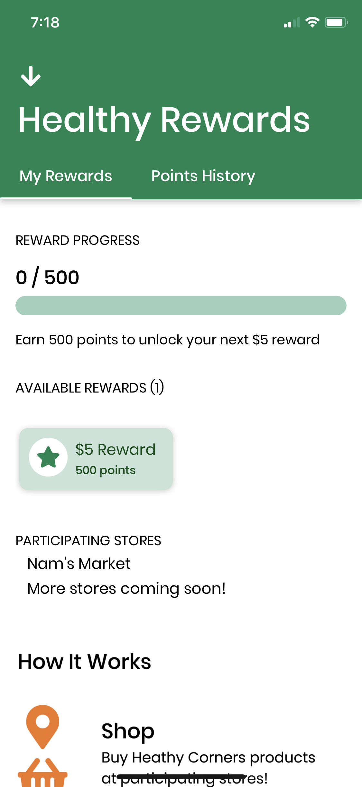
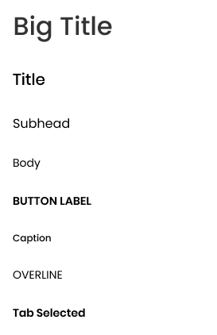
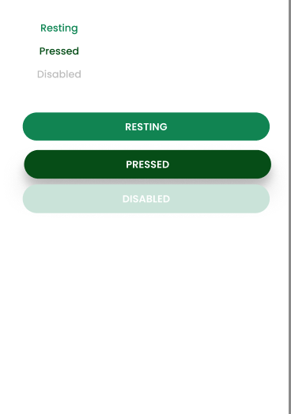

# Styling
Created By: Kenneth Lien

## Base Components

If you find yourself adding something that is used throughout the application (e.g. a new styled button) rather than having it confined to one screen or one location, consider making it into a base component as to reduce repetitive code/importing from different locations.

## Rundown of Base Components

## Buttons

### `ButtonLabel`
- `ButtonLabel`: Used to add text to button containers.
- `ButtonContainer`: Just a sized TouchableOpacity.
    
    ``` jsx
    // Source: WelcomeScreen.js
    <ButtonContainer onPress={async () => this.guestLogin()}>
        <ButtonLabel style={{ textTransform: 'none' }}
            color={Colors.primaryGreen}>
            Continue without an account
        </ButtonLabel>
    </ButtonContainer>
    ```
- `FilledButtonContainer`: Rounded button that is green by default, but color props and rounding can be passed in.
    ``` jsx
    <FilledButtonContainer
        color={Colors.lighterGreen}
        width="100%"
        onPress={() => this.navigateLogIn()}>
        <ButtonLabel color={Colors.lightest}>Log In</ButtonLabel>
    </FilledButtonContainer>
    ```
## Navigation Headers


TODO: reevaluate
- `TextButton`: Used as a base of other buttons
- `CircleIconContainer`: Used to add FontAwesome icons to various things, such as rewards cards and transactions.



Here's a solid example. We have the entire header in a `NavHeaderContainer`, the $5 reward with a `CircleIconContainer`, and a `NavButton` on the top left.

### Base Text Components

For convenience, here is a list of the text components with a visual graphic of which is which.

- `BigTitle`
- `Title`
- `Subhead`
- `Body`
- `Caption`
- `Overline`
- `TabSelected`

    

## Colors

Various colors used throughout the app have been defined in `Colors.js`

<<< @/constants/Colors.js

They won't be listed here, but here are screenshots of the colors and button usage.




## Rundown of Shared.js

`shared.js` contains a variety of styled containers to format components. For simplicity, the names are intuitive. There are the following:

- `RowContainer`
- `ColumnContainer`
- `InLineContainer`
- `SpaceBetweenRowContainer`
- `SpaceBetweenColumnContainer`
- `SpaceAroundRowContainer`
- `ScrollCategory`
- `PoppinsText`
- `JustifyCenterContainer`

We can see things like `JustifyCenterContainer` used to center buttons on screens such as `SignUpScreen.js.`Use shared/ to find components to format.

## When to create a base component/shared component

If you find yourself using a fairly styled component throughout the app (say, a fun looking button!), it's time to make that a base component to reduce redundant code.

If you're trying to align components in a fun way, check `shared.js` first, and if it's not there, add a container so that it can be reused in the future!