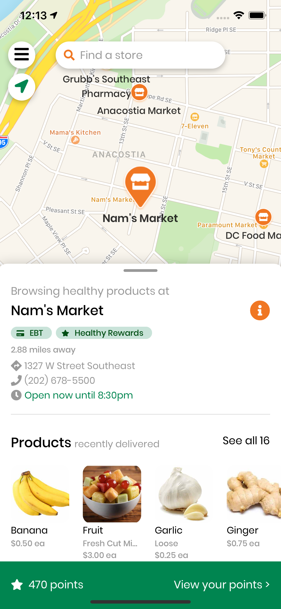
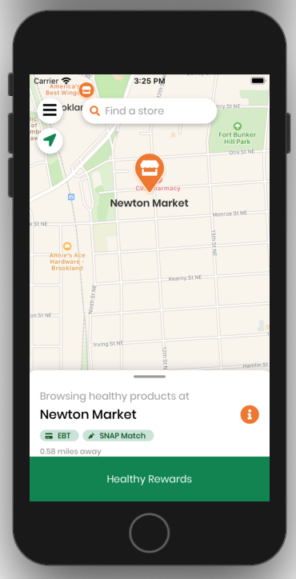
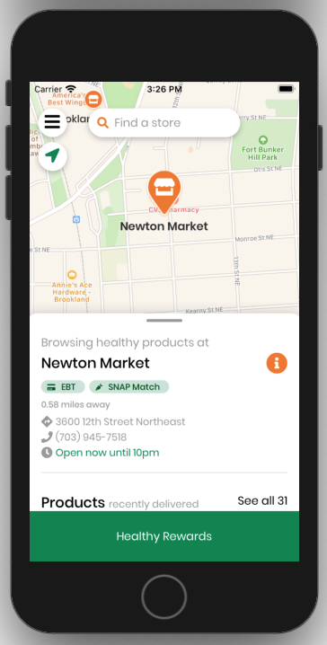
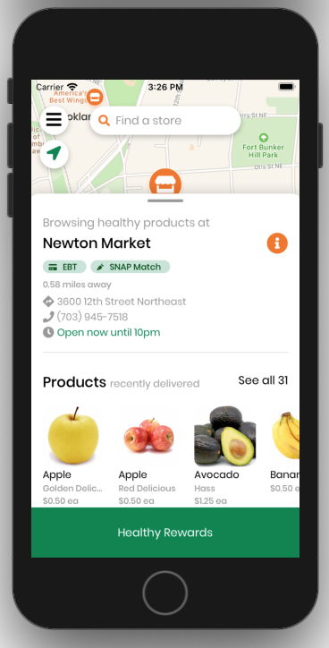

# Map Screen

This document runs through the different components within the main `MapScreen` that a user uses to discovers stores and products.

The different components/sections relevant for the `MapScreen` are as follows:
[[toc]]



## Map

- The map uses the component `MapView`, which is imported from the package [`react-native-maps`](https://github.com/react-native-community/react-native-maps)

## Store Markers

- These store markers are rendered on the map based on where the different grocery/corner stores are.
- Clicking on these store makers automatically navigates the map's area to where the store is, focuses the store marker, and displays the store's information on the Bottom Sheet (more details below).
    - Supported by helper function `changeCurrentStore()`

#### How to modify

- The icon images
    - Navigate to file `components/store/StoreMarkers.js` and change the icons for the markers, for both the resting and focused state.
- Callback action / What happens when you click on the markers
    - Modify either the `onPress` callback function to call a different function, or modify the current helper function used (`changeCurrentStore()`)

    ```jsx
    <Marker
      key={store.id}
      coordinate={{
        latitude: store.latitude,
        longitude: store.longitude,
      }}
      onPress={() => this.changeCurrentStore(store)}>
    ```

## Search Bar

- Essentially a styled button
- Clicking on the search bar brings the user to the `StoreListScreen` where they can browse the full list of stores.

#### How to modify

- The component is found within `styled/store.js/`
- The margins and paddings can be modified for the component there

## Center location button

- Button only renders if location services is enabled on user's device
- Clicking on this button brings the map to where the user currently is, and also displays the closest store to the user on the bottom sheet
    - Supported with helper functions `_findCurrentLocation()` and `_orderStoresByDistance(stores)`

## Hamburger menu button

- Button to toggle the drawer menu, showing different screens that the user can navigate to

## BottomSheet

- Component imported from the package `'reanimated-bottom-sheet'`
- Takes in several different props as seen below, configured for the best user experience

    ```jsx
    <BottomSheet
    	  initialSnap={1}
    	  enabledInnerScrolling={false}
    	  enabledBottomClamp
    	  overdragResistanceFactor={1}
    	  enabledContentTapInteraction={false}
    	  snapPoints={[maxSnapPoint, midSnapPoint, minSnapPoint]}
    	  renderHeader={this.renderHeader}
    	  renderContent={this.renderContent}
    	  ref={(bottomSheetRef) => (this.bottomSheetRef = bottomSheetRef)}
    	/>
    ```

To modify the content, see the two functions below

#### renderHeader()

- Necessary to allow users to move the Bottom Sheet
- Only shows a small black bar, indicating the region where the user can hold and drag to move the BottomSheet

#### renderContent()

- Renders the content from component `StoreProducts`, which contains basic store information and list of products that are being delivered

### BottomSheet heights
- This section runs through how the height of the `BottomSheet` in the `MapScreen` is calculated and determined.
- The heights are labelled as `snapPoints`, for which there are a total of three values.
    - `minSnapPoint` – lowest height the sheet can go
    - `midSnapPoint` – mid-level. This is the height that the sheet starts with, providing a quick view of the store's important information while having a decent view of the map.
    - `maxSnapPoint` – highest height of the sheet.
  




`minSnapPoint`, `midSnapPoint`, and `maxSnapPoint` above

BottomSheet documentation can be found [**here**](https://github.com/osdnk/react-native-reanimated-bottom-sheet).

#### How the values are calculated

- Current values are stated below. The values are in `pt` units, as required by the `BottomSheet` package.

    ```jsx
    const minSnapPoint = 185;
    const midSnapPoint = 325;
    const maxSnapPoint = 488;
    ```

- The values seen above are done after rough estimation and testing by visually accounting how it looks like on phone screens of different sizes.
- Read the next section to see an example of how we estimated the values for `maxSnapPoint`. The same process is done for the other snap points as well.

#### Estimation (maxSnapPoint)

- Estimating pixel (`px`) height from bottom of the screen
    - Green Healthy Rewards Tab: `70px`
    - Height of `BottomSheet` when fully expanded: `~540px`
    - Adjustment pixels (after testing): `40px`
    - TOTAL: `650px`
- Converting to `pt` value
    - `650px * 0.75 = 487.5pt`
    - Rounded up to final value of `488pt`

## Healthy Rewards Footer

Clicking on the footer brings the user to the `RewardsScreen`.

The footer display changes depending on the user's guest and points status:
- If the user is logged in and has rewards, show # of rewards
- If the user is logged in and has NO rewards, show # of points
- If the user is signed in as a guest, show "Learn about Healthy Rewards"

[Customer PR #149: Rewards Footer](https://github.com/calblueprint/dccentralkitchen/pull/149)

## Helper functions

There are several helper functions that are used that can be modified for any type of repurposing

#### `_findCurrentLocation()`

- Checks if user has location services enabled
- Animates map region to where the user's location is, if method is called
- If user's location services are disabled, map region is animated to a default store

#### `_orderStoresByDistance(stores)`

- Orders list of stores by their distance from user's current location, and sets the current store to the one that is nearest to the user
- If user location is not available/location services are disabled, OR if the user is more than `100` miles away from the nearest store, the default store is set as the current store

#### `_populateStoreProducts(store)`

- Fetches products for specific store
- Populates the `StoreProducts` component used in the `BottomSheet` to allow user to see the list of products

#### `_populateInitialStoresProducts()`

- Get list of stores from Airtable, and order them by distance to current location (if available) using helper function `_orderStoresByDistance(stores)` (see below)
- Populates `StoreProducts` component with `_populateStoreProducts(store)`