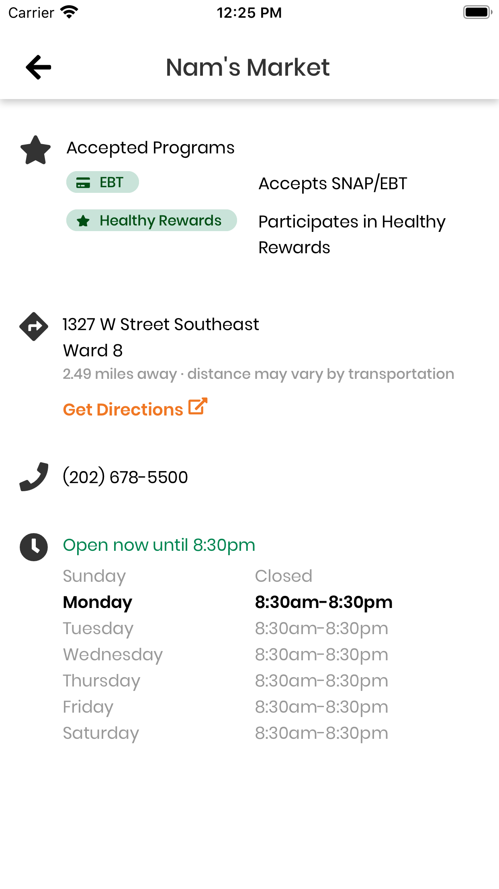

# Navigation Headers
3 parts come together to make a navigation header.

### `NavButton`
Used as navigation buttons, seen as the back buttons and hamburger button throughout the app.

### `NavHeaderContainer`
Container with shadows for most screens. For example, rewards and resources use differently styled headers which is created by passing in the background color, margin, height, and shadow for the header.

#### Props
| Name            | Type    | Description                                                                                                                             |
| --------------- | ------- | --------------------------------------------------------------------------------------------------------------------------------------- |
| backgroundColor | string  | The background color of the header container. Defaults to `Colors.lightest` which is `#ffffff` white.                                   |
| withMargin      | boolean | If true, the header container will have a 16px bottom margin.<br><br>Defaults to false so content after will be flush to the container. |
| vertical        | boolean | If false, the header will expand vertically to accommodate content.<br><br>Defaults to false for a horizontal flex direction.           |
| noShadow        | boolean | If true, the header container will not have any drop shadow.<br><br>Defaults to false to include a drop shadow.                         |

### `NavTitle`
Specially styled `Title` for headers with centered text and appropriate spacing.

#### Props
| Name  | Type   | Description                                                         |
| ----- | ------ | ------------------------------------------------------------------- |
| color | string | Text color of the navigation title. Defaults to `Colors.activeText` |


## Usage Examples
``` jsx
// Source: StoreDetailsScreen.js
import { FontAwesome5 } from '@expo/vector-icons';
import { NavButton, NavHeaderContainer, NavTitle } from '../../components/BaseComponents';
...
<NavHeaderContainer>
    <NavButton onPress={() => this.props.navigation.goBack()}>
        <FontAwesome5 name="arrow-left" solid size={24} />
    </NavButton>
    <NavTitle>{storeName}</NavTitle>
</NavHeaderContainer>
```




<CodeScreenshot title="TEST" imgSRC="basecomponents/storedetails.png" theCode="<NavHeaderContainer><NavButton onPress={() => this.props.navigation.goBack()}><FontAwesome5 name='arrow-left' solid size={24} /></NavButton><NavTitle>{storeName}</NavTitle></NavHeaderContainer>" />