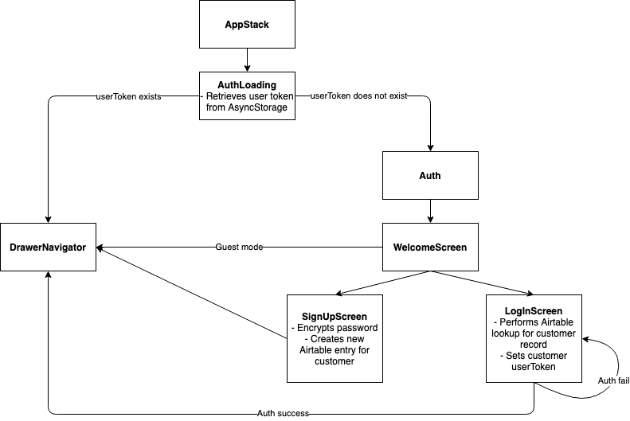
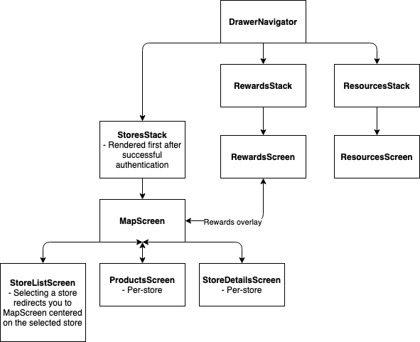

# Customer Navigation

## Overview

React Navigation 5 offers a completely new API based on components rather than JSON-serializable objects.

#### Relevant files

`AppNavigator.js`

`navigation/stack_navigators`

`DrawerContent.js`

## Existing stacks

Currently, the following stacks exist:

- `AppStack` (`AppNavigator.js`): Screens accessible within the app, as provided by drawer tabs

- `AuthStack` (`stack_navigators/AuthStack.js`): Deals with authorization screens like sign up and login

- `NewsStack` (`stack_navigators/NewsStack.js`): Currently unused

- `ResourcesStack` (`stack_navigators/ResourcesStack.js`): Points to the resources screen, accessible via the drawer

- `StoresStack` (`stack_navigators/StoresStack.js`): Screens related to store lookup, such as the map screen, store list, products screen (per-store basis), and store details screen (per-store basis)

### Flow diagrams



## Adding a new stack
::: tip
Refer to documentation on [adding a new stack](https://reactnavigation.org/docs/stack-navigator/)
::: 
Create a new file under `stack_navigators` .

```jsx
import { createStackNavigator } from '@react-navigation/stack';
import React from 'react';
import { Platform } from 'react-native'; // for config
import NewScreen from '{new screen path name here}';

const **NewStack** = createStackNavigator();

export default function **NewStack**Navigator() {
  return (
    <**NewStack**.Navigator
      screenOptions={{
        drawerLabel: 'New Screen',
        headerShown: false,
        cardStyle: { backgroundColor: Colors.lightest },
        config,
      }}>
      <**NewStack**.Screen name="NewStuff" component={NewScreen} />
    </**NewStack**.Navigator>
  );
}
```

### `screenOptions`

`drawerLabel`: The label that you want to appear on the drawer in the app, if applicable (i.e. you will be adding this stack to the `DrawerNavigator`)

`headerShown`: prevents default header from being displayed in app, should set to `false` for style consistency purposes

`config`: Add this to your stack files.

```jsx
const config = Platform.select({
  web: { headerMode: 'screen' },
  default: {
    headerMode: 'none',
  },
});
```

### `NewStack.Screen`

`name`: What you will refer to your screen as when navigating between screens in the app

`component`: The name of the screen component being rendered

## Adding a new screen

1. Create a new screen component (i.e. `NewScreen`)
2. Import screen to corresponding stack navigator and pass in as screen component under the stack

::: warning NOTE
We've had a lot of issues with class components conflicting with our need to use hooks (i.e. `useEffect` or `useFocusEffect`), so it would be best to make a functional component from the get-go and avoid using deprecated methods like `componentWillReceiveProps` in classes
:::

## Adding a tab to the drawer (hamburger menu)

No actual edits need to be made to the HamburgerButton when changing the drawer. The drawer relies on React Navigation + Drawer, so all the button does is call `toggleDrawer`.

Import and pass in your new screen or stack to the `DrawerNavigator`

```jsx
<Drawer.Screen
  name="New"
  component={NewStackNavigator}
  options={{ title: 'New Screen', swipeEnabled: false }}
/>
```

::: warning NOTE
`name` : how we will reference the stack or screen when navigating within the app, if necessary to define

`title`: string that can be used as a fallback for headerTitle ([docs](https://reactnavigation.org/docs/stack-navigator/)), **NOT** to be confused with `drawerLabel` (we don't really need this if we don't have a header)
:::

Styling for the drawer can be found in `DrawerContent.js`.

#### Adding a link to the drawer

These links are basically hardcoded and not passed in as props from the `DrawerNavigator` to `DrawerContent`. To add functional buttons (such as the LogOut button), add a styled `TouchableOpacity` and have it and call a function in `onPress`.

```jsx
<TouchableOpacity
  style={{ padding: 16 }}
  onPress={() => action()}>
  <Title>New Link</Title>
</TouchableOpacity>
```

Refer to "Report Issue" and "Log Out" buttons for more details in `DrawerContent`.

## Navigating between screens in the app

This is an example from `StoreCard.js` upon clicking the search bar to navigate to `StoresList`:

```jsx
navigation.navigate('Stores', {
  currentStore: store,
})
```

The first argument, `'Stores'`, is the name of the screen you want to navigate to.

The second argument refers to props we want to pass in between components. In a class component, this is accessible via `this.props.route.params`.

```jsx
const store = this.props.route.params;
```

In a functional component, this is accessible via the component parameter `route`.

```jsx
const store = route.params;
```

For more details on parameters in components, visit this [doc](https://reactnavigation.org/docs/params/).

In a functional component, you can use the `useNavigation()` hook.

```jsx
const navigation = **useNavigation**();
```

You can also pass navigation to a functional component as a parameter.

In classes, you can get `navigation` through props.

```jsx
<NavButton onPress={() => **this.props.navigation**.goBack()}>
```

## Helpful Links
- [React Navigation 5 upgrade docs](https://reactnavigation.org/docs/upgrading-from-4.x/)
- [Customer PR #76: Upgrade to React Navigation 5.0](https://github.com/calblueprint/dccentralkitchen/pull/76)