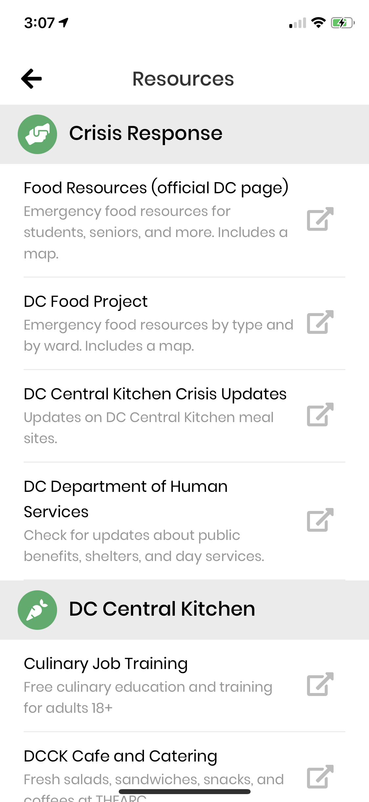
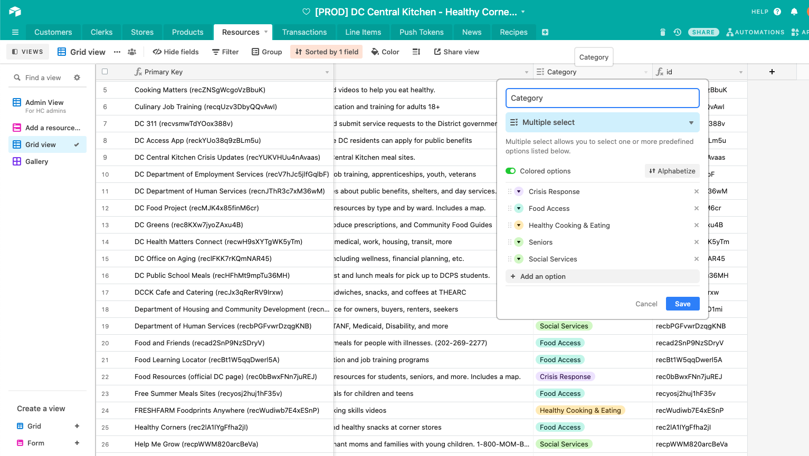

# Resources
The Resources screen (accessed from the hamburger menu) includes a list of helpful links from DC Central Kitchen.

::: warning NOTE
The "Crisis Reponse" section was orignally titled "COVID-19 (Coronavirus)", but it was rejected by the App Store for specifically mentioning the pandemic. This section might be removed in the future if these resources are no longer relevant.
:::

## Adding a new resource link
To add a new resource, fill out the [Airtable form here](https://airtable.com/shrrLPnVm6kOA9nZZ). 

For example, if you added something under “Crisis Response", and titled it DC Food Project, it would appear in the list like below.


## Adding a new category

::: tip
Resources that are uncategorized in Airtable or do not match a category in the code will still display under a **Miscellaneous** section
:::

Adding new resources can be done through `ResourcesScreen.js`.

Navigate to the state, and add a list for your new category.

```jsx {9}
constructor(props) {
    super(props);
    this.state = {
      CrisisResponse: [],
      Seniors: [],
      Food: [],
      SocialServices: [],
      Miscellaneous: [],
      ADDCATEGORYHERE: [],
    };
  }
```

Then, create a new filter for your resource in componentDidMount, 

```jsx
const YOURCATEGORY = resources.filter(
        resource => resource.category === 'CATEGORYNAME'
);
```

Then, in the render function, fill in the appropriate category name fields and pick a FontAwesome5 icon (which can be found [here](https://icons.expo.fyi/)) to match it.

```jsx
<ResourceCategoryBar icon="YOURICONNAME" title="YOURCATEGORYNAME" />
          {this.state.YOURCATEGORY.map(resource => (
            <ResourceCard
              key={resource.id}
              resourceCard={resource}
              navigation={this.props.navigation}
            />
          ))}
```

Your new category should now render.

### Add the new category in Airtable

1. Click into the Category column, and go into "Rename Field" to get to this dropdown.
2. Click "Add an option" and add it there, so that the form to add more resources will be automatically updated, and we can ensure that the filter implemented earlier works properly.
   


#### Relevant PRs
- [Customer PR #166: Resources category updates](https://github.com/calblueprint/dccentralkitchen/pull/166)
- [Customer PR #37: Resources Screen](https://github.com/calblueprint/dccentralkitchen/pull/37)