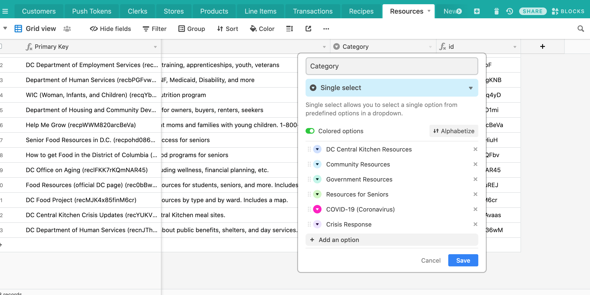

# Resources
The Resources screen (accessed from the hamburger menu) includes a list of helpful links from DC Central Kitchen.

::: warning NOTE
The "Crisis Response" section was originally titled "COVID-19 (Coronavirus)", but it was rejected by the App Store for specifically mentioning the pandemic. This section might be removed in the future if these resources are no longer relevant.
:::

## Adding a new resource link
To add a new resource, fill out the [Airtable form here](https://airtable.com/shrrLPnVm6kOA9nZZ). 

For example, if you added something under “Crisis Response" and title it DC Food Project, it would appear in the list like below.


## Adding a new category

::: tip
Resources that are uncategorized in Airtable or do not match a category in the code will still display under section titled **Miscellaneous**.
:::

To add a new resource category, in `ResourcesScreen.js`, add an entry to `categories` with the category title and a corresponding icon (which can be found [here](https://icons.expo.fyi/)).
```jsx {7}
const categories = {
  'Crisis Response': 'exclamation-triangle',
  'Food Access': 'utensils',
  'Healthy Cooking & Eating': 'carrot',
  Seniors: 'user',
  'Social Services': 'hands-helping',
  'YOUR NEW CATEGORY TITLE': 'CATEGORY ICON',
};
```

#### Things to note
- Category headings will only display if there is at least 1 corresponding resource item with that category. This also pertains to the Miscellaneous category.
- If the category name does not exactly match the category name in Airtable, the resource might end up under 'Miscellaneous' instead.
- Since `Category` is a 'multiple select', a single resource may display multiple times under different categories. 

### Add a new category in Airtable

1. Click into the Category column, and go into "Customize field type" to get to this dropdown.
2. Click "Add an option" and add it there, so that the form to add more resources will be automatically updated, and we can ensure that the filter implemented earlier works properly.
   



### Reordering categories

Categories will display in order by the `categories` object with **Miscellaneous** at the bottom. To re-order the categories, adjust the order in the categories object.
```jsx
const categories = {
  'Crisis Response': 'exclamation-triangle', // displays first (top)
  'Food Access': 'utensils', // displays second
  'Healthy Cooking & Eating': 'carrot', // displays third
  ... // etc.
};
```

#### Relevant PRs
- [Customer PR #166: Resources category updates](https://github.com/calblueprint/dccentralkitchen/pull/166)
- [Customer PR #37: Resources Screen](https://github.com/calblueprint/dccentralkitchen/pull/37)