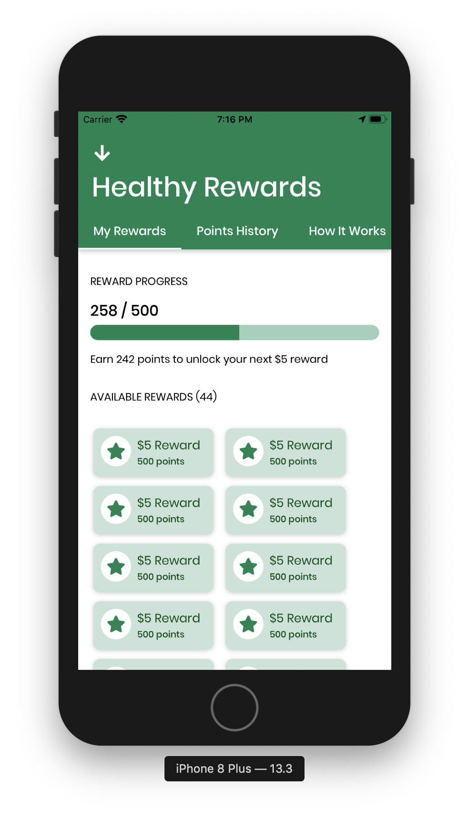

# Rewards Screen

This guide explains the different components of Rewards.

#### Relevant Files
- `RewardsScreen.js`
- `PointsHistory.js`
  - `Transaction.js`
- `RewardsHome.js` 
  - `RewardsCard.js`
- `HowItWorks.js`
- `ParticipatingStores.js`
  
## RewardsScreen

If the user is **logged in as a guest** (`this.state.isGuest`), then `RewardsScreen` will only display `HowItWorks` and `ParticipatingStores`.

If the user is **logged into an account**, `RewardsScreen` uses `react-native-tab-view` ([API reference](https://github.com/react-native-community/react-native-tab-view#api-reference)) for the tab navigation to display each component.

`routes`: an array containing a list of route objects used for rendering the tabs, including the `key` and `title` (how it displays in the tab bar).

There are three routes:
- 'home' which renders `RewardsHome`
- 'history' which renders `PointsHistory`
- 'howitworks' which renders `HowItWorks`

#### Styling

The header uses the `NavheaderContainer` base component ([see Styling docs](./styling.html#navheadercontainer)). Custom styling for the tab bar can be found in `styles` in `styled/rewards.js`.

## Rewards home

Rewards home (displays as 'Rewards' on the tab bar) shows:
- a progress bar (from `react-native-paper`) displaying the customer's progress toward unlocking their next reward
- a list of available rewards -- `RewardsCard`s based on how many rewards the customer has unlocked
- the list of stores participating in rewards using `ParticipatingStores`

::: tip
Point and dollar values are pulled from `constants/Rewards.js`. See the [Updating Constants](./constants.md) guide for a breakdown on what these values mean and how to edit them.
:::

[Customer PR #38: Rewards Progress Bar](https://github.com/calblueprint/dccentralkitchen/pull/38)

## Points history

`PointsHistory` displays the customer's transaction history and displays a card when the customer:
- makes a purchase
- unlocks a reward
- redeems a reward

Transaction cards are in `Transaction.js`. 

::: warning NOTE
The [designs](../design.md) for Points History include dividers by month, but that is not yet implemented.
:::

[Customer PR #93: Additional reward cards for point history](https://github.com/calblueprint/dccentralkitchen/pull/93)
[Customer PR #46: Points History and Rewards tab bar styling](https://github.com/calblueprint/dccentralkitchen/pull/46)

## How it works

The How it Works section explains how the Rewards program works using illustrated graphics and text. This displays directly on `RewardsScreen` for users in guest mode, and displays in a separate tab for users who are logged in.

[Customer PR #147: Updated How It Works](https://github.com/calblueprint/dccentralkitchen/pull/147)

## Participating stores

`ParticipatingStores` displays the list of stores which accept rewards. Tapping the store name redirects to the map (just as tapping the store card in StoreListScreen does).

[Customer PR #129: Add participating stores to Rewards screen](https://github.com/calblueprint/dccentralkitchen/pull/129)

