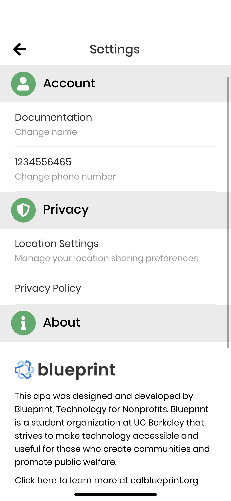
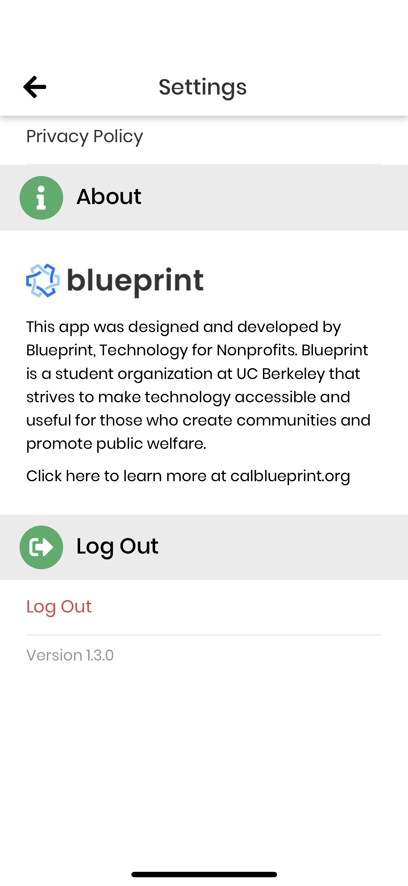

# Settings

## Overview

`AppNavigator.js` and`SettingsStack.js` have been modified/created to accommodate a new button in the drawer and new settings screens.

`SettingsScreen.js` contains 3 buttons, **Change Name**, **Change Number** and **Log Out**, and a tribute to Blueprint unless you are signed in as Guest, in which Change Name and Change Number become **Create Account**.

::: warning NOTE
We use Updates.reload() whenever logging out now to force some things (changed names, etc) to display their new version. This isn't the best user experience and Updates.reload() is deprecated and will be removed in the next expo version. See [this issue](https://github.com/calblueprint/dccentralkitchen/issues/153) for details.
:::

## Change Name
**Change Name** navigates to `NameChangeScreen.js`, which uses `AuthTextField` to validate the name and then updates Airtable.

## Change Phone Number
**Change Number** navigates to `PhoneNumberChangeScreen.js`, which uses `AuthTextField` to validate the number, and relies on `RecaptchaVerifier` and `VerificationModal.js` to text the number with a code before updating Airtable.

For more information on phone number authentication, see the docs on [SMS Verification](auth.html#sms-verification).

## Additional Options
- **Create Account** logs the guest out to sign up for an account
- Privacy and Location settings also found on this screen

## Adding to Settings
To add buttons/categories to the settings screen:
  - Add a button using `SettingsCard.js`
  - Add a category using `CategoryCard.js`
  - This is very similar to [Resources](./resources.md)

## Helpful links & PRs
- [Customer #148: Settings (Change Name/Number/Password)](https://github.com/calblueprint/dccentralkitchen/pull/148)
