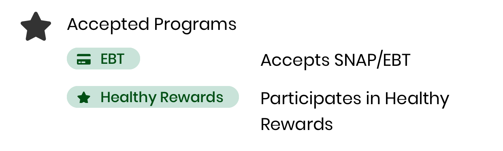
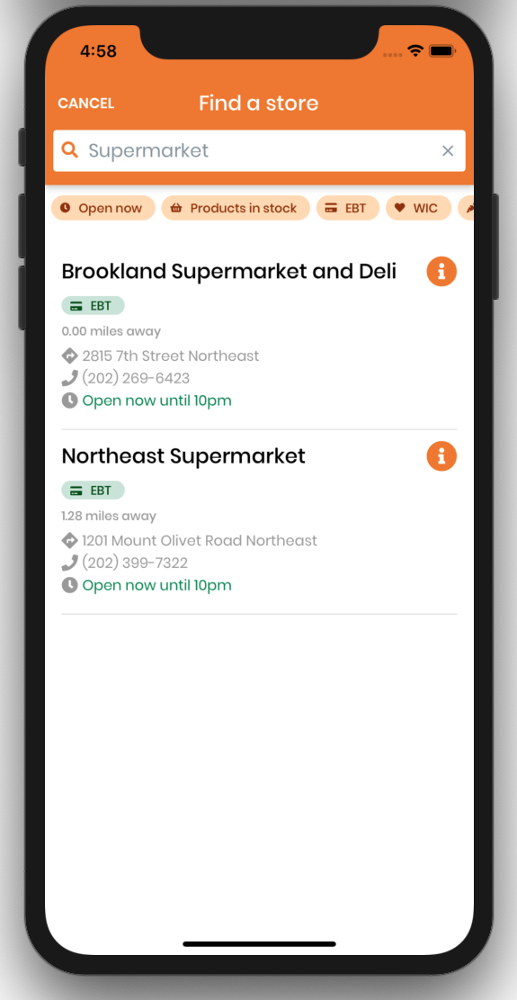
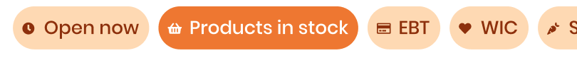

# Stores
[[toc]]
## Program tags
Program tags list the various programs a store offers. 




#### Relevant Files

`ProgramTag.js`

Program tags are currently used in `StoreCard.js`, `StoreDetailsScreen.js`, and `StoreListScreen.js` for [store filters](#store-search-filters).

### Referencing an existing program tag

Currently, the following program labels are recognized by `ProgramTag`: `"EBT", "WIC", "SNAP Match", "Healthy Rewards"`

For reference, this is how the Airtable column names display in the app.
| Airtable column name   | Tag label       |
| ---------------------- | --------------- |
| SNAP or EBT Accepted   | EBT             |
| Coupon Program Partner | SNAP Match      |
| Rewards Accepted       | Healthy Rewards |
| WIC                    | WIC             |


We map program labels to their corresponding chip icons to create program tags. Pass in an accepted program name string to the `program` param.

```jsx
<ProgramTag program="WIC" />
<ProgramTag program="SNAP Match" />
```
::: tip
The code currently protects against capitalization errors, so passing in `"wIC"` or `"snap match"` should still render a correct program tag.
::: 

### Creating a new program tag

1. Add the new program as a new **Checkbox** column to the Stores table in Airtable.
2. Run `npm run generate-schema` to re-generate schema and utility functions (refer to [documentation on running the schema generator](/shared/airtable.html#running-the-generator) for more details)
3. Add the new program to the `programtoIcon` dictionary by mapping the program label (as it will be displayed on the chip) to the corresponding FontAwesome5 icon.
4. Add the new program name to the error handling conditionals. Currently, there is one conditional for acronyms (i.e. "WIC" and "EBT") and one for program phrases (i.e. "Healthy Rewards")

#### Helpful Links

- [Chip icons](https://callstack.github.io/react-native-paper/icons.html)
- [Chip component](https://callstack.github.io/react-native-paper/chip.html)
- [Airtable Schema Generator](shared/airtable.html#running-the-generator)

## Store search by name


### Files involved

- `screens/map/StoreListScreen`

### How it works

- The list of stores that appears is filtered based on what the user types into the search bar. As long as any of the store name contains the search word(s), it will appear.
- Following the example in the photo above, typing '**Supermarket**' in the search bar will show all the stores whose name has that word.

### How to modify

- To change the logic of how the search result depends on the search word(s), modify the `filterStore` function in `StoreListScreen.js`

## Store search filters


### Files involved

- `screens/map/StoreListScreen`
- `components/store/ProgramTag`

### Filter types

- EBT
- WIC
- Snap Match
- Healthy Rewards
- Open Now
- Products in stock

### How it works

- Within the Airtable base, there is data on whether the store matches the filters or not (e.g. supports EBT). This data is used to identify stores that
- When one or more of the filters are clicked and activated, the stores that appear in the list will be filtered based on whether they support that filter.
- When no filters are active, all the stores will be shown.

### How to add a new program filter

- Add data to Airtable
    - Navigate to the Stores table and add a new Checkbox column based on the new filter
- Modify code
    - Add a new `ProgramTag` (see [Creating a new program tag](#creating-a-new-program-tag))
    - Navigate to file: `screens/map/StoreListScreen`
        - Add the new filter into the list of filters in `this.state`
        - Insert the new `ProgramTag` with relevant props
