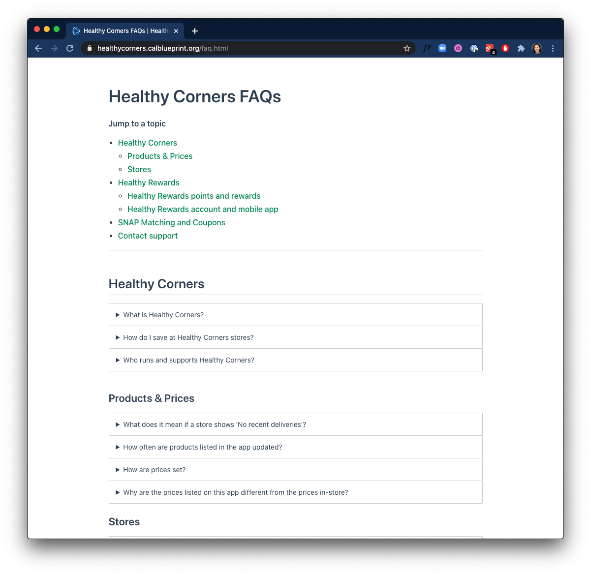
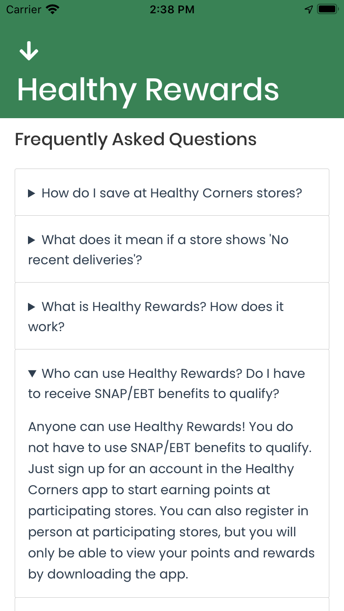

# Updating FAQs

There are two customer-facing FAQ pages, both hosted on this documentation site.

| Function                                                                                                                                                                                                                       | Screenshot                                               |
| ------------------------------------------------------------------------------------------------------------------------------------------------------------------------------------------------------------------------------ | -------------------------------------------------------- |
| **Full FAQ:** all FAQs related to Healthy Corners, SNAP matching, Healthy Rewards, and more. The public link is: <https://healthycorners.calblueprint.org/faq.html>. This page is linked but not directly embedded in the app. |        |
| **Mini FAQ:** highlighted questions embedded **within** the 'How it Works' screen in the customer app. Source site can be found here <https://healthycorners.calblueprint.org/faq-mini.html>                                   |  |

::: tip Why FAQs are on this site
We decided to host the FAQ section in this documentation site to make it easy to update without having to push direct updates for the app. 

Since Markdown is also relatively easy to use for non-technical individuals, Admins *could* also modify FAQ contents directly through a Github-syncing Markdown editor like [HackMD](http://hackmd.io/), though this would require setting up and authorizing a Github account.
:::

## FAQ components

The FAQs are written in Markdown and hosted in this documentation site. The question and answer drop-downs are created using a custom Vue component (see `config.js`):

::: faq Here is the question
Here is the answer in a dropdown
:::

```
::: faq Here is the question
Here is the answer in a dropdown
:::
```
The mini FAQ page is styled to blend in with the customer app, and embedded in the app through a React WebView. The page uses `NoMarginLayout`, a custom Vue component that removes default margins and modifies the font styling to match the rest of the app. If the app-wide font family changes from the current font Poppins, make sure to update the font in `NoMarginLayout` as well.

## Modifying FAQ content
To modify the content of either the [full FAQ page](../faq.md) or the [mini FAQs](../faq-mini.md), edit the source markdown in the customer repo and push updates to the `docs` branch just like any update to this docs site (see [Editing this site](../../#editing-this-site)).

Be careful not to include too much content in the 'mini FAQ' that displays in the app to make sure the page does not get too crowded.

::: warning Before making changes
Basic changes like modifying text content or adding/editing/removing/reordering questions should not require any modifications to custom components or page layouts. Avoid modifying custom Vue components if possible, since some areas of the VuePress documentation aren't very comprehensive.
:::


## Relevant PRs
- [Customer #169: Healthy Corners FAQs](https://github.com/calblueprint/dccentralkitchen/pull/169)