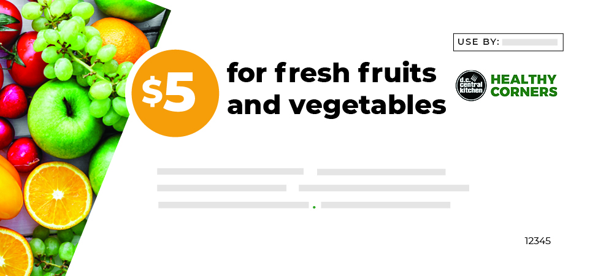

# Healthy Corners FAQs

#### Jump to a topic
[[toc]]

---
 

## Healthy Corners
 

::: faq What is Healthy Corners?
Healthy Corners is a [DC Central Kitchen (DCCK)](https://dccentralkitchen.org/) social enterprise that strives to expand healthy food access in DC. We deliver fresh produce and healthy snacks to corner stores in areas where food access is limited, offering produce at wholesale prices and providing marketing and technical assistance to store owners. 
:::

::: faq How do I save at Healthy Corners stores?
- **Low prices** - Healthy Corners keeps prices low for stores and customers. Prices are listed on each product in the app.
- **SNAP matching** - At select stores, earn a $5 coupon for free fresh produce every time you spend $5 with SNAP and include 1 item of fresh produce in your purchase. Look for “SNAP Match” on the store profile to find stores that offer this program. 
- **Healthy Rewards** - At select stores, earn points every time you buy Healthy Corners products including fresh produce, frozen produce, and healthy snacks. When you’ve earned 500 points, get $5 free! Look for “Healthy Rewards” on the store profile to find stores that offer this program. 
:::

::: faq Who runs and supports Healthy Corners?
Healthy Corners is a DC Central Kitchen (DCCK) social enterprise that launched in 2011. Our team includes several graduates of our esteemed Culinary Job Training program, as well as community-based Store Champions, and other DCCK staff and volunteers. We are funded and supported in large majority by DC Health and the US Department of Agriculture. Our program depends on the commitment and engagement of corner store owners and managers. To find out more about DCCK and Healthy Corners, visit our website at [www.dccentralkitchen.org](https://dccentralkitchen.org/).
:::

 

### Products & Prices
 

:::faq What does it mean if a store shows 'No recent deliveries'?
“No recent deliveries” means a store has not received a Healthy Corners delivery in the past week. The store may have fruits and vegetables in stock from another vendor or a previous delivery. 
:::

:::faq How often are products listed in the app updated?
Products are updated daily at 5 PM EST.
:::

:::faq How are prices set?
Prices are set quarterly with the seasons: summer, fall, winter, and spring. Healthy Corners charges stores the exact cost of produce from distributors, with no minimums or markups. In the event of COVID-19, prices have been further discounted: 25% off whole fruits and 50% off whole vegetables. Stores are expected to follow the customer prices set by Healthy Corners. Occasionally the price for an item will change mid-season due to factors like weather or supply chain issues.
:::

:::faq Why are the prices listed on this app different from the prices in-store?
Healthy Corners stores agree to charge customers no higher than the displayed prices for their items. However, it can be difficult to regulate this across all stores and employees. If prices do not match what you see in the app, it could be because a clerk is not aware of a price change or because the manager has not updated the prices in the cash register. If stores choose to buy fresh produce from other vendors, those items may also have different prices. If you notice this while shopping, you can ask the store manager or [submit the feedback form](https://airtable.com/shr1Rh6ZUaJNQTQqf) to Healthy Corners.
:::

### Stores
 

:::faq How are stores chosen for Healthy Corners?
To qualify for Healthy Corners, a store must: 
- serve a low-income population
- be located in an area where food security needs are not being met by full-service grocery stores
- have owners that are committed to promoting healthy and affordable food in the community
:::

:::faq I know a store that would make a great addition to Healthy Corners. How can I recommend them?
We welcome your suggestions for new Healthy Corners stores. [Nominate a store here](https://airtable.com/shrkH32QSrC0gleAY).
:::
 

## Healthy Rewards 
 

:::faq What is Healthy Rewards? How does it work?
Healthy Rewards is an exciting new rewards program that allows shoppers to earn points with every purchase at participating Healthy Corners stores. Here’s how you save using Healthy Rewards: 
1. **Shop.** Simply purchase the Healthy Corners products you need at participating stores.
2. **Earn.** Earn 100 points for every dollar you spend on our products!
	$1 = 100 points
3. **Save.** Unlock a $5 reward for free Healthy Corners products every time you reach 500 points.

   500 points = $5 free

   ($5 spent = $5 saved!)
:::

:::faq Who can use Healthy Rewards? Do I have to receive SNAP/EBT benefits to qualify?
Anyone can use Healthy Rewards! You do not have to use SNAP/EBT benefits to qualify. Just sign up for an account in the Healthy Corners app to start earning points at participating stores. You can also register in person at participating stores, but you will only be able to view your points and rewards by downloading the app.
:::

:::faq How do I join the Healthy Rewards program?
You can create a Healthy Rewards account by clicking “Log In” or “Get Started” in the [Healthy Corners app](https://tiny.cc/HealthyCornersApp). You can also register in person at participating stores, but you will only be able to view your points and rewards by downloading the app.

**Registering through the Healthy Corners App**
1. Open the Healthy Corners app, or download from the app store
2. On the opening screen, select **Get Started** and **Sign Up** 
3. Enter your name, phone number, and set a password. 
4. Enter the code sent to you by text message to verify your phone number.
5. Once your account is set up, you can start earning points and using Healthy Rewards!
   
**Registering in person**
1. At a participating Healthy Corners store, tell the clerk you want to sign up for Healthy Rewards
2. They will ask for your **name** and **phone number** to register your account. You can then start earning points and using Healthy Rewards.
3. If you registered for an account in person and want to use the [Healthy Corners app](https://tiny.cc/HealthyCornersApp) to see your points and rewards progress:
   1. Open the Healthy Corners app
   2. On the opening screen, select **Get Started** and **Set a password**
   3. Enter the phone number you used to sign up in store 
   4. Enter the code sent to you by text message to verify your phone number.
   5. Set a password for your account
   6. Log in using your new account information
    
Once your account is set up, you can access your account from the Healthy Corners app!
:::

:::faq Do I have to pay a membership fee?
No, the Healthy Rewards program is completely free. Just use your registered phone number at checkout in a participating Healthy Corners store to earn points.
:::

:::faq What is the difference between SNAP matching and Healthy Rewards?
SNAP matching and Healthy Rewards are at different stores, so please check the store profile to see which program a store participates in. 

| [SNAP matching](https://dccentralkitchen.org/snapmatch/)                                             | [Healthy Rewards](#healthy-rewards)                                                                                                  |
| ---------------------------------------------------------------------------------------------------- | ------------------------------------------------------------------------------------------------------------------------------------ |
| You must use SNAP/EBT to qualify                                                                     | Anyone can participate in Healthy Rewards—you don’t have to qualify for SNAP/EBT to earn points                                      |
| Earn $5 by spending $5 with SNAP/EBT and including at least 1 item of fresh produce in your purchase | Earn $5 free by purchasing $5 of Healthy Corners products with any payment method                                                    |
| The clerk will give you a $5 paper coupon                                                            | There are no paper coupons at Healthy Rewards stores Instead, you can track your points and rewards on the Healthy Corners app       |
| You can only redeem your SNAP matching coupon on fresh fruits and vegetables                         | Earn and spend points on all Healthy Corners products listed in the app, including fresh and frozen produce and other healthy snacks |

Learn more about [SNAP matching](https://dccentralkitchen.org/snapmatch/) or [Healthy Rewards](#healthy-rewards).
:::

 

### Healthy Rewards points and rewards
 

:::faq Where can I find the Healthy Rewards program? Can I use Healthy Rewards at any Healthy Corners store?

Healthy Rewards points and rewards may only be earned and redeemed at participating Healthy Corners stores. The updated list of participating stores can be found under **Participating Stores** in the Rewards page in the [Healthy Corners app.](https://tiny.cc/HealthyCornersApp)
:::

:::faq How do I earn and redeem rewards?
**Earning rewards**

You automatically unlock a reward every time you reach 500 points (by spending $5 on Healthy Corners products).

Earn points by purchasing Healthy Corners items at participating stores. When you go to check out, let the clerk know that you are in the rewards program and share your phone number. The clerk will apply the points to your account. You will earn 100 points for every $1 spent on Healthy Corners products at participating stores.

Once you reach 500 points, your reward will be added to your account within one hour of your purchase. You can find your available rewards any time by logging in to your account on the [Healthy Corners app](https://tiny.cc/HealthyCornersApp), or by asking a store clerk.

**Redeeming rewards**

Rewards can be redeemed in participating stores by providing a store clerk your account phone number. $5 will be deducted from your purchase.
You can only redeem rewards on Healthy Corners products.
:::

:::faq How can I check how many points and rewards I have?
You can check how many points you have through the [Healthy Corners app](https://tiny.cc/HealthyCornersApp) or by asking a store clerk at a participating store.
Through the Healthy Corners app:
1. Log in to your account using your account phone number and password. If you registered in person and haven’t used the app before, select **Set a password** to access your account.
2. Once you are logged in, tap the green button at the bottom of the Store Map screen
3. In the **My Rewards** tab:
   - you can see how many points you have under **Reward Progress**
   - you can see how many rewards you have under **Available Rewards**
At a participating store:
You can ask a clerk to check how many points and rewards you have with your account phone number.
:::

:::faq What can I redeem a reward for? How do I know a product is eligible for Healthy Rewards?
You can redeem each reward for $5 of any Healthy Corners products at a participating Healthy Corners store. All Healthy Corners products that are listed in the app are eligible for Healthy Rewards. If you click on a product in the app, you will see the number of points earned.
:::

:::faq If I spend less than the reward amount, can I save the rest for later?
A reward must be redeemed in a single purchase, and cannot be divided over multiple visits. No change is given, so try to spend the full reward amount when you are redeeming a reward. If you have multiple rewards, you do not have to redeem all of them at once.
:::

:::faq Can I earn more than one reward before I redeem? Is there a limit to how many rewards I can have at any given time?
Yes, you can earn more than one reward before you redeem. There is no limit to how many rewards you can have or redeem at any given time.
:::

:::faq Will my rewards or points expire?
Rewards and points do not have an expiration date, but we encourage you to use them as you earn them. If for any reason the program is discontinued, an expiration date may be applied and this will be noted in the app.
:::

:::faq My points or rewards are incorrect. What do I do?
Each time you reach 500 points, your points are automatically converted to a reward, and 500 points are deducted from your total points. If it seems like your points disappeared, first check to see if you have a new reward.

If the issue persists, contact us through [our online form](https://tiny.cc/RewardsFeedback).
:::

 

### Healthy Rewards account and mobile app
 

:::faq I signed up for Healthy Rewards in a store. How do I set up my account in the app?
1. Download the [Healthy Corners app](https://tiny.cc/HealthyCornersApp) from the app store
2. On the opening screen, select **Get Started** and **Set a password**
3. Enter the phone number you used to sign up in store
4. Enter the code sent to you by text message to verify your phone number
5. Set a password for your account
6. Log in using your new account information
   
Once your account is set up, you can access your account from the Healthy Corners app.
:::

:::faq How do I manage my location permissions?
To update your location permissions for Healthy Corners app:
1. Access the Healthy Rewards app
2. Select **Settings** in the Menu
3. Select **Location Settings** under Privacy
4. Select **Location** and choose a location setting
:::
 

## SNAP Matching and Coupons
 

:::faq What is SNAP Matching?

If a store offers SNAP matching, shoppers who purchase fresh produce with SNAP/EBT can get more fresh produce for free. To earn a $5 coupon for fresh produce, spend at least $5 with SNAP/EBT at a participating store and include at least 1 item of fresh produce in your purchase. 
:::

:::faq How do I earn SNAP match coupons?
Spend at least $5 using your SNAP/EBT card. Your SNAP/EBT purchase must contain at least 1 fresh fruit or vegetable. The store clerk will give you a $5 coupon at checkout.
:::

:::faq How many SNAP match coupons can I earn?
You will earn 1 coupon per purchase every time you make a qualifying purchase.
:::

:::faq What can I buy with my SNAP match coupons?
Each coupon is for $5 of fresh fruits and vegetables. You cannot buy canned or frozen items with your coupons.
:::

:::faq Do the SNAP match coupons expire?
Yes. Please use your coupons by the expiration date.
:::

:::faq Where can I spend my SNAP match coupons? What if my store does not have the fruits and vegetables I want? 
Use your coupons at the store where you received them, or at any store listed on the coupon. Please request any new fruits or vegetables with the store manager.
:::

:::faq If I spend less than $5 using my SNAP match coupon, will I get change?
No change is given, so please spend the full $5 at once. 
:::

:::faq What is the difference between SNAP matching and Healthy Rewards?
SNAP matching and Healthy Rewards are at different stores, so please check the store profile to see which program a store participates in. 

| [SNAP matching](https://dccentralkitchen.org/snapmatch/)                                             | [Healthy Rewards](#healthy-rewards)                                                                                                  |
| ---------------------------------------------------------------------------------------------------- | ------------------------------------------------------------------------------------------------------------------------------------ |
| You must use SNAP/EBT to qualify                                                                     | Anyone can participate in Healthy Rewards—you don’t have to qualify for SNAP/EBT to earn points                                      |
| Earn $5 by spending $5 with SNAP/EBT and including at least 1 item of fresh produce in your purchase | Earn $5 free by purchasing $5 of Healthy Corners products with any payment method                                                    |
| The clerk will give you a $5 paper coupon                                                            | There are no paper coupons at Healthy Rewards stores Instead, you can track your points and rewards on the Healthy Corners app       |
| You can only redeem your SNAP matching coupon on fresh fruits and vegetables                         | Earn and spend points on all Healthy Corners products listed in the app, including fresh and frozen produce and other healthy snacks |

Learn more about [SNAP matching](https://dccentralkitchen.org/snapmatch/) or [Healthy Rewards](#healthy-rewards).
:::

 

## Contact support

To contact us, [use our online form](https://tiny.cc/RewardsFeedback).

To learn more about [DC Central Kitchen](https://dccentralkitchen.org/) and the [Healthy Corners program](https://dccentralkitchen.org/healthy-corners/), visit our website at [www.dccentralkitchen.org](https://dccentralkitchen.org/).