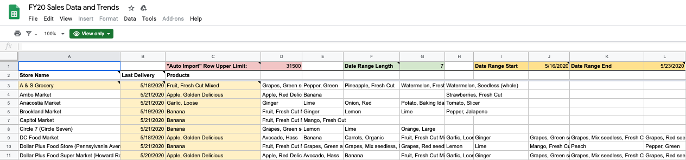
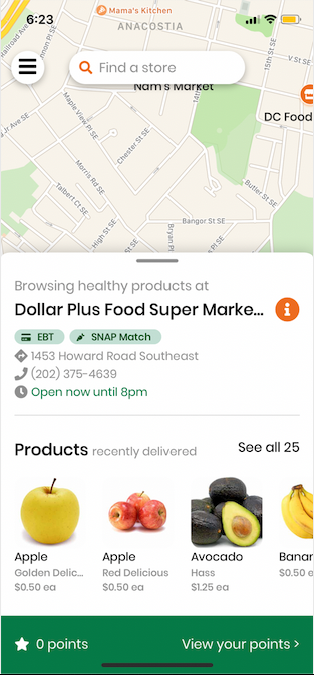
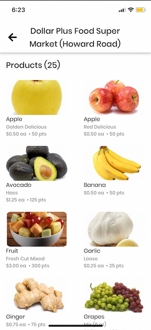

# Backend Server (Node.js)

This backend server built with Express and Node integrates the Airtable and Google Sheets APIs to run a scheduled daily job to update the products delivered in the customer app. Products displayed must have been delivered in the last seven days by default, though the number of days can be configured.

---

Here's a screenshot of the sheet (`Blueprint - Store Products`) that our app modifies, which acts as the data source for Airtable.

::: tip
The details of how it's configured can be found in the [admin guide](../admin/#google-sheets), but for our purposes, we will assume this spreadsheet will always accurately list stores & products delivered during the range specified in the yellow-highlighted cells.
:::

---

Here are some of the affected views in the customer application.
|                           Map view                           |                        Individual store's product list                         |
| :----------------------------------------------------------: | :----------------------------------------------------------------------------: |
|  |  |

## Server

This application is live at <https://healthycorners-rewards-node.herokuapp.com/>.
