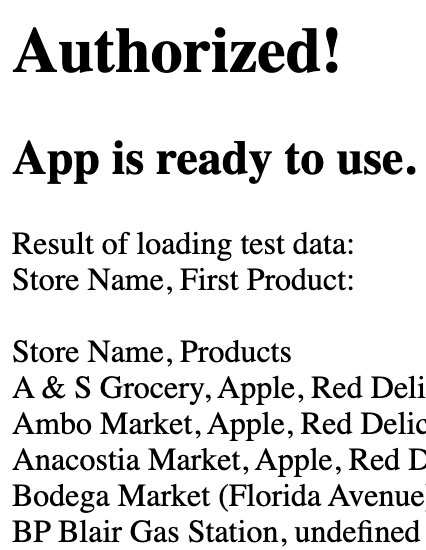
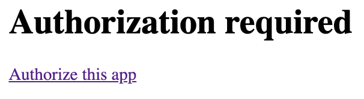
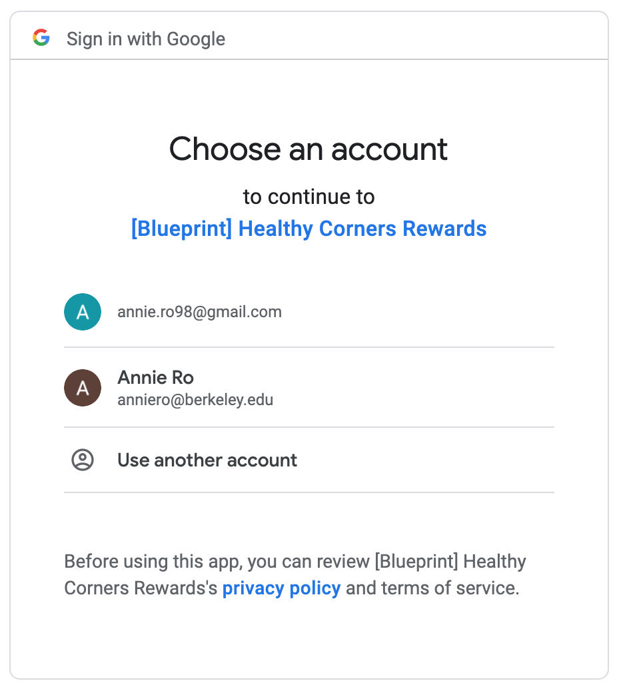
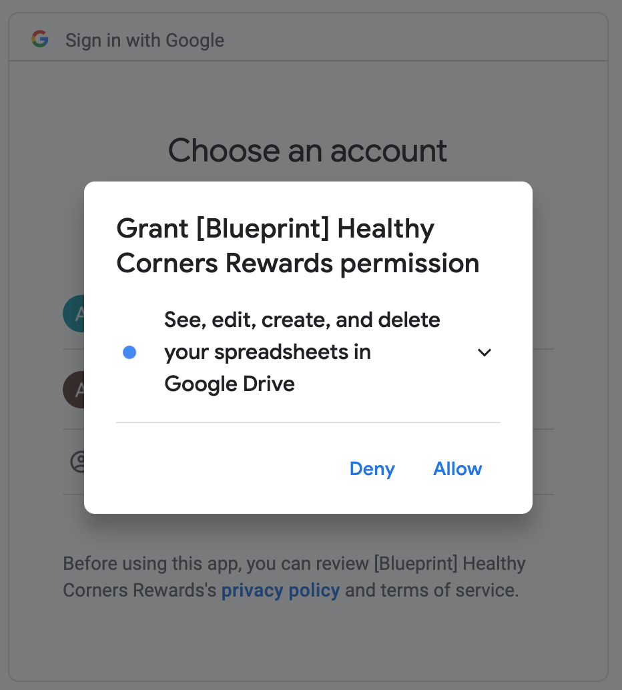
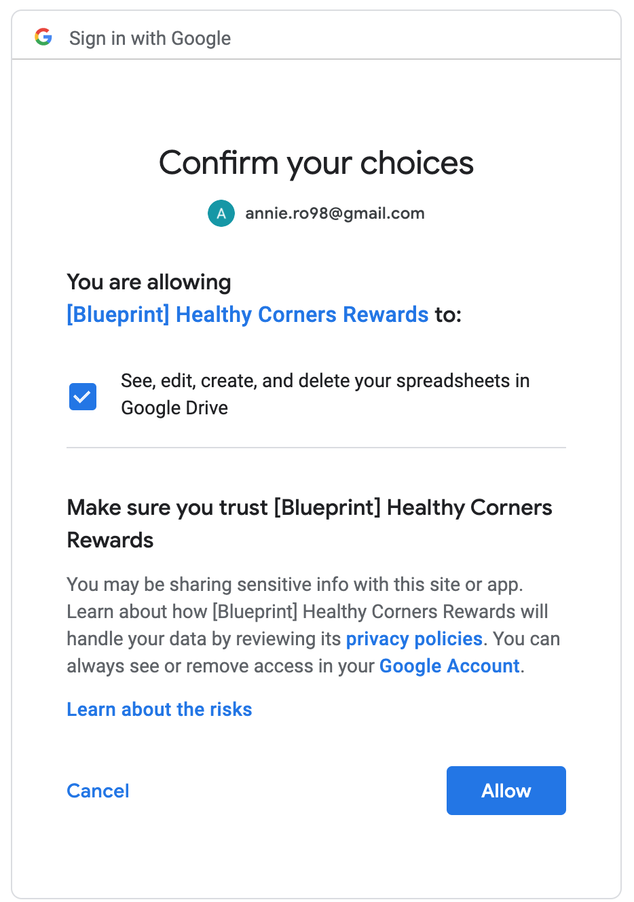
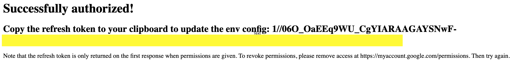

# Application Overview

This application runs with Express and Node.js, and mainly uses the Google Sheets and Airtable APIs.

We've included plenty of inline comments, and the update logic is encapsulated in `utils/*.js` files which are relatively self-explanatory. Instead of documenting line by line, this page should serve as a guide to understand how everything works.

For local development, the server will run on port 3000 by default at <localhost:3000>.

To run the job locally, use the `POST '/updateMappings/prod'` route.

## `index.js`

The server logic is contained in this file. We initialize the Express app and configure it. We initialize the Google OAuth client and configure it.

Next, the various endpoints are defined. They are documented via inline comments. The auth-related endpoints are documented in the next section. Otherwise, the functions called are documented in the [`utils/*.js` section](#utils-js-files).

## Google Auth

Google requires consent to be given via its authorization flow for any application using its APIs. It uses a token-based system, meaning that once a user has authorized an application, the Google API will send a token back; we configure the OAuth client with it, and now our requests to the Google API will succeed.

However, these `access_token`s expire regularly. Thus, on the first authorization to an application, Google also returns a `refresh_token`. When the OAuth client is configured with the `refresh_token`, and has a listener for token expiration, the application can continue to get authorization tokens without further input from the user.

::: tip
Revoke access here when testing the auth flow: <https://myaccount.google.com/permissions>
:::

Because the scheduled job is an idempotent operation (running it repeatedly does no harm), we decided it was best to simply store a developer's `refresh_token` as an environment variable, essentially caching+hardcoding it as a secret key. This means we only need to authorize the application once, save the `refresh_token`, add it to the Heroku config, and the scheduled job will always work properly.

::: danger
Currently, the application runs with <anniero@berkeley.edu>'s Google Sheets permissions.

However, **we highly recommend** using a Healthy Corners-owned account's `refresh_token` instead, since the account authorized in this application will need access to any future spreadsheets that may be used as input for product delivery data.
:::

### In `index.js`

We create the Google OAuth Client, state the `spreadsheets` scope (read/write access), and add the listener. We first register the OAuth Client with our `refresh_token`.

```javascript
// Add a listener. Always register `refresh_token` using the environment variable
oAuth2Client.on('tokens', (tokens) => {
  const combined = { ...tokens, refresh_token: process.env.REFRESH_TOKEN };
  oAuth2Client.setCredentials(combined);
});
```

::: warning NOTE
We only access Google Sheets, but we will need to both read and write to spreadsheets, so our `SCOPES` variable is `spreadsheets`.

```javascript
// If modifying these scopes, delete token.json.
const SCOPES = ['https://www.googleapis.com/auth/spreadsheets'];
```

However, if these scopes ever change, we need to remove permission for the application, then get a new token via the [initial auth flow](#get-auth-initial).
:::

### GET '/auth'

This will use the `refresh_token` in the environment and initialize the OAuth client to be usable. If no `refresh_token` exists, it will prompt the user to go to `/auth-initial`.

::: tip Sanity-checking the deployed application

1. Go to <https://healthycorners-rewards-node.herokuapp.com/auth>. This will check if a user has been authorized, and then do a read-only call to the Google Sheets API. It accesses a [test version of the live spreadsheet](https://docs.google.com/spreadsheets/d/129BwSHKu-_qTMcpZKpqCp55qQWNipXft9tPOnqFkyB0/edit#gid=0), which is viewable to anyone with the link.
   If all is well with the authorization, you'll see something like this:
   > 
2. To check that the authorized user is able to access the live spreadsheeht, go to <https://healthycorners-rewards-node.herokuapp.com/getMappings/current>. This will use the authorized user to do a read-only call to the live spreadsheet and display the current store-product mapping.

:::

### GET '/auth-initial'

This route must be used to collect a user's `refresh_token`.

Here's the initial page:



The authorization flow - choose an account



The authorization flow - grant requested permissions



The authorization flow - confirm permissions



### GET '/auth-callback'

This is the `REDIRECT_URI`: after a user has initiated authorization at `/auth-initial` and authorized the app through the OAuth consent screen, they are redirected here. _\*These `REDIRECT_URI`s must be whitelisted in the [Google console](./getting-started.md#get-project-credentials)._

The auth flow:

If authorization is successful, this page will be shown.



Copy the `refresh_token` in full (we've censored part of it in this screenshot for obvious reasons), and update it in both your local `.env` file and the [Heroku config vars](./getting-started.md#config-vars).

Note that the app must be re-deployed after env configs are updated to ensure that the scheduled job runs with the new user's `access_token`.

### References

- <https://github.com/googleapis/google-api-nodejs-client#google-apis-nodejs-client>
- Why do we need to keep `refreshToken` around? <https://github.com/googleapis/google-api-nodejs-client/issues/750#issuecomment-304521450>

## `utils/*.js` Files

### `utils/googleSheets.js`

This file contains the logic to interact with the Google Sheet. `listTestData` is a sanity-check function, which prints the contents of a public Google sheet.

The other functions require a user who has authorization for the live spreadsheets. We call these functions in `storeProducts.js`.

In `getCurrentStoreProducts`, we parse the data from Google Sheets into a Javascript array to be used to update Airtable. The returned object, `storeData`, is an array of Javascript objects which each represent a store, with attributes `name` (string), `deliveryDate` (string), and `products` (array).

::: danger Data format constraints
Some products and stores are formatted differently in Airtable than they are in the live spreadsheet, e.g `Ken Mart Inc` has been renamed to `Z-Mart` and is named thusly in Airtable, but at some point it was receiving deliveries as `Ken Mart Inc`. Product names are tricky as well.

Because we ultimately use the names with string matching to find the correct Airtable record(s) to update, the correct spelling and formatting is **crucial**.

If the names do not match, the updates will **not** be reflected in Airtable.

Thus, in this file, we have two objects representing the corrections needed:

```javascript
const formatStores = {
  'Nams Market': "Nam's Market",
  'Ken Mart Inc': 'Z-Mart',
};

const formatProducts = {
  'Grapes, Red seedless, Fresh Cut': 'Grapes, Red (6 oz)',
  'Grapes, Green seedless, Fresh Cut': 'Grapes, Green (6 oz)',
  'tomato, cherry': 'Tomato, Cherry (6 oz)',
  'Grapes, Mix seedless, Fresh Cut': 'Grapes, Mix (6 oz)',
  'Collard Greens (bunch)': 'Collard Greens, (bunch)',
  'Garlic, peeled (bag)': 'Garlic, Peeled (bag)',
  'Clementines (bag)': 'Clementines, (bag)',
  'Collard Greens, Bag': 'Collard Greens, (bag)',
  'Corn, Frozen Vegetables': 'Corn, Frozen',
  'Lettuce, Butterhead (clamshell)': 'Lettuce, Butterhead',
  'Spring Mix,Organic': 'Spring Mix, Organic',
  'Kale (bunch)': 'Kale, (bunch)',
  'Spinach, Frozen Vegetables': 'Spinach, Frozen',
  'Peas, Frozen Vegetables': 'Peas, Frozen',
};
```

When parsing the data, we do a lookup on the raw input `name` and transform it if necessary.
:::

### `utils/storeProducts.js`

This file contains the logic to update Airtable. It currently only contains one function - `updateStoreProducts`. This switches on the parameter `base` to update the correct Airtable base.

We first call `updateDateRange` from `googleSheets.js` to make sure we're getting the most recent delivery data. Then, we get the parsed `storeData` array of Javascript objects. Next, we get the arrays of all stores and all products registered in Airtable via the Airtable API.

Finally, we generate the array of stores in Airtable that need to be updated to be linked to various product records. Airtable (and schema-generator naming conventions) requires that this format is:

```json
{
  "id": storeId,
  "fields": { "productIds": [product1Id, product2Id, productId] }
}
```

::: tip
We actually had to modify the generated files quite a bit for this to work properly. Be sure to be careful when running the schema generator and copy back in code that's essential!
:::

During this process, we generate some useful information and `console.log` it so that can be viewed in the Heroku logs, or in your terminal when developing locally:

- Stores with deliveries this cycle
- Stores without deliveries this cycle
- Stores that received deliveries, but were missing in the Airtable base
- Products that were delivered, but were missing in the Airtable base

::: warning
Out of these four, the "missing" categories are important to be aware of. You can view the Heroku logs via [Logentries](./getting-started.md#logentries).

Ask a Healthy Corners admin to add products/stores to the `PROD` Airtable base via [Airtable form](../admin/forms.md).
:::

### `utils/synchDevProd.js`

This file and the endpoints that call various functions in it is useful if you want to update data in the DEV base first, then update all of PROD at once. We expect that it will remain unused post-handoff, but thought the use case wasn't so rare that we needed to delete it completely. It is code that works exclusively with Airtable, so it might be a helpful reference as well.

### `scheduled-update.js`

This is the job run daily via Heroku Scheduler. It simply initializes the OAuth client with the stored `refresh_token`, adds a listener to ensure `access_token` automatic updates, and then calls `updateStoreProducts`.

Details on how to configure the scheduled job are in the [Getting Started page](./getting-started.md#heroku-scheduler).

### `utils/parseCsv.js`

The naive implementation can be found in `parseCsv.js`. In this version, we accomplish the same thing using the `csv-parser` package. However, there was still a good amount of manual input required:

1. Update the date range in Google Sheets
2. Download the `Blueprint - Store Products` sheet as a CSV file
3. Start the server locally
4. Run the code through API

We've kept `2020mar30-apr17.csv` in the repo for example runs of the code in `parseCsv.js`. If the Google Sheets version seems to be unfixable, in the worst case this can be used as a fallback to update the Airtable.
