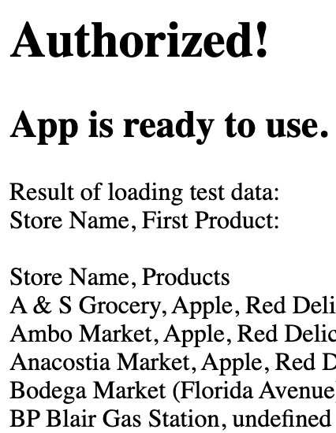

# Application Overview

The purpose of this application is to ensure that the products displayed on the customer application are always up-to-date with recent deliveries made by the Healthy Corners team.

## Google OAuth (Authentication)

::: tip Sanity-checking the deployed application

1. Go to <https://healthycorners-rewards-node.herokuapp.com/auth>. This will check if a user has been authorized, and then do a read-only call to the Google Sheets API. It accesses a [test version of the live spreadsheet](https://docs.google.com/spreadsheets/d/129BwSHKu-_qTMcpZKpqCp55qQWNipXft9tPOnqFkyB0/edit#gid=0), which is viewable to anyone with the link.
   If all is well with the authorization, you'll see something like this:
   > 
2. To check that the authorized user is able to access the live spreadsheeht, go to <https://healthycorners-rewards-node.herokuapp.com/getMappings/current>. This will use the authorized user to do a read-only call to the live spreadsheet and display the current store-product mapping.

:::
