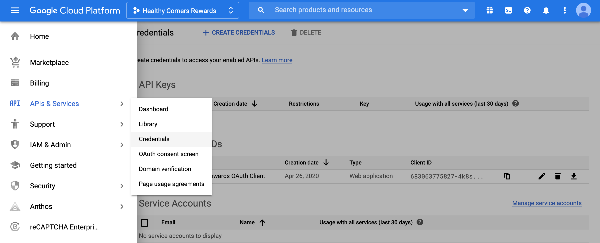
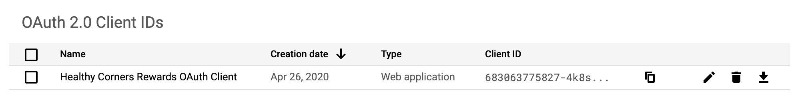
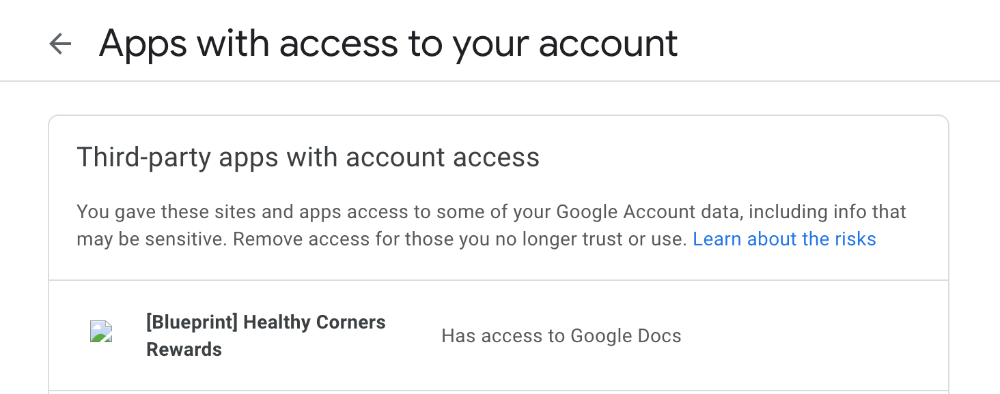
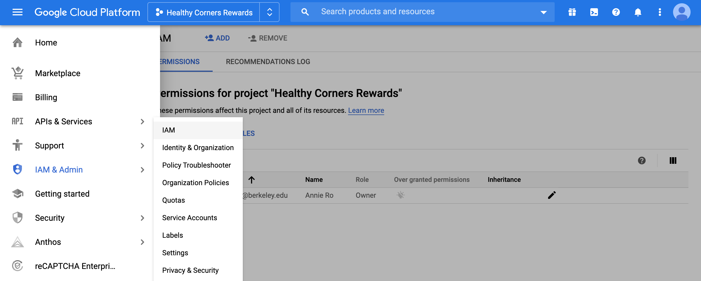

# Getting Started

You'll need access to our Airtable workspace in order to access the bases. Please request access from a member of the Healthy Corners team.

Additionally, you must have been added to the [Heroku](#deploying-with-heroku) project as well as the [Google](#google-api) project as a collaborator.

## Setup

1. Requirements

   Install `yarn` and `Node` using your favorite package manager (we recommend [Homebrew](https://brew.sh/) for macOS users). We use `yarn` instead of `npm` because that's what the other two apps use, and we want to be consistent.

2. Clone the repo and install dependencies

   - Clone this repo using `git clone`
   - Run `yarn install` in the downloaded repo. This will install all dependencies that are listed in `package.json`.

3. Add `.env`

   We use `.env` as our config file for secrets and API keys. Duplicate `.env.example`, name it `.env`, and fill in all missing fields.

   ::: tip
   Some of these are specifically for using the `airtable-schema-generator` package.
   :::

4. VS Code Setup (`ESLint` and `Prettier`)

   We develop with [Visual Studio Code](https://code.visualstudio.com/) as our editor. It has a packed marketplace of extensions that you can install; the useful ones in our case are a code linter and formatter - `eslint` (search `Extensions` for `dbaeumer.vscode-eslint`) and `prettier` (search `Extensions` for `esbenp.prettier-vscode`), respectively. These are dependent on certain `devDependencies` found in `package.json`: `eslint-plugin-react`, `eslint-config-prettier`, etc but should all be installed already via `yarn`.
   The rules for the linter and formatter are in `.eslintrc.js` and `prettier.config.js`. The configuration for VS Code is shared and enforced across developers for this project; it's found in `.vscode/settings.json`.

   ::: warning NOTE
   We noticed that because VS Code and Prettier (the extension) sometimes conflict with their formatters, formatting can be slightly inconsistent even with the `formatOnSave` option in VS Code's `settings.json`. See this for more: <https://github.com/prettier/prettier-vscode/issues/716>. Thus, we run `prettier` in a pre-commit hook using `husky` and `lint-staged`.
   :::

## Contributing

More details on how the application works in [Application Overview](./app-overview.md).

::: warning NOTE
This application is set up with `babel-node` to allow `import/export` syntax instead of `require` syntax. Thus, running `.js` files requires `yarn babel-node` as a prefix - e.g `yarn babel-node index.js` instead of `node index.js`.
:::

### Development Lifecycle

Most of the information in the [customer/clerk documentation](../shared/getting-started.md#development-lifecycle) still holds true, with some exceptions:

- There was only one developer for this repo, so no PRs were really made, though that can and should change (^:
- This repo does not use `yarnhook`
- This repo uses `pretty-quick` instead of `prettier` for the pre-commit hook
- This repo doesn't have any fun scripts - just `start` and `generate-schema`

### Working with Airtable

You'll need to fill in `REACT_APP_AIRTABLE_API_KEY` with your **personal API key** once you have access to the workspace. This can be found in your [Airtable account overview page](https://airtable.com/account). **You should never commit this key!** In the unfortunate event that you do, click "Regenerate API key" on the same page.

First, read through the [general "Working With Airtable" page](../shared/airtable) for an introduction to working with Airtable and the `airtable-schema-generator` package, which generates custom helper functions based on a specific Airtable base's configuration, or "schema".

In our code, we only ever call functions in `request.js`; see `utils/storeProducts.js` for example usage of the helper functions.

### Google API

Any application that interacts with any of Google's products must utilize the auth flow (essentially getting consent from the user).

::: danger
With the currently deployed application, we've gotten auth set up such that the application uses `anniero@berkeley.edu`'s permissions for editing the "FY20 Sales Data and Trends" spreadsheet.

This isn't sustainable, as the authenticated user will need "Edit access" to the spreadsheet source and the source Google Sheet may change. See the [code documentation](./app-overview.md#google-auth) for how to update the authenticated user.
:::

In general, I found the Google documentation a bit lacking, and the Google Cloud Platform page unintuitive to navigate. Thus, I've included screenshots along with minimal instructions for some common pages you may need to visit.

#### Get project credentials

Project credentials (`CLIENT_ID`, `CLIENT_SECRET`) are located in the `APIs & Services` section.



Click on the "Healthy Corners Rewards OAuth Client"



Click "Download JSON" or alternatively directly copy-paste the Client ID and Client Secret. If you scroll down, you'll see this section:


Here, you can set redirect URIs - if the domain ever changes, you **must** update this. Otherwise, authorization will stop working! Furthermore, the `REDIRECT_URI` in `.env` and Heroku's config vars **must match and be listed here**.

#### Revoke application permissions

When testing auth, you may need to revoke application permission, since the `refreshToken` is by default only returned on the first authorization of the application.

You can do so here: <https://myaccount.google.com/permissions>



#### Add a user to the project

This can be done via the [IAM page in the Google Cloud console](https://console.cloud.google.com/iam-admin/iam?authuser=1&folder=&organizationId=&orgonly=true&project=quickstart-1587887313757&supportedpurview=organizationId).



### Working with Dates

Since we need to update the date range in Google Sheets, we must manipulate Javascript `Date` objects. However, it's a well-known fact that the naive Javascript `Date` objects are difficult and can be unreliable.

The easiest thing to do is use [moment.js](https://momentjs.com/docs/). Don't waste time (^:

## Interacting with the application

Some routes are accessible via browser (e.g the `GET` routes - in particular, the initial authorization **must** be done via browser since it requires user consent).

::: warning POSTMAN
Another option is to do so via the API through an HTTP request (we recommend using [Postman](https://www.postman.com/)). All API calls that modify the spreadsheet are locked via a `HC_SECRET`. This secret key can be found in [Heroku's config vars](./getting-started.md#config-vars) (which should match the local `.env`).

**Example**


Note that you **must** add the `Content-Type: application/json` header. Then, the `Body` (select `raw` for format) of the request in its expected format:

```json
{
  "key": "<HC_SECRET>"
}
```

:::

## Deploying with Heroku

Follow [the instructions here](https://devcenter.heroku.com/articles/collab#deploy-the-app) to get set up as a collaborator.

### Config vars

Heroku config vars are exposed to the application's code as environment variables. Thus, all necessary variables in the local `.env` have been set directly in `heroku config`.

::: danger
Please do not add your Airtable email and password to the config vars, as they are only ever used for local development with the `airtable-schema-generator`.
:::

You can access or update config vars via the Heroku dashboard.


Notably, the `REACT_APP_AIRTABLE_API_KEY` and `REFRESH_TOKEN` are personal to individual developers; the `HC_SECRET` securing `POST` routes is also a member of the config variables.

### Deploying

To push new changes and deploy, run

```bash
git push heroku master
```

::: danger
Be sure to push your changes to the canonical repository (typically with `git push origin master`) as well as to the Heroku remote.
:::

Once the application is up and running, you will see this on the application homepage:


### Heroku Scheduler

Scheduler is a free add-on for running jobs on your app at scheduled time intervals, much like cron in a traditional server environment.

::: rightlink
From [Heroku Documentation](https://devcenter.heroku.com/articles/scheduler)
:::

It's perfect for our particular use case, and is why we deployed with Heroku (recall that this documentation site is hosted on and auto-deploys with Netlify).

This is what the [scheduler dashboard](https://dashboard.heroku.com/apps/healthycorners-rewards-node/scheduler) looks like:


With the job editor, you can configure how often you want the scheduled job to run. It's currently set to run daily at 5pm eastern time.


### Logentries

[Logentries](https://devcenter.heroku.com/articles/logentries) is a free add-on for monitoring your application and viewing logs.

We've installed it because we might want to inspect the `console.log` output of the scheduled job. Logentries will also send email notifications when the server crashes.


## References

Google API

- Google Sheets API reference: <https://developers.google.com/sheets/api/guides/concepts>
- Google Project console (only viewable to authorized users for the project) <https://console.cloud.google.com/apis/credentials/consent?project=quickstart-1587887313757>

Deploying

- <https://devcenter.heroku.com/articles/deploying-nodejs>
- <https://devcenter.heroku.com/articles/config-vars>
- <https://erickar.be/blog/running-a-cron-job-with-node-js-and-heroku>
- <http://www.modeo.co/blog/2015/1/8/heroku-scheduler-with-nodejs-tutorial>
