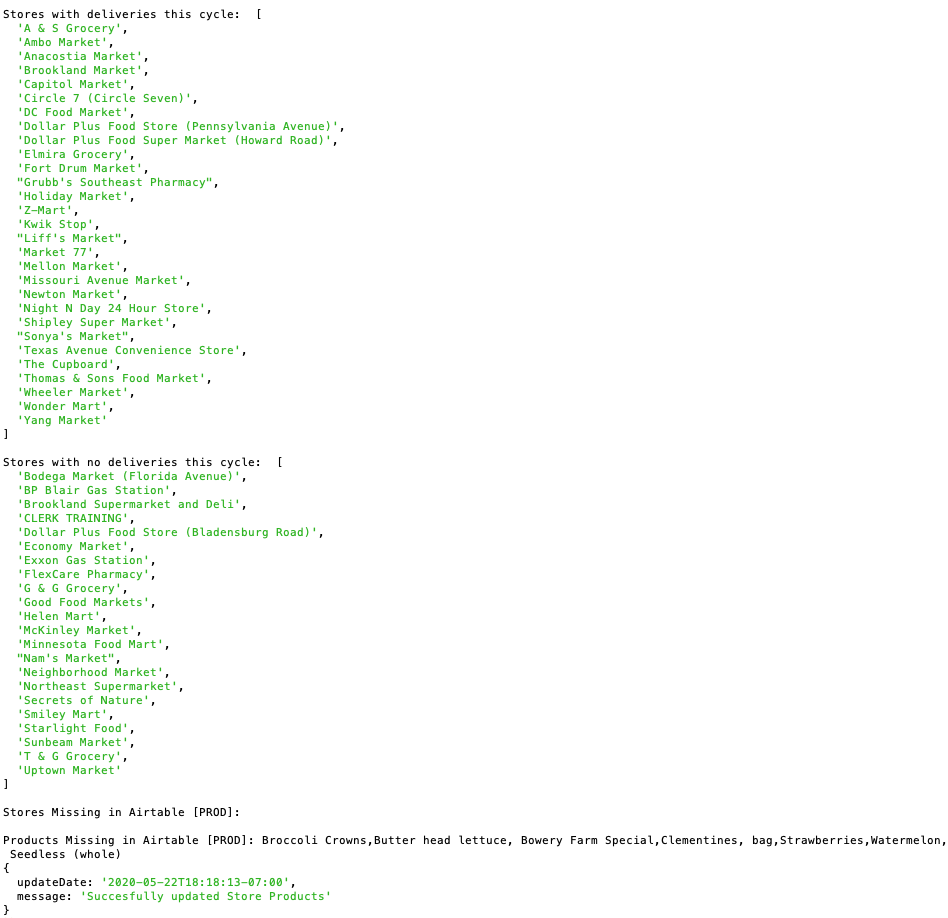

# Updating Store Products

We've included plenty of inline comments, and the update logic is encapsulated in `utils/*.js` files which is relatively self-explanatory. Instead of documenting line by line, this page should serve as a guide to understand how everything works.

::: tip Note
Products displayed must have been delivered in the last 9 days by default. To modify this number, you will have to ask Healthy Corners admins or Appian developers to modify the date range.
:::

## `scheduled-update.js`

This is the job run daily via Heroku Scheduler. It simply calls `updateStoreProducts`.

Details on how to configure the scheduled job are in the [Getting Started page](./getting-started.md#heroku-scheduler).

## `utils/*.js` Files

### `utils/appian.js`

This file contains the logic to interact with the Appian API.
  
In `getProducts`, we make a `GET` request to the `/recent-order-data` endpoint of the Appian API (custom-built for DC Central Kitchen) and parse the response into a Javascript array to be used to update Airtable. The returned object, `storeData`, is an array of Javascript objects which each represent a store, with attributes `storeName` (string), `lastDeliveryDate` (string), and `products` (array).

Here's a sample response from the `/recent-order-data` endpoint:
``` json
{
    "startDate": "12/19/2020",
    "endDate": "12/28/2020",
    "data": [
        {
            "storeName": "A & S Grocery",
            "lastDeliveryDate": "12/21/2020",
            "products": [
                "Fruit, Fresh Cut Mixed",
                "Grapes, Green seedless, Fresh Cut",
            ]
        },
        {
            "storeName": "A-1 Grocery",
            "lastDeliveryDate": "12/27/2020",
            "products": [
                "Banana",
                "Broccoli Crowns",
                "Clementines, Bag",
                "Corn, Frozen Vegetables (Local)",
                "Fruit, Fresh Cut Mixed",
            ]
        }
        ...
    ]
}
```

::: danger Data format constraints
Some products and stores are formatted differently in Airtable than they are in the API input. For example, `Ken Mart Inc` is a store's name through the Appian API, but Healthy Corners admins want it to be displayed to customers as `Ken Mart`, so it is named as so in Airtable. Product names are tricky as well.

Because we ultimately use the names with string matching to find the correct Airtable record(s) to update, the correct spelling and formatting is **crucial**.

If the names do not match, the updates will **not** be reflected in Airtable.

Thus, at the top of this file, we have two objects representing the corrections needed:

```javascript
const formatStores = {
  'Nams Market': "Nam's Market",
  'Ken Mart Inc': 'Ken Mart',
};

const formatProducts = {
  'Grapes, Red seedless, Fresh Cut': 'Grapes, Red (6 oz)',
  'Grapes, Green seedless, Fresh Cut': 'Grapes, Green (6 oz)',
  'tomato, cherry': 'Tomato, Cherry (6 oz)',
  'Grapes, Mix seedless, Fresh Cut': 'Grapes, Mix (6 oz)',
  'Collard Greens (bunch)': 'Collard Greens, (bunch)',
  'Garlic, peeled (bag)': 'Garlic, Peeled (bag)',
  'Clementines (bag)': 'Clementines, (bag)',
  'Collard Greens, Bag': 'Collard Greens, (bag)',
  'Corn, Frozen Vegetables': 'Corn, Frozen',
  'Lettuce, Butterhead (clamshell)': 'Lettuce, Butterhead',
  'Spring Mix,Organic': 'Spring Mix, Organic',
  'Kale (bunch)': 'Kale, (bunch)',
  'Spinach, Frozen Vegetables': 'Spinach, Frozen',
  'Peas, Frozen Vegetables': 'Peas, Frozen',
  ...
};
```

When parsing the data, we do a lookup on the raw input `name` and transform it if necessary.
:::

### `utils/storeProducts.js`

This file contains the logic to update Airtable. It currently only contains one function - `updateStoreProducts`. This switches on the parameter `base` to update the correct Airtable base.

1. We first call `getProducts` from `appian.js`, which returns the properly-formatted store data.
2. Next, we get the arrays of all stores and all products registered in Airtable via the Airtable API.
3. Finally, we generate the array of stores in Airtable that need to be updated to be linked to various product records. Airtable (and schema-generator naming conventions) requires that this format is:

```json
{
  "id": storeId,
  "fields": { "productIds": [product1Id, product2Id, product3Id], "latestDelivery": lastDeliveryDate }
}
```

During this process, we generate some useful information and `console.log` it so that can be viewed in the [Heroku logs](./getting-started.md#logentries), or in your terminal when developing locally:

- Stores with deliveries this cycle
- Stores without deliveries this cycle
- Stores that received deliveries, but were missing in the Airtable base
- Products that were delivered, but were missing in the Airtable base

::: warning
Out of these four, the "missing" categories are important to be aware of. You can view the Heroku logs via [Logentries](./getting-started.md#logentries).

Ask a Healthy Corners admin to add products/stores to the `PROD` Airtable base via [Airtable form](../admin/forms.md).
:::


### `utils/synchDevProd.js`

This file and the endpoints that call various functions in it is useful if you want to update data in the DEV base first, then update all of PROD at once. We expect that it will remain unused post-handoff, but thought the use case wasn't so rare that we needed to delete it completely. It is code that works exclusively with Airtable, so it might be a helpful reference as well.
