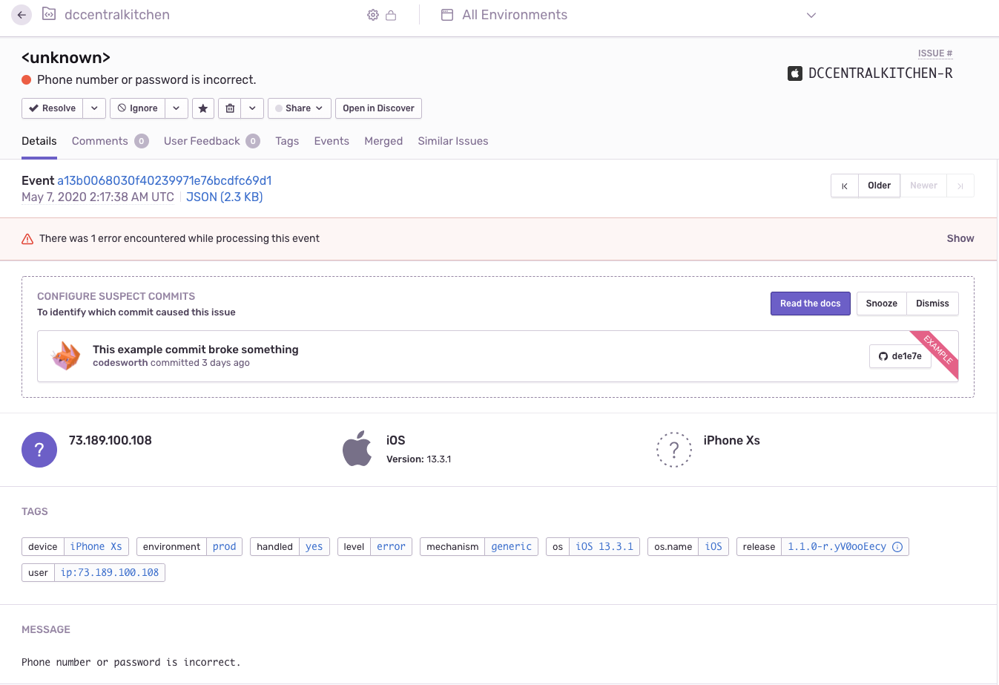
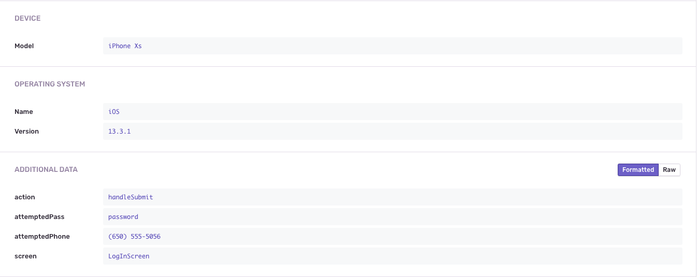

# Analytics & Error Reporting

::: warning NOTE
This documentation is the same for both the customer and clerk applications.
:::

Both Customer and Clerk apps use Sentry for error reporting and Firebase Analytics for insights on app usage and user engagement.

## Sentry
[Sentry Dashboard](https://sentry.io/auth/login/)

### Configuration
```
SENTRY_ORG='calblueprint'
SENTRY_PROJECT='dccentralkitchen'
SENTRY_AUTH_TOKEN={secure}
```

### Usage Examples
Both repos include the following functions in `/lib/logUtils.js`.

<<< @/lib/logUtils.js

#### Auth Error
``` jsx
// LogInScreen.js lines 118-124
logAuthErrorToSentry({
    screen: 'LogInScreen',
    action: 'handleSubmit',
    attemptedPhone: formattedPhoneNumber,
    attemptedPass: password,
    error,
});
```


[Resulting error log in Sentry](https://sentry.io/organizations/calblueprint/issues/1608366610/?project=5172575&query=is%3Aunresolved)

#### Capturing Messages
In addition to error logging, we also record the following messages:
* Log In Successful
* Sign Up Successful
* Guest Login Successful 
* Returning User (a user opens the app while already logged in)


```jsx
// LogInScreen.js lines 132-139 
Sentry.configureScope((scope) => {
    scope.setUser({
    id: customer.id,
    phoneNumber: formattedPhoneNumber,
    username: customer.name,
    });
    Sentry.captureMessage('Log In Successful');
});
```
These events help us diagnose issues that aren't directly logged as errors. `Sentry.configureScope` is used to capture the specific user's information, and Sentry automatically logs other helpful details like device, software version etc.

For example, if a user reports a bug that we thought we already fixed and updated OTA, we can find the Sentry event when the user opened the app and see if their `expoAppPublishedTime` and `expoAppVersion` reflect the latest version.

#### Relevant PRs
- [Customer #85 Sentry integration](https://github.com/calblueprint/dccentralkitchen/pull/85)
- [Clerk #54 Firebase Analytics + Sentry error logging](https://github.com/calblueprint/dccentralkitchen-clerks/pull/54)
- [Clerk #35 Sentry integration](https://github.com/calblueprint/dccentralkitchen-clerks/pull/35) and [#36 additional modifications](https://github.com/calblueprint/dccentralkitchen-clerks/pull/36)

#### Helpful links
- [Expo Docs: Using Sentry](https://docs.expo.io/guides/using-sentry/?redirected)


## Firebase Analytics

 Go to the [Firebase Console](https://console.firebase.google.com/) to see analytics data and event details.

*Note: events logged under the Web App (not iOS or Android) are recorded in development. Only events logged in production will appear under the corresponding platform.*
### Configuration
Firebase is configured using the `google-services.json` for Android and `GoogleService-Info.plist` for iOS. The additional web configuration in `app.json` is required for testing in development. [Learn more about Expo Firebase Analytics limitations.](https://docs.expo.io/versions/latest/sdk/firebase-analytics/#expo-client-limitations--configuration)


### Usage Examples
#### Setting user properties
When the user signs up, Analytics tracks the user's ID with their name and phone number.
``` jsx
// SignUpScreen.js lines 167-171
Analytics.setUserId(customerId);
Analytics.setUserProperties({
    name,
    phoneNumber,
});
```

#### Logging events
The example below logs an event when the user opens an external resources link and records the name of the resource. This helps us track user engagement with resources and understand which links they find most helpful.

``` jsx
// ResourceCard.js lines 15-19
Analytics.logEvent('resources_ext_link', {
    name: resource.title,
    screen: 'Resources',
    purpose: 'Opens external link',
});
```

#### Relevant PRs
- [Customer #88 Firebase integration + Analytics](https://github.com/calblueprint/dccentralkitchen/pull/88)
- [Clerk #54 Firebase Analytics + Sentry error logging](https://github.com/calblueprint/dccentralkitchen-clerks/pull/54)

#### Helpful Links
- [Expo Docs: using the native Firebase SDK](https://docs.expo.io/guides/setup-native-firebase/?redirected)
- [Expo Docs: FirebaseAnalytics](https://docs.expo.io/versions/latest/sdk/firebase-analytics/)
  - [Log an event](https://docs.expo.io/versions/latest/sdk/firebase-analytics/#logevent)
- [React Navigation Screen Tracking](https://reactnavigation.org/docs/screen-tracking/)