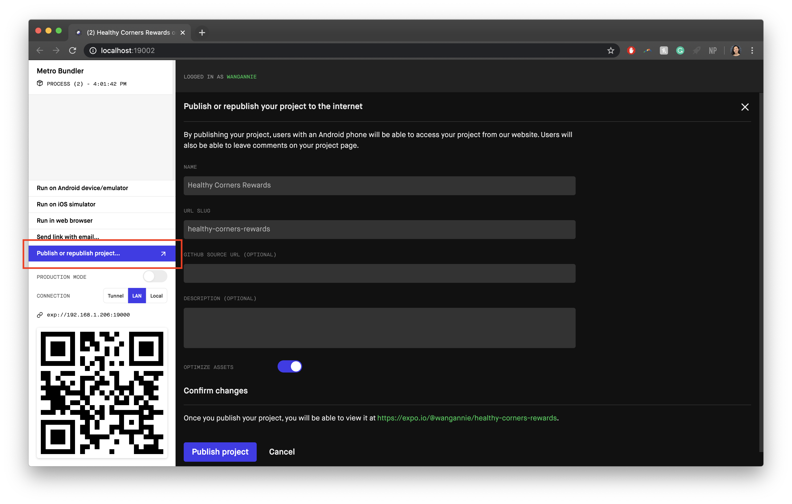

# Updating the app

## Set up your release branch
1. Pull the lastest version of `master` into the `release` branch
2. Bump the following version numbers in **`app.json`**
    - Increment `version` and `buildNumber` based on [Semantic Versioning](https://semver.org/) guidelines
    - `versionCode` must be an integer. Increment by 1 for each release.

    ```json {4,8,14}
    {
      "expo": {
        ...
        "version": "1.0.1", // would become "1.1.0"
        ...
        "ios": {
          ...
          "buildNumber": "1.0.1", // would become "1.1.0"
          ...
          }
        },
        "android": {
          ...
    			"versionCode": 2 // would become 3
        },
        ...
      }
    }
    ```

#### Helpful Links
[Expo Docs: Configuration with app.json](https://docs.expo.io/versions/latest/workflow/configuration/)


## Start the Expo Build

1. In the Expo CLI, run `expo build:android` or `expo build:ios`. Once the build starts, it can take anywhere from a few minutes to a several hours, depending on how much traffic there is. You can check the build status in your Expo Dashboard, or monitor the queues in [Expo's Turtle status site](https://expo.io/turtle-status).
::: warning
When you run an `expo build` command, Expo will also automatically run `expo publish`. Due to the issue with font and icon loading noted [**here**](otaupdate.html#publish-with-expo), you **must** manually publish again through Expo Dev Tools to restore the icons and fonts.
::: 
2. Once the build completes re-publish through Expo Dev Tools to restore icons and fonts:
   1. Run `expo start` in your release branch
   2. In Expo Dev Tools, select **Publish or republish project** from the left sidebar
       
   3. Do not modify the name or url slug, or else the update will not match the binary in the app store.
   4. Select **Publish project**
   
3. Once the build is complete, continue with [Android](#android-google-play) or [iOS](#ios-app-store)
#### Helpful Links
[Expo Docs: Building Standalone Apps](https://docs.expo.io/distribution/building-standalone-apps/)

## Android - Google Play

### Uploading for Android
Once the build is complete, click the link in the console or go to your Expo dashboard, select the build, and download the Build artifact (APK).


#### Test the APK

If you have Android Studio with an emulator or virtual device, select **Profile or debug APK** to run the APK on a virtual device. 

[Android Docs: Run apps on the Android Emulator](https://developer.android.com/studio/run/emulator)

::: tip
If you don't have an Android Emulator, upload the APK to [Appetize](https://appetize.io/upload) to test it on an Android device online for free.
:::


### Create a new Release in the Google Play Console
1. Go to the [Google Play Console](https://play.google.com/apps/publish/) and sign in
2. Select **Healthy Corners Rewards** or **Healthy Rewards Clerk** from **All Applications**
3. From the menu on the left, open **Release management** and select **App releases**
4. Under **Production track** select **Manage** on the right
5. Select **Create Release** on the top right.
6. Upload the APK downloaded from Expo
7. Name the release with the version code and a brief description.
   - ex.  `v1.2.0 - Password Security Updates`
8. Add release notes 
   - Customer v1.2 example: 
      > - New Crisis Response section in Resources provides links to keep you updated with emergency food resources and meal sites
      >- All-new Guest Mode allows you to use all of the store locator features without creating an account. Tap 'Continue without an account' and start finding affordable healthy food
      >- The new Stores display includes more detailed product information and the most updated prices
      >- Get navigation directions to a store in a map app by tapping the store's address
      >- Security updates
9.  Select **Review**. On the "Review and roll out release" screen, make sure there aren't any issues.
10. Select **Confirm rollout** 

### Updating the Store listing
If there are any major updates that would require updating any of the following information, see [Play Console: Manage your store listings](https://support.google.com/googleplay/android-developer/topic/3450987?hl=en&ref_topic=7072031)
- Title
- Description
- Graphic assets (icons, screenshots)
- Categorization (categories, tags)
- Contact details

#### Helpful Links

[Google Play Console: Prepare & roll out releases](https://support.google.com/googleplay/android-developer/answer/7159011?hl=en)


## iOS - App Store

### Uploading for iOS
Once the build is complete, run `expo upload:ios` in the Expo CLI. You will be prompted to enter your developer Apple ID credentials. 

Alternatively, you can download the .IPA file from the Expo dashboard and upload it to Testflight using **Transporter** from the App Store ([link](https://apps.apple.com/app/transporter/id1450874784)). Learn more about manually uploading from [Expo Docs](https://docs.expo.io/distribution/uploading-apps/#manually-uploading-your-app).


#### Test on TestFlight

Once you have uploaded the build, you can check the status of your app submission to TestFlight in App Store Connect:
1. Login to [App Store Connect](https://appstoreconnect.apple.com ) with your Apple ID credentials
2. Select **My Apps** and you should see your app listed.
3. Select **TestFlight** from the to menu bar. 

This will show your current app builds that are available for testing.
To test the app on your device, you will need to install the TestFlight iOS app from the App Store, and sign in using your Apple ID.

#### Helpful Links
[Expo Docs: Uploading Apps to the Apple App Store and Google Play](https://docs.expo.io/distribution/uploading-apps/)

### Create a new Version in App Store Connect

1. Sign in to the developer account in [App Store Connect](https://appstoreconnect.apple.com/](https://appstoreconnect.apple.com/))
2. Go to **My Apps** and select **Healthy Corners Rewards**
3. Under the **App Store** tab on the left menu bar, select **+ Version or Platform**, and select **iOS** from the dropdown

    

4. Update Version Information

   - **What's New in This Version:** describe any updates related to this version in up to 4000 characters.
       - Customer v1.2 example
           > • The all-new Guest Mode allows you to use all of the store locator features without creating an account. Just tap 'Continue without an account' and start finding affordable healthy food!<br>
           • The Crisis Response section in Resources provides links to keep you up to date with local emergency food resources and meal sites.<br>
           • The new Stores display includes more detailed product information and the most updated prices.<br>
           • The redesigned Points History displays more comprehensive information about your points earnings.<br>
           • Easily get navigation directions to a store in a map app of your choice by tapping the store's address.<br>
           • The redesigned map icons and labels help speed up your store search by helping you select stores from the map at a glance.<br>
           • Security updates, small improvements, and bug fixes.

   - **App Previews and Screenshots**: Upload new app screenshots if necessary to reflect any major new features or visual changes. You can take these screenshots using `cmd` + `s` in an iOS simulator in devices of the proper dimensions. See [Apple's guidelines here.](https://help.apple.com/app-store-connect/#/dev910472ff2)
   - **Description**: Update the app description if there are any major new features or updates. This should not need to change much for smaller updates.


## Tracking Releases in GitHub

### Tag the Release
1. In your release branch, mark the release point using a tag with the SemVer version code from `version` in **`app.json`**

   For **major updates**, use annotated tags 
   ``` bash
   $ git tag -a v1.2.0 -m "Fix security upgrades and update OTA timeout"
   ```
    To **track smaller OTA updates** where the version number does not change, note what the specific change is within the tag name
    ``` bash
    $ git tag v1.2.0_signup_bonus
    ```
    More on [Git Tagging](https://git-scm.com/book/en/v2/Git-Basics-Tagging)
2. Push the tag using `git push origin <tagname>`
   ``` bash
    $ git push origin v1.2.0_signup_bonus
    ```
### Create a Release from the tag
This is optional but highly recommended to track bigger releases including more major feature changes.
1. Go to the **Tags** within the **Releases** page in the [customer](https://github.com/calblueprint/dccentralkitchen/tags) or [clerk](https://github.com/calblueprint/dccentralkitchen-clerks/tags) repo
2. Select the `•••` menu by the latest tag and select **Create release**
   
3. In **Release Title**, enter the SemVer code from `version` in **`app.json`**
4. Add a description about the **Features & Improvements** and **Bug Fixes**.
   ::: callout v1.1.1 Example
    #### Features & Improvements
    - Added styled map icons and transition animations in #87 by @tommypoa 
    - Integrated Sentry for error logging in #85 by @JustinMi 
    - Upgraded to Expo SDK 37 in #82 by @thumn 
    - Added COVID-19/Crisis resources section in #79 by @kennethlien 
    - Upgraded to React Navigation 5 in #76  by @thumn 
    - Added Guest Mode in #74 by @kennethlien 
    - Set the default store and added re-center location button in #72 by @tommypoa 
    - Updated styling and navigation in #45, #46, #56, #64, and #83  by @wangannie 
    - Updated product card details in #50 by @tommypoa 
    - Added external links to navigation directions in #47 by @wangannie 
    - Refactored Airtable in #48 by @anniero98 
    - Updated Log In and Sign Up flow with Material UI text fields in #48 by @anniero98 and @tommypoa 
    #### Bug Fixes
    - Fixed map issues that would crash the Android app in #92 by @wangannie 
    - Fixed Android styling bugs in #78 by @wangannie 
    - Made the bottom drawer responsive to screen size in the map screen in #71 by @tommypoa 
    - Fixed long store names pushing the See Products button off the screen in #51 by @tommypoa and @wangannie 
   ::: rightlink
   Source: [Customer v1.1.1 Release Notes](https://github.com/calblueprint/dccentralkitchen/releases/tag/v1.1.0)
   :::
5. Select **Publish release**

#### Helpful Links
[Github Docs: Managing releases in a repository](https://help.github.com/en/github/administering-a-repository/managing-releases-in-a-repository)