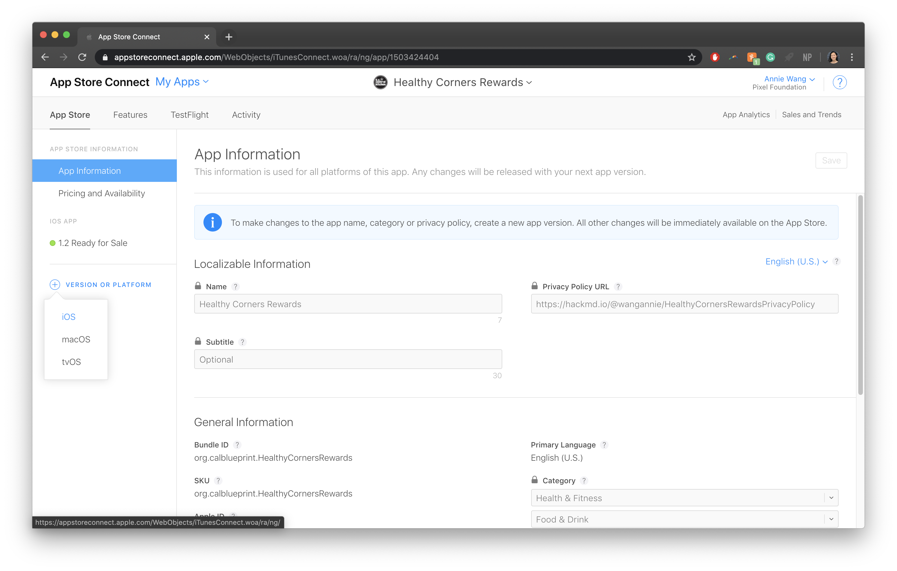
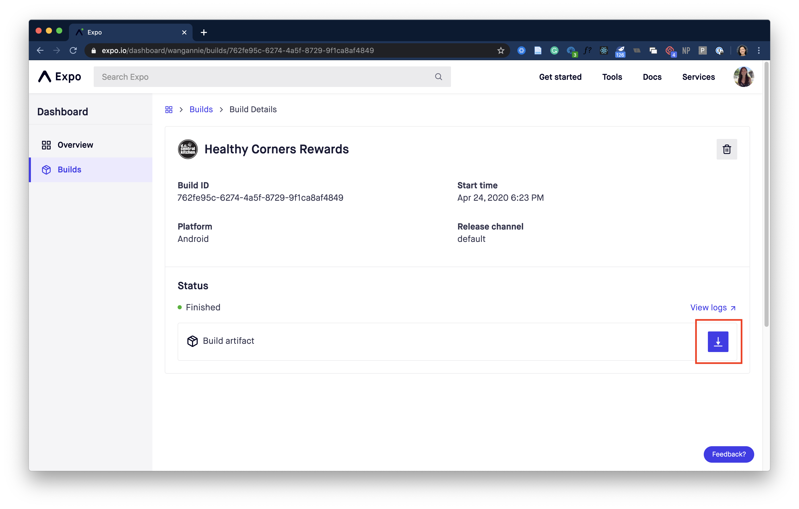
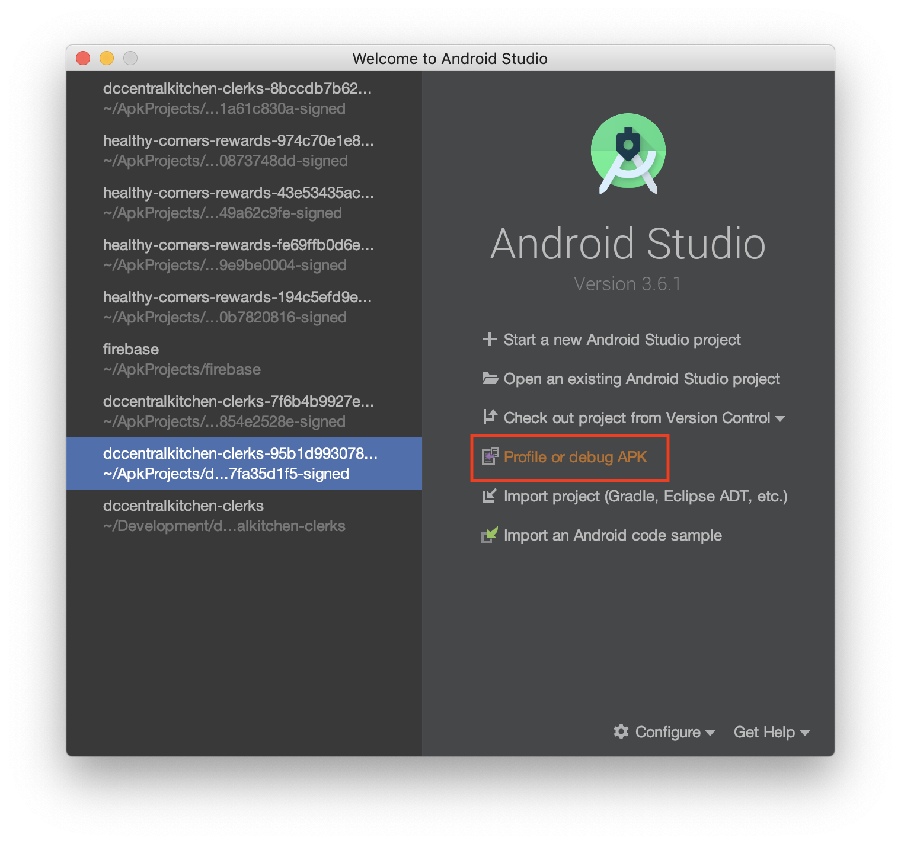
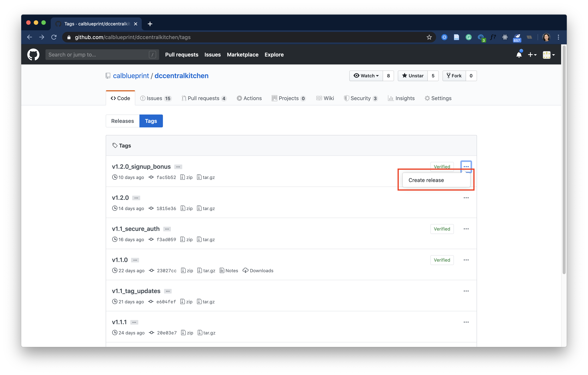

# Deploying Updates

::: warning NOTE
This documentation is the same for both the customer and clerk applications.
:::

You can either deploy the update over-the-air (OTA) or submit a build a new version of the standalone app and re-submit to app stores.

**Jump to instructions:**

- [Option A. Updating over-the-air (OTA)](#option-a-updating-ota)
- [Option B. Submitting a new build](#option-b-submitting-a-new-build)

If you are unsure which method to use, carefully read the guidelines below.

## Updating OTA vs. submitting a new build

> Over-the-air (OTA) updates allow you to publish a new version of your app JavaScript and assets without building a new version of your standalone app and re-submitting to app stores.

::: rightlink
From [Expo Docs: Configuring OTA Updates](https://docs.expo.io/guides/configuring-ota-updates/)
:::

Not all updates can be submitted OTA. There are several limitations with OTA updates, including many changes in `app.json`. You can read more about the [limitations of OTA updates here](https://docs.expo.io/workflow/publishing/#limitations). Additionally, rollout and adoption of OTA updates can be unreliable. Err on the side of caution when deciding whether to make an OTA update or submit a new build.

### When to [update OTA](#option-a-updating-ota)

- **Backwards-compatible bug fixes**: features where the app would remain usable for those with or without the latest update
  - ex. front-end additions with store details and store hours in [v1.1_tag_updates](https://github.com/calblueprint/dccentralkitchen/releases/tag/v1.1_tag_updates)
- **Minor time-sensitive changes**
  - ex. Healthy Corners requested adding 500 bonus points for signing up to help the Nam's Market launch in [v1.2.0_signup_bonus](https://github.com/calblueprint/dccentralkitchen/releases/tag/v1.2.0_signup_bonus), which also includes several visual bug fixes
- **Airtable schema updates**: breaking if not updated immediately. [More details here](./airtable.md#making-changes-to-the-airtable-base-s).

### When to [submit a new build](#option-b-submitting-a-new-build)

- **Backwards-incompatible breaking changes**
  - ex. all passwords had to be changed in Airtable for [#130 Implement basic encryption for passwords](https://github.com/calblueprint/dccentralkitchen/pull/130). If users had not recieved the OTA update, they would not be able to access their accounts
- **Modifications in `expo.ios` or `expo.android` in `app.json`**

  - Learn more about specific limitations in the [Expo Docs](https://docs.expo.io/workflow/publishing/#limitations)
  - ex. adding Firebase configuration in [#88 Firebase integration + Analytics](https://github.com/calblueprint/dccentralkitchen/pull/88)

## Option A. Updating OTA

Over-the-air (OTA) updates allow you to publish a new version of your app JavaScript and assets without building a new version of your standalone app and re-submitting to app stores.

::: rightlink
From [Expo Docs: Configuring OTA Updates](https://docs.expo.io/guides/configuring-ota-updates/)
:::

### Set up your release branch

1. Create a new branch from the most up-to-date version of `main` named `release` with the update version number using [Semantic Versioning](https://semver.org/) guidelines. For most updates, it is recommended to only increment the PATCH version.
   ```bash
   git checkout -b release-1.1.2
   ```
2. Bump the `expo.version` number in **`app.json`** with the new SemVer version number.

   ```json {4}
   {
     "expo": {
       ...
       "version": "1.1.1", // would become "1.1.2"
       ...
     }
   }
   ```

### Publish with Expo

1. In your release branch, run `expo publish --release-channel prod`
2. Once the update finishes processing, the latest updates should appear within the app. If changes do not appear immediately, close and reopen the app.

Once the OTA update is successfully published, skip the next section and jump to [Merge release changes](#merge-release-changes).

## Option B. Submitting a new build

### Set up your release branch

1. Create a new branch from the most up-to-date version of `main` named `release` with the update version number using [Semantic Versioning](https://semver.org/) guidelines.
   ```bash
   git checkout -b release-1.1.0
   ```
2. Bump the following version numbers in **`app.json`**

   - Increment `version` and `buildNumber` based on [Semantic Versioning](https://semver.org/) guidelines
   - `versionCode` must be an integer. Increment this for each release.

   ```json {4,8,13}
   {
     "expo": {
       ...
       "version": "1.0.1", // would become "1.1.0"
       ...
       "ios": {
         ...
         "buildNumber": "1.0.1", // would become "1.1.0"
         ...
         },
       "android": {
         ...
   			"versionCode": 2 // would become 3
       },
       ...
     }
   }
   ```

#### Helpful Links

[Expo Docs: Configuration with app.json](https://docs.expo.io/versions/latest/workflow/configuration)

### iOS - App Store

::: warning Follow these instructions for the Customer app ONLY
Only the customer-facing app is deployed to the App Store. The Clerk app is only deployed for Android on the Google Play Store. To deploy updates for the Clerk app, skip to the instructions on [deploying for Android](#android-google-play)
:::

#### Start the Expo Build

1. In the Expo CLI, run `expo build:ios --release-channel prod`
2. When prompted, select `archive`
3. Enter Apple ID credentials

Once the build starts, it can take anywhere from a few minutes to a several hours, depending on how much traffic there is. You can check the build status in your Expo Dashboard, or monitor the queues in [Expo's Turtle status site](https://expo.io/turtle-status).

#### Upload for iOS

Once the build is complete, run `expo upload:ios` in the Expo CLI. You will be prompted to enter your developer Apple ID credentials.

Alternatively, you can download the .IPA file from the Expo dashboard and upload it to TestFlight using **Transporter** from the App Store ([link](https://apps.apple.com/app/transporter/id1450874784)). Learn more about manually uploading from [Expo Docs](https://docs.expo.io/distribution/uploading-apps/#manually-uploading-your-app).

#### Test on TestFlight

Once you have uploaded the build, you can check the status of your app submission to TestFlight in App Store Connect:

1. Login to [App Store Connect](https://appstoreconnect.apple.com) with your Apple ID credentials
2. Select **My Apps** and you should see your app listed.
3. Select **TestFlight** from the to menu bar.

This will show your current app builds that are available for testing.
To test the app on your device, you will need to install the TestFlight iOS app from the App Store, and sign in using your Apple ID.

#### Create a new Version in App Store Connect

1. Sign in to the developer account in [App Store Connect](<https://appstoreconnect.apple.com/](https://appstoreconnect.apple.com/)>)
2. Go to **My Apps** and select **Healthy Corners**
3. Under the **App Store** tab on the left menu bar, select **+ Version or Platform**, and select **iOS** from the dropdown

   

4. Update Version Information

   - **What's New in This Version:** describe any updates related to this version in up to 4000 characters.

     - Customer v1.2 example
       > • The all-new Guest Mode allows you to use all of the store locator features without creating an account. Just tap 'Continue without an account' and start finding affordable healthy food!<br>
       > • The Crisis Response section in Resources provides links to keep you up to date with local emergency food resources and meal sites.<br>
       > • The new Stores display includes more detailed product information and the most updated prices.<br>
       > • The redesigned Points History displays more comprehensive information about your points earnings.<br>
       > • Easily get navigation directions to a store in a map app of your choice by tapping the store's address.<br>
       > • The redesigned map icons and labels help speed up your store search by helping you select stores from the map at a glance.<br>
       > • Security updates, small improvements, and bug fixes.

   - **App Previews and Screenshots**: Upload new app screenshots if necessary to reflect any major new features or visual changes. You can take these screenshots using `cmd` + `s` in an iOS simulator in devices of the proper dimensions. See [Apple's guidelines here.](https://help.apple.com/app-store-connect/#/dev910472ff2)
    ::: tip
    Follow [this guide on updating app screenshots](../design.html#updating-app-screenshots) to use the styled screenshot frames. 

    Past versions of app screenshots are included [in Dropbox here](../design.html#additional-assets).
    :::
   - **Description**: Update the app description if there are any major new features or updates. This should not need to change much for smaller updates.

#### Helpful Links

- [Expo Docs: Building Standalone Apps](https://docs.expo.io/distribution/building-standalone-apps/)
- [Expo Docs: Uploading Apps to the Apple App Store and Google Play](https://docs.expo.io/distribution/uploading-apps/)
- [App Store Connect Help: App Store icon, app preview, and screenshots overview](https://help.apple.com/app-store-connect/#/dev910472ff2)

### Android - Google Play

::: tip Follow these instructions for both apps
Both the customer-facing and clerk-facing apps are deployed in the Google Play Store.
:::

#### Start the Expo Build

1. In the Expo CLI, run `expo build:android --release-channel prod`
2. When prompted, select `apk`

Once the build starts, it can take anywhere from a few minutes to a several hours, depending on how much traffic there is. You can check the build status in your Expo Dashboard, or monitor the queues in [Expo's Turtle status site](https://expo.io/turtle-status).

#### Upload for Android

Once the build is complete, click the link in the command line or go to your Expo dashboard, select the build, and download the Build artifact (APK).



#### Test the APK

If you have Android Studio with an emulator or virtual device, select **Profile or debug APK** to run the APK on a virtual device.

[Android Docs: Run apps on the Android Emulator](https://developer.android.com/studio/run/emulator)

::: tip
If you don't have an Android Emulator, upload the APK to [Appetize](https://appetize.io/upload) to test it on an Android device online for free.
:::



#### Create a new Release in the Google Play Console

1. Go to the [Google Play Console](https://play.google.com/apps/publish/) and sign in
2. Select either **Healthy Corners** (customer-facing app) or **Healthy Corners Clerk** (clerk-facing app) from **All Applications**
3. From the menu on the left, open **Release management** and select **App releases**
4. Under **Production track** select **Manage** on the right
5. Select **Create Release** on the top right.
6. Upload the APK downloaded from Expo
7. Name the release with the version code and a brief description.
   - ex. `v1.2.0 - Password Security Updates`
8. Add release notes
   - Customer v1.2 example:
     > - New Crisis Response section in Resources provides links to keep you updated with emergency food resources and meal sites
     > - All-new Guest Mode allows you to use all of the store locator features without creating an account. Tap 'Continue without an account' and start finding affordable healthy food
     > - The new Stores display includes more detailed product information and the most updated prices
     > - Get navigation directions to a store in a map app by tapping the store's address
     > - Security updates
9. Select **Review**. On the "Review and roll out release" screen, make sure there aren't any issues.
10. Select **Confirm rollout**

#### Update the Store listing

If there are any major updates that would require updating any of the following information, see [Play Console: Manage your store listings](https://support.google.com/googleplay/android-developer/topic/3450987?hl=en&ref_topic=7072031)

- Title
- Description
- Graphic assets (icons, screenshots)
  ::: tip
  Since Android screenshot guidelines are more flexible, we usually use the same screenshots that we use for the Apple App Store. 
  
  Follow [this guide on updating app screenshots](../design.html#updating-app-screenshots) to use the styled screenshot frames.

  Past versions of app screenshots are included [in Dropbox here](../design.html#additional-assets).
  :::
- Categorization (categories, tags)
- Contact details

#### Helpful Links

- [Expo Docs: Building Standalone Apps](https://docs.expo.io/distribution/building-standalone-apps/)
- [Google Play Console: Prepare & roll out releases](https://support.google.com/googleplay/android-developer/answer/7159011?hl=en)

## Merge release changes

Once the update is successfully deployed, merge the release branch into `main` to update any hotfixes and version numbers.

## Track the Release in GitHub

It is easy to lose track of which changes are included with which updates, and whether those updates were delivered OTA or through new builds. Releases in Github are good for organizing and documenting releases.

### Tag the Release

1. In your release branch, mark the release point using a tag with the SemVer version code from `expo.version` in **`app.json`**

   ```bash
   $ git tag v1.2.0
   ```

   For updates where the version number does not change, note what the specific change is within the tag name.

   ```bash
   $ git tag v1.2.0_signup_bonus
   ```

2. Push the tag using `git push origin <tagname>`

   ```bash
    $ git push origin v1.2.0_signup_bonus
   ```

   More on [Git Tagging](https://git-scm.com/book/en/v2/Git-Basics-Tagging)

### Create a Release from the tag

This is optional but highly recommended to track bigger releases including more major feature changes.

1. Go to the **Tags** within the **Releases** page in the [customer](https://github.com/calblueprint/dccentralkitchen/tags) or [clerk](https://github.com/calblueprint/dccentralkitchen-clerks/tags) repo
2. Select the `•••` menu by the latest tag and select **Create release**
   
3. In **Release Title**, enter the SemVer code from `version` in **`app.json`**. In parentheses, add either **OTA** if the update was published OTA, or **build** if the update was published by a standalone build.
4. Add a description about the **Features & Improvements** and **Bug Fixes**.
   ::: callout Example: v1.1.0 (build)
   #### Features & Improvements
   - Added styled map icons and transition animations in #87 by @tommypoa
   - Integrated Sentry for error logging in #85 by @JustinMi
   - Upgraded to Expo SDK 37 in #82 by @thumn
   - Added COVID-19/Crisis resources section in #79 by @kennethlien
   - Upgraded to React Navigation 5 in #76 by @thumn
   - Added Guest Mode in #74 by @kennethlien
   - Set the default store and added re-center location button in #72 by @tommypoa
   - Updated styling and navigation in #45, #46, #56, #64, and #83 by @wangannie
   - Updated product card details in #50 by @tommypoa
   - Added external links to navigation directions in #47 by @wangannie
   - Refactored Airtable in #48 by @anniero98
   - Updated Log In and Sign Up flow with Material UI text fields in #48 by @anniero98 and @tommypoa
   #### Bug Fixes
   - Fixed map issues that would crash the Android app in #92 by @wangannie
   - Fixed Android styling bugs in #78 by @wangannie
   - Made the bottom drawer responsive to screen size in the map screen in #71 by @tommypoa
   - Fixed long store names pushing the See Products button off the screen in #51 by @tommypoa and @wangannie
     ::: rightlink
     Source: [Customer v1.1.0 Release Notes](https://github.com/calblueprint/dccentralkitchen/releases/tag/v1.1.0)
     :::
5. (Only for new build updates) Upload the .apk and .ipa files downloaded from Expo
6. Select **Publish release**

#### Helpful Links

[Github Docs: Managing releases in a repository](https://help.github.com/en/github/administering-a-repository/managing-releases-in-a-repository)
